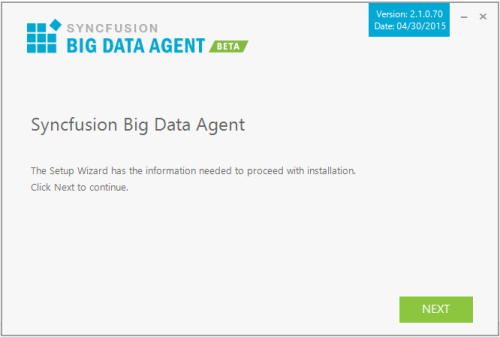
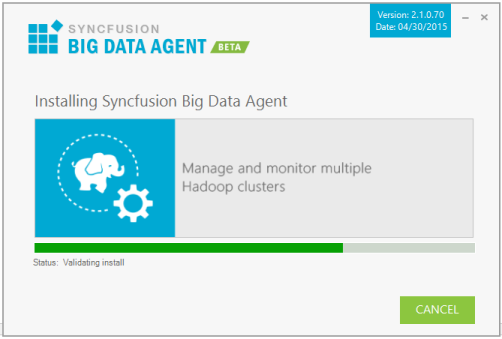
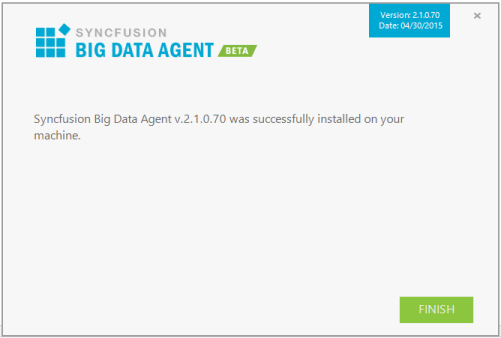

# Big Data Agent

## Overview

Syncfusion Big Data Agent is a Windows service that is used to communicate with the Big Data Cluster Manager application from Client machines like Hadoop nodes.

## Step-by-Step Installation

The following are the steps to install the Big Data Agent Setup.

1. Double-click the Syncfusion Big Data Agent Installer Setup file. The Syncfusion Big Data Agent Installer Wizard opens.

   

   N> The WinZip Self-Extractor extracts the syncfusionbigdataagent_(version).exe dialog, displaying the unzip operation of the package._ 

   

   
2. Click Next.

   

3. To install it in the displayed default location, click Install.

    
	
	N> The Completed screen is displayed once the Big Data Agent Platform setup is installed.

    

4. Click Finish. Big Data Agent Platform is installed in your system.

## Command Line 

Syncfusion Big Data Agent supports installing the setup through Command Line Install and Uninstall. The following sections illustrate these options. 

### Command Line Installation

Follow the given steps to install through Command Line in Silent mode.

1. Open Command Prompt in administrator mode and pass the following arguments:

   “Setup file path\SyncfusionBigDataAgentSilent_(version).exe” /log “{Log file path}” /Install silent   /InstallPath:{Location to install}

    Example: “D:\Temp\SyncfusionBigDataAgentSilent_2.1.0.70.exe” /log “C:\Temp\BigDataAgent.log” /Install silent /InstallPath:C:\Syncfusion\x.x.x.x

2. Setup is installed.

   N> x.x.x.x needs to be replaced with the Big Data version installed on your machine.
   
   
### Command Line Uninstallation

Syncfusion Big Data Agent supports uninstalling the setup through Command Line in Silent mode. The following steps help you uninstall the setup. 

1. Open the Command Prompt in the Administrator mode and pass the following arguments: 

   “Setup file path\SyncfusionBigDataAgentSilent_(version).exe” /uninstall silent

    Example: “D:\Temp\SyncfusionBigDataAgentSilent_2.1.0.70.exe" /uninstall silent

2.  Setup is uninstalled.