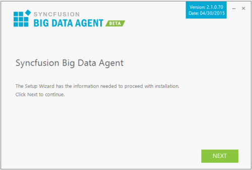

### Step-by-Step Installation

The following are the steps to install the Big Data Agent Setup.

1. Double-click the Syncfusion Big Data Agent Installer Setup file. The Syncfusion Big Data Agent Installer Wizard opens.

{:.image }

> 
{:.image }
_Note: The WinZip Self-Extractor extracts the syncfusionbigdataagent_(version).exe dialog, displaying the unzip operation of the package._ 

> 

{:.image }

1. Click Next.

{:.image }

1. To install it in the displayed default location, click Install.

{:.image }

{:.image }
_Note: The Completed screen is displayed once the Big Data Agent Platform setup is installed._

{:.image }

2. Click Finish. Big Data Agent Platform is installed in your system.
