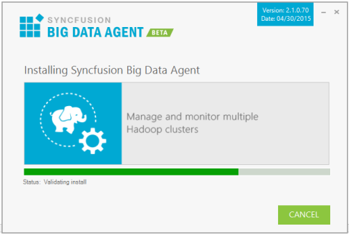

### Step-by-Step Installation

The following are the steps to install the Big Data Agent Setup.

1. Double-click the Syncfusion Big Data Agent Installer Setup file. The Syncfusion Big Data Agent Installer Wizard opens.

   
   
   _Note: The WinZip Self-Extractor extracts the syncfusionbigdataagent_(version).exe dialog, displaying the unzip operation of the package._ 
   
   

1. Click Next.
   
   

2. To install it in the displayed default location, click Install.

   

   _Note: The Completed screen is displayed once the Big Data Agent Platform setup is installed._

   

3. Click Finish. Big Data Agent Platform is installed in your system.
