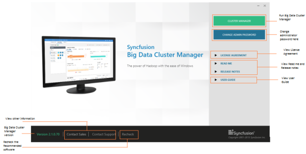

### Dashboard

This section provides details on the structure and composition of the Syncfusion Big Data Cluster Manager dashboard. It also elaborates on navigating the dashboard to access various utilities and product samples.

{:.image }

Big Data Cluster Manager:

Click any of the following to know more about the selected product.

* Cluster Manager – To access the Cluster Manager.
* Change Admin Password – To change the password of the Cluster Manager.
* User Guide – To view the User Guide on the Big Data platform.
* License Agreement – To view the user’s license information.
* Release Notes - To view the “Release Notes” content.
* ReadMe - To view the “ReadMe” content.
* Recheck – Torecheck the prerequisites list and refresh the currently installed software list.
