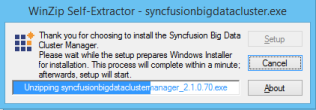
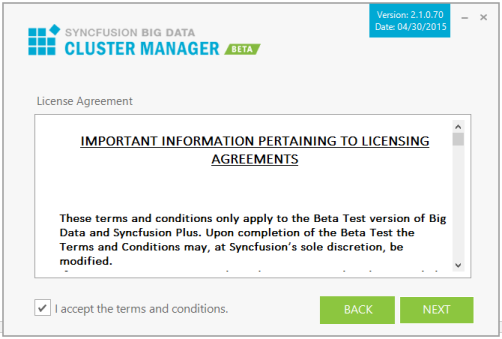
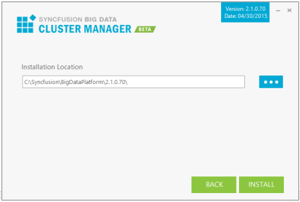
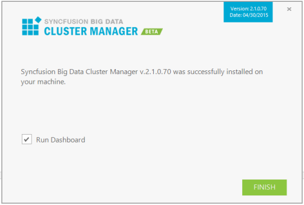
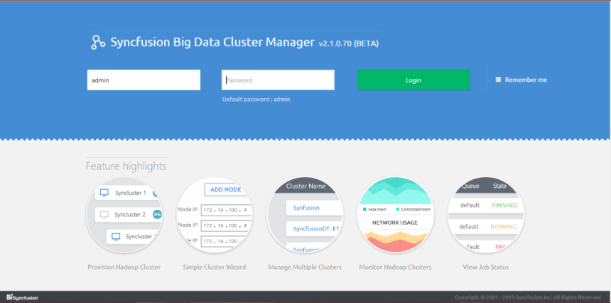

# Big Data Cluster Manager

## Overview

Syncfusion Big Data Cluster Manager is a web application that allows you to create, manage, and monitor multiple Hadoop clusters in minutes using commodity machines that have the most recent versions of Windows (Windows 7, Windows Server 2008, and later 64bit OS).

## Step-by-Step Installation

Follow the given steps to install the Big Data Cluster Manager Platform Setup.

1. Double-click the Syncfusion Big Data Cluster Manager Platform Installer Setup file. The Syncfusion Big Data Cluster Manager Installer Wizard opens.

   

   N> The WinZip Self-Extractor extracts the syncfusionbigdataclustermanager_(version).exe dialog, displaying the unzip operation of the package.

   

2. Click Next.
   
   

3.  After reading the terms, click the I accept the terms and conditions check box.

4. Click Next.

   

5. To install it in the displayed default location, click Install.

   

   N> The Completed screen is displayed once the Big Data Custer Manager Platform setup is installed.

   

7. Select the Run Dashboard check box to launch the Dashboard after installing.

8. Click Finish. Big Data Cluster Manager is installed in your system and the Syncfusion Big Data Cluster Manager Dashboard is launched automatically.

## Command Line 

Syncfusion Big Data ClusterManager supports installing the setup through Command Line Install and Uninstall. The following sections illustrate these options. 

### Command Line Installation

Follow the given steps to install through Command Line in Silent mode.

1. Double-click the Syncfusion Big Data ClusterManagerSetup file. The Self-ExtractorWizard opens and extracts the package automatically.
2. The SyncfusionBigDataClusterManager_(version).exe file is extracted into the Temp folder. 
3. Run %temp%. The Temp folder opens. The SyncfusionBigDataClusterManager_(version).exe file is available in one of the folders.
4. Copy the SyncfusionBigDataClusterManager_(version).exe file in local drive. Example: D:\temp
5. Cancel the wizard.
6. Open Command Prompt in the Administrator mode and pass the following arguments:

   “Setup file path\SyncfusionBigDataClusterManager_(version).exe” /log “{Log file path}” /Install silent /InstallPath:{Location to install}

   Example: “D:\Temp\SyncfusionBigDataClusterManager_2.1.0.70.exe” /log “C:\Temp\BigDataClusterManager.log” /Install silent /InstallPath:C:\Syncfusion\x.x.x.x

7. Setup is installed.

   N> x.x.x.x needs to be replaced with the Big Data version installed on your machine.
   
### Command Line Uninstallation

Syncfusion Big Data ClusterManager supports uninstalling the setup through Command Line in Silent mode. The following steps help you uninstall the setup. 

1. When you do not have the extracted setup (SyncfusionBigDataClusterManager_(version).exe) follow the steps from 2 to 7.
1.  Double-click the Syncfusion Big Data Cluster Manager Setup file. The Self-ExtractorWizard opens and extracts the package automatically.
2.  The SyncfusionBigDataClusterManager_(version).exe file gets extracted into the Temp folder.
3. Run %temp%. The Temp folder opens. The SyncfusionBigDataClusterManager_(version).exe file is available in one of the folders.
4. Copy the SyncfusionBigDataClusterManager_(version).exe file in the local drive. Example: D:\temp
5. Cancel the wizard.
6. Open the Command Prompt in the Administrator mode and pass the following arguments: 

    “Setup file path\SyncfusionBigDataClusterManager_(version).exe” /uninstall silent

    Example: “D:\Temp\SyncfusionBigDataClusterManager_2.1.0.70.exe" /uninstall silent

7. Setup is uninstalled.

## Dashboard

This section provides details on the structure and composition of the Syncfusion Big Data Cluster Manager dashboard. It also elaborates on navigating the dashboard to access various utilities and product samples.

### Big Data Cluster Manager:

Click any of the following to know more about the selected product.

* Cluster Manager – To access the Cluster Manager.
* Change Admin Password – To change the password of the Cluster Manager.
* User Guide – To view the User Guide on the Big Data platform.
* License Agreement – To view the user’s license information.
* Release Notes - To view the “Release Notes” content.
* ReadMe - To view the “ReadMe” content.
* Recheck – Torecheck the prerequisites list and refresh the currently installed software list.

### Big Data Cluster Manager Studio

### Change Admin Password

#### Other Information:

Other information available in the dashboard includes:

* Message- This section allows you to view the installed version of the Big Data Cluster Manager.

  

* [Contact Sales](http://www.syncfusion.com/downloads/bigdata/confirmation) – Clicking this link takes you to the Big Data platform’s Downloads page.
* [Contact Support](http://www.syncfusion.com/Account/Logon?ReturnUrl=%2fsupport%2fdirecttrac) - Clicking this link directs you to the Direct-Trac Login page, to contact the Support Team.
