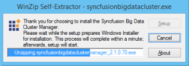
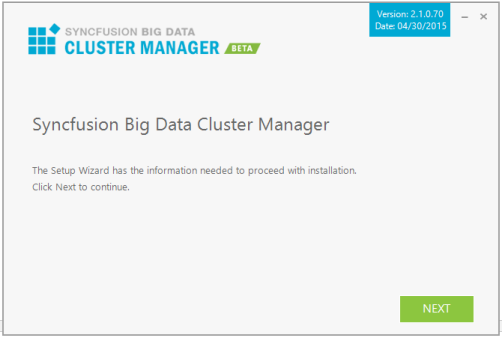
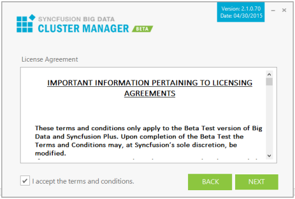
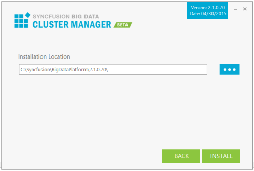
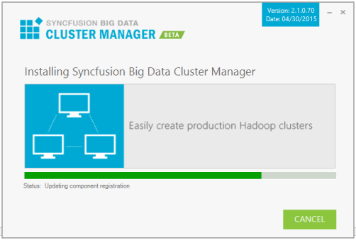
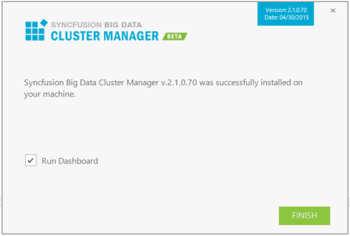

# Step-by-Step Installation

Follow the given steps to install the Big Data Cluster Manager Platform Setup.

1. Double-click the Syncfusion Big Data Cluster Manager Platform Installer Setup file. The Syncfusion Big Data Cluster Manager Installer Wizard opens.

   

   > Note: The WinZip Self-Extractor extracts the syncfusionbigdataclustermanager_(version).exe dialog, displaying the unzip operation of the package._ 

   

2. Click Next. 

   

3. After reading the terms, click the I accept the terms and conditions check box.

4. Click Next.

   

1. To install it in the displayed default location, click Install.

   

   > Note: The Completed screen is displayed once the Big Data Custer Manager Platform setup is installed.

   

7. Select the Run Dashboard check box to launch the Dashboard after installing.
8. Click Finish. Big Data Cluster Manager is installed in your system and the Syncfusion Big Data Cluster Manager Dashboard is launched automatically.