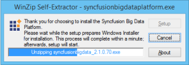
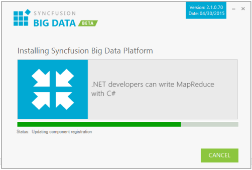
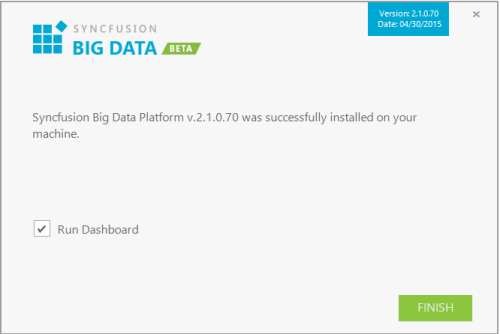
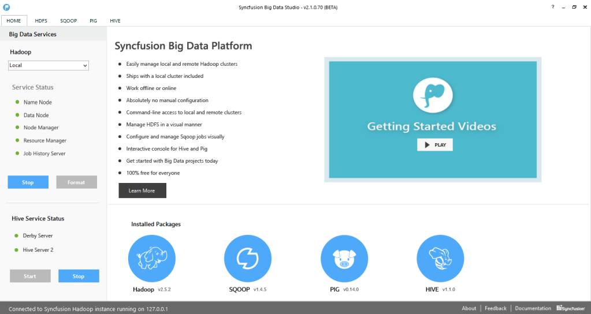
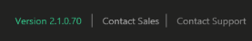

# Big Data SDK

## Overview

Syncfusion Big Data SDK is a tool that allows you to process large datasets using Hadoop in a much simpler and more user-friendly way in Windows. It reduces the burden of setting up the Hadoop environment manually in Windows.

## Step-by-Step Installation

The following are the steps to install the Big Data SDK Setup.

1. Double-click the Syncfusion Big Data SDK Setup file. The Syncfusion Big Data SDK Installer Wizard opens.

   
   
   N> The WinZip Self-Extractor extracts the syncfusionbigdata_(version).exe dialog, displaying the unzip operation of the package. 

   

2. Click Next.

   

3. After reading the terms, click the I accept the terms and conditions check box.

4. Click Next.

   

9. To install it in the displayed default location, click Install.

   

   N> The Completed screen is displayed after the Big Data SDK platform is installed.

   

7. Select the Run Dashboard check box to launch the Dashboard after installing.

8. Click Finish. Big Data is installed in your system and Syncfusion Big Data Dashboard is launched automatically.

## Command Line 

Syncfusion Big Data supports installing the setup through Command Line Install and Uninstall. The following sections illustrate these options. 

### Command Line Installation

Follow the given steps to install through Command Line in Silent mode.

1. Double-click the Syncfusion Big Data SDK Setup file. The Self-ExtractorWizard opens and extracts the package automatically.
2. The SyncfusionBigData_(version).exe file is extracted into the Temp folder. 
3. Run %temp%. The Temp folder opens. The SyncfusionBigData_(version).exe file is available in one of the folders.
4. Copy the SyncfusionBigData_(version).exe file to a local drive. Example: D:\temp
5. Cancel the wizard.
6. Open Command Prompt in Administrator mode and pass the following arguments:

   “Setup file path\SyncfusionBigData_(version).exe” /log “{Log file path}” /Install silent /InstallPath:{Location to install}

    Example: “D:\Temp\SyncfusionBigData_2.1.0.70.exe” /log “C:\Temp\BigData.log” /Install silent /InstallPath:C:\Syncfusion\x.x.x.x

7. Setup is installed.
   
   N> x.x.x.x needs to be replaced with the Big Data version installed on your machine.
   

### Command Line Uninstallation

Syncfusion Big Data supports uninstalling the setup through Command Line in Silent mode. The following steps help you uninstall the setup. 

1. When you do not have the extracted setup (SyncfusionBigData_(version).exe), follow the steps from 2 to 7.
2. Double-click the Syncfusion Big Data Setup file. The Self-ExtractorWizard opens and extracts the package automatically.
3. The SyncfusionBigData_(version).exe file gets extracted into the Temp folder.
4. Run %temp%. The Temp folder opens. The SyncfusionBigData_(version).exe file is available in one of the folders.
5. Copy the SyncfusionBigData_(version).exe file in local drive. Example: D:\temp
6. Cancel the wizard.
7. Open the Command Prompt in Administrator mode and pass the following arguments: 

   “Setup file path\SyncfusionBigData_(version).exe” /uninstall silent

   Example: “D:\Temp\SyncfusionBigData_2.1.0.70.exe" /uninstall silent

8. Setup is uninstalled.

## Dashboard

This section provides details on the structure and composition of the Syncfusion Big Data dashboard. It also elaborates on navigating the dashboard to access various utilities and product samples.

### Big Data Studio and its Samples:

Syncfusion provides lots of online and local samples for better understanding of the platform. You can access them using the following options.  

* Big Data Studio – To access the Big Data Management Studio application.
* Service Manager – To run the Hadoop Service Manager.
* C# Map Reduce Samples – To run C# Map Reduce sample browser.
* Java Map Reduce Samples – To run the Java Map Reduce samples.
* Pig Samples – To run the Pig samples.
* Hive Samples – To run the Hive samples.
* WPF, Windows, MVC, Web Samples – To run the Hive local samples.
* Online Samples – To view the Online Samples.
* User Guide – To view the User Guide about the Big Data platform.
* License Agreement – To view the License Agreement.
* Release Notes - To view the “Release Notes” content.
* ReadMe - To view the “ReadMe” content.
* Recheck – Torecheck the prerequisites list and refresh the currently installed software list.

### Big Data Studio

### Service Manager

### C# MapReduce Samples

#### Hive Samples:

#### WPF Samples:

#### Windows Forms Samples:

#### MVC Samples: 

#### Web Forms Samples: 

#### Other Information:

Other information available in the dashboard includes:

* Message- This section allows you to view the installed version of the Big Data Platform.

  

* [Contact Sales](http://www.syncfusion.com/downloads/bigdata/confirmation) – Clicking this link takes you to the Big Data platform’s Downloads page.

* [Contact Support](http://www.syncfusion.com/Account/Logon?ReturnUrl=%2fsupport%2fdirecttrac) - Clicking this link directs you to the Direct-Trac Login page to contact the Support Team.
