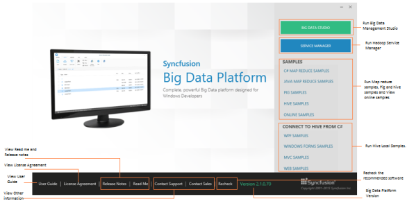

### Dashboard

This section provides details on the structure and composition of the Syncfusion Big Data dashboard. It also elaborates on navigating the dashboard to access various utilities and product samples.

{:.image }

Big Data Studio and its Samples:

Syncfusion provides lots of online and local samples for better understanding of the platform. You can access them using the following options.  

* Big Data Studio – To access the Big Data Management Studio application.
* Service Manager – To run the Hadoop Service Manager.
* C# Map Reduce Samples – To run C# Map Reduce sample browser.
* Java Map Reduce Samples – To run the Java Map Reduce samples.
* Pig Samples – To run the Pig samples.
* Hive Samples – To run the Hive samples.
* WPF, Windows, MVC, Web Samples – To run the Hive local samples.
* Online Samples – To view the Online Samples.
* User Guide – To view the User Guide about the Big Data platform.
* License Agreement – To view the License Agreement.
* Release Notes - To view the “Release Notes” content.
* ReadMe - To view the “ReadMe” content.
* Recheck – Torecheck the prerequisites list and refresh the currently installed software list.
