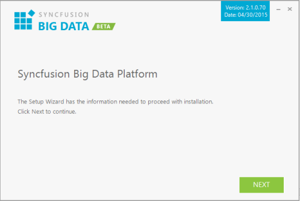
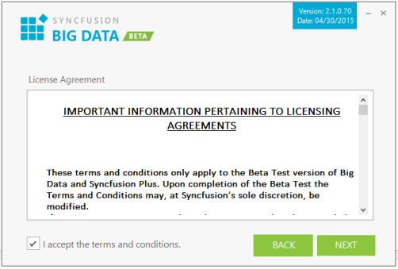
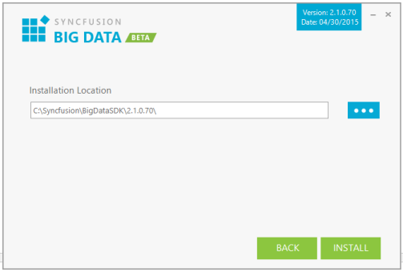

### Step-by-Step Installation

The following are the steps to install the Big Data SDK Setup.

1. Double-click the Syncfusion Big Data SDK Setup file. The Syncfusion Big Data SDK Installer Wizard opens.
   
   
   
   _Note: The WinZip Self-Extractor extracts the syncfusionbigdata_(version).exe dialog, displaying the unzip operation of the package._ 
   
   

2. Click Next.

   

3. After reading the terms, click the I accept the terms and conditions check box.
4. Click Next.
   
   

5. To install it in the displayed default location, click Install.
   
   

   _Note: The Completed screen is displayed after the Big Data SDK platform is installed._

   

6. Select the Run Dashboard check box to launch the Dashboard after installing.
7. Click Finish. Big Data is installed in your system and Syncfusion Big Data Dashboard is launched automatically.
