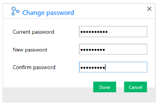

### Change Admin Password

{:.image }

Other Information:

Other information available in the dashboard includes:

* Message- This section allows you to view the installed version of the Big Data Cluster Manager.

{:.image }

* [Contact Sales](http://www.syncfusion.com/downloads/bigdata/confirmation) – Clicking this link takes you to the Big Data platform’s Downloads page.
* [Contact Support](http://www.syncfusion.com/Account/Logon?ReturnUrl=%2fsupport%2fdirecttrac) - Clicking this link directs you to the Direct-Trac Login page, to contact the Support Team.
