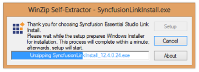
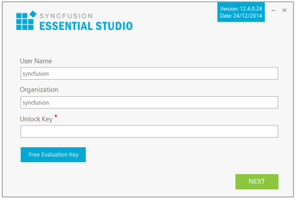
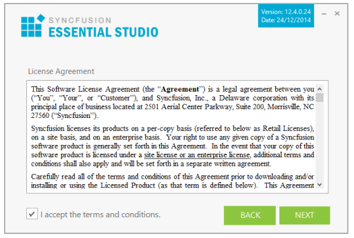
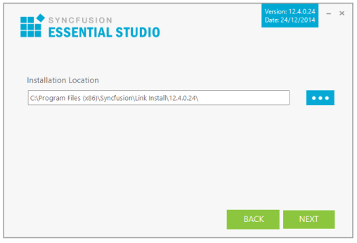
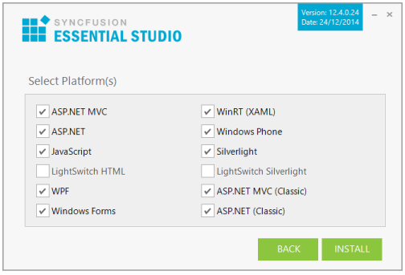
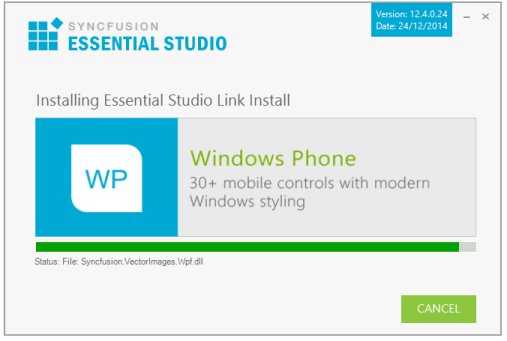
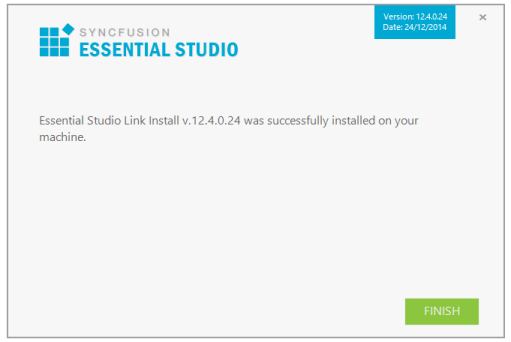

### Link Install Setup

Syncfusion provides the Link Install Setup to configure the Syncfusion controls in a build machine, in which Syncfusion Essential Studio is not installed. This installs Essential Studio assemblies into the target folder. It also registers the product key to enable you to compile a project developed on a build machine. 

Installing Link Install Setup

The following procedure illustrates how to install Link Install setup.

1. Double-click the Syncfusion Link Install Setup file. The Self-ExtractorWizard opens and extracts the package automatically.

{:.image }

2. Once the unzip operation is complete, the User Information screen opens.

{:.image }

3. Enter your User Name, Organization and Unlock Key in the corresponding text boxes provided.
4. Click Next to continue with installation. The License Agreement screen opens.

{:.image }

5. After reading the License Agreement, select the I accept the terms and conditions check box.
6. Click Next. The Installation Location screen opens.

{:.image }

7. To install in the displayed default location, click Next.
> 

{:.image }
_Note: Click Browse to choose a location for installing the Essential Studio assemblies._

8. The Select Platform screen opens. Select the required platforms to install the assemblies.

{:.image }

9. Click Next to continue with the installation.

{:.image }

> 
{:.image }
_Note: The Completed screen is displayed once the selected package is installed._

{:.image }

10. Click Finish to exit the Setup Wizard. Essential Studio Assemblies are installed.
