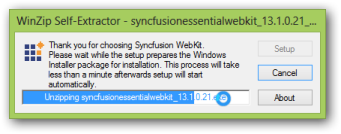
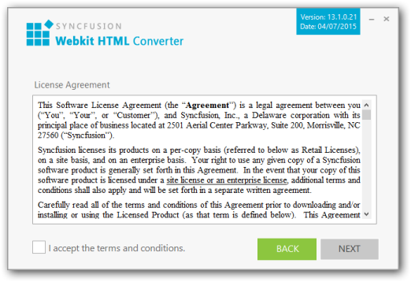
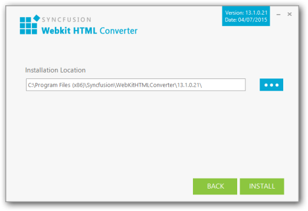
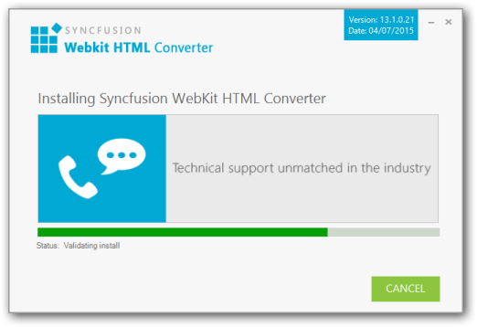
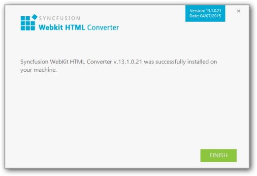

#### Step-by-Step Installation

The following are the steps to install the WebKit Setup.

1. Double-click the Syncfusion WebKit Installer Setup file. The Syncfusion WebKit Installer Wizard opens.
   
   
   
   _Note: The WinZip Self-Extractor extracts the syncfusionessentialWebKit_(version).exe dialog, displaying the unzip operation of the package._ 
   
   
   
   _Figure 100__: Welcome dialog_
   
   _Note: No key is required for Syncfusion WebKit Installer._

2. Click Next.

   
   

3. After reading the terms, click the I accept the terms and conditions check box.
4. Click Next.
   
   
   
   _Note: You can also browse and choose a location by clicking Browse._

5. To install in the displayed default location, click Install.

   
   
   _Note: The Completed screen is displayed once the WebKit is installed._

   

6. Click Finish. WebKit is installed in your system.

