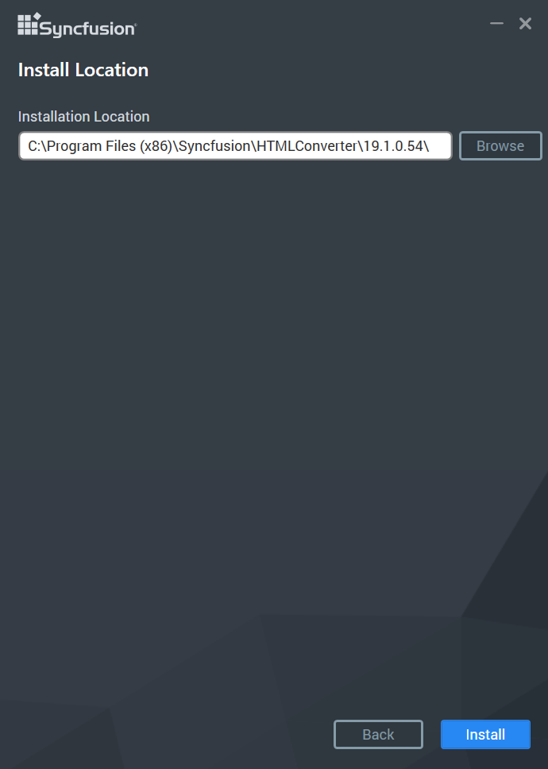
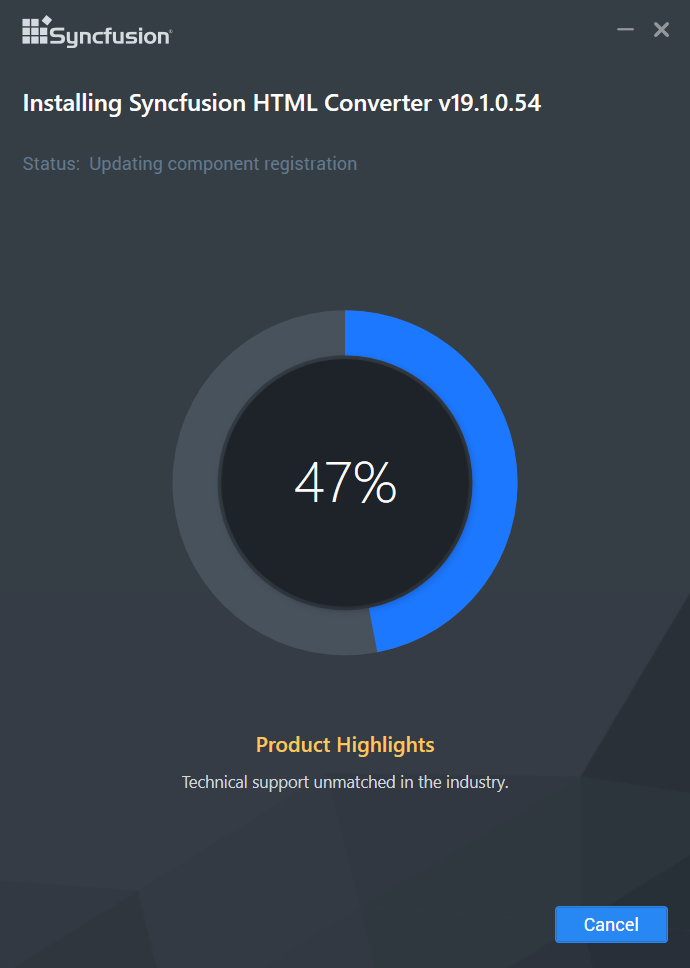
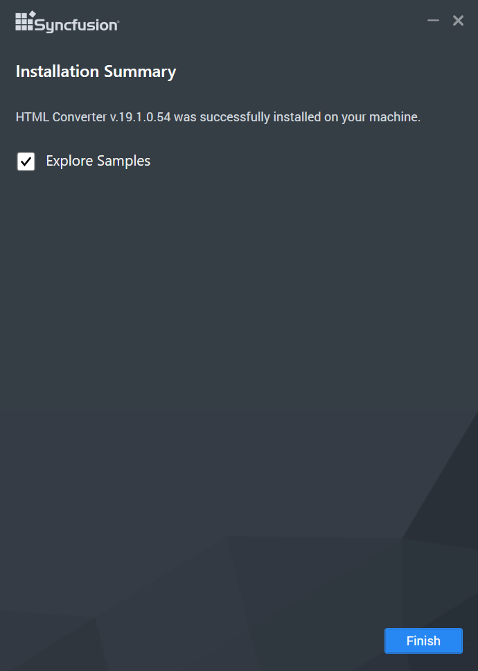

# Add-On

## Link Install Setup

Syncfusion provides the Link Install Setup to configure the Syncfusion controls in a build machine, in which Syncfusion Essential Studio is not installed. This installs Essential Studio assemblies into the target folder. It also registers the product key to enable you to compile a project developed on a build machine. 

### Installing Link Install Setup

The following procedure illustrates how to install Link Install setup.

1.  Double-click the Syncfusion Link Install Setup file. The Self-ExtractorWizard opens and extracts the package automatically.

    

2.  Once the unzip operation is complete, the User Information screen opens.

    

3.  Enter your User Name, Organization and Unlock Key in the corresponding text boxes provided.

4.  Click Next to continue with installation. The License Agreement screen opens.

    

5.  After reading the License Agreement, select the I accept the terms and conditions check box.

6.  Click Next. The Installation Location screen opens.

    

7.  To install in the displayed default location, click Next.
   
    N> Click Browse to choose a location for installing the Essential Studio assemblies.

8.  The Select Platform screen opens. Select the required platforms to install the assemblies.

    
   
9.  Click Next to continue with the installation.

    

    N> The Completed screen is displayed once the selected package is installed.
    
    

10. Click Finish to exit the Setup Wizard. Essential Studio Assemblies are installed.

## Digitally Signed Assemblies Setup

Syncfusion provides Digitally Signed Assemblies Setup. It signs the Syncfusion assemblies with a .pfx file. 

The following steps illustrate how to install Digitally Signed Assemblies Setup.

1.  Double-click the Syncfusion Digitally Signed Setup file. The Self-ExtractorWizard opens and extracts the package automatically. 
   
    

2.  Once the unzip operation is complete, Syncfusion Essential Studio Digitally Signed Assemblies Setup screen opens.

    

3.  Click Next. The User Information screen opens.

    

4.  Enter your User Name, Organization and Unlock Key in the corresponding text boxes provided.

5.  Click Next.

    N> The Unlock Key is validated and the Welcome screen opens.
	
    
	
6.  Click Next to continue with installation. The License Agreement screen opens.

    

7.  On accepting the terms, click the I accept the terms in the License Agreement option.

8.  Click Next. The Select the Installation Folder screen opens.

    

    N> You can also browse to choose a location by clicking Browse.

9.  Click Next. The Setup Type screen opens.

    

10. Select the preferred setup type. To install the complete setup, click Complete.

    

11. Click Install to continue with the installation.

    

    N> The Completed screen is displayed once the selected package is installed.

    

12. Click Finish to exit the Setup Wizard. Assemblies will be installed.

## QTP Add-on

Syncfusion supports Quick Test Professional software with the help of Essential Test Studio, termed as QTP add-on, specially designed to meet the requirements of professionals who need to test your controls. Essential Test Studio contains Custom Libraries that helps Quick Test Professional record and replay the scripts of the application containing the Syncfusion controls. These custom libraries are built with the help of Quick Test Professional .NET Add-in extensibility. For more details, refer to Mercury Quick Test Professional Help.  

 Essential Test Studio supports the following Windows-based controls. 

### Essential Grid

* Grid control
* Grid Grouping control
* GridDataBoundGrid control
* Grid List control
* TabBar Splitter control

### Essential Tools

* Docking Package
* Menus Package
* Command Bars Package
* Tree Package
* Editors Package
* Tabs Package
* Navigation Package
* Notification Package

 N> You need to install Syncfusion Essential Studio of the same version and Mercury QuickTestProfessional, before installing this add-on.

## CAB Add-on

The Syncfusion Essential CAB Enabling Kit provides extensible support for working with CAB easily. It helps developers enhance the look and feel of their applications, as well as speed up the development process with customizable UIs. The workspaces are components or controls that encapsulate visual effects and layout strategies without affecting the business logic. 

The Essential CAB Enabling Kit offers the following workspaces and UI Elements.

### Workspaces

* Dockable Workspace
* DockingClientPanel Workspace
* GroupBar Workspace
* PopupControlContainer Workspace
* SplashPanel Workspace
* SplitContainerAdv Workspace
* TabControlAdv Workspace
* TabbedMDIManagerWorkspace
* XPTaskPane workspace

### UIElements 

* XP Menus
* TreeViewAdv
* StatusBarAdv
* StatusStripEx
* ContextMenuStripEx
* RibbonControlAdv
* XPTaskBar

### Pre-Requisites 

* Visual Studio 2005/2008
* Microsoft Composite UI Application Block Framework
* Syncfusion Essential Studio (Essential Tools – Windows Forms)

### Framework Support

Essential CAB setup supports Visual Studio framework versions V2.0, V3.5, V4.0, V4.5, and V4.5.1.

## WebKit

Syncfusion introduces WebKit HTML converter from the version 13.1.0.21 of Essential Studio that supports HTML to PDF conversion by using the WebKit rendering engine. This converter works on both x86 and x64 environments and can be easily integrated into any application on .NET platforms such as Windows Forms, WPF, ASP.NET, and ASP. NET MVC to convert URLs, HTML string, images, and SVG to PDF.

### Step-by-Step Installation

The following are the steps to install the WebKit Setup.

1. Double-click the Syncfusion WebKit Installer Setup file. The Syncfusion WebKit Installer Wizard opens.

   

   N> The WinZip Self-Extractor extracts the syncfusionessentialWebKit_(version).exe dialog, displaying the unzip operation of the package.

   

   

   N> No key is required for Syncfusion WebKit Installer.

2. Click Next.

   

3. After reading the terms, click the I accept the terms and conditions check box.

4. Click Next.

   

   N> You can also browse and choose a location by clicking Browse.

4. To install in the displayed default location, click Install.

   
   
   N> The Completed screen is displayed once the WebKit is installed.
   
   

5. Click Finish. WebKit is installed in your system.

### Command Line 

The Syncfusion WebKit Installer supports installing the setup through Command Line Install and Uninstall. The following sections illustrate this ability. 

#### Command Line Installation

Follow the given steps to install through Command Line in Silent mode.

1. Double-click the Syncfusion WebKit Installer Setup file. The Self-ExtractorWizard opens and extracts the package automatically.
2. The syncfusionessentialwebkit _(version).exe file is extracted into the Temp folder. 
3. Run %temp%. The Temp folder opens. The syncfusionessentialwebkit _(version).exe file is available in one of the folders.
4. Copy the syncfusionessentialwebkit _(version).exe file in local drive. Example: D:\temp
5. Cancel the wizard.
6. Open Command Prompt in administrator mode and pass the following arguments:

   “Setup file path\syncfusionessentialwebkit _(version).exe” /Install silent [/log “{Log file path}”] [/InstallPath:{Location to install}]

   N> [..] – Arguments inside the square brackets are optional.

   Example: “D:\Temp\syncfusionessentialwebkit _13.2.0.30.exe” /Install silent /log “C:\Temp\EssentialWebkit.log” /InstallPath:C:\Syncfusion\x.x.x.x 

7. Setup is installed.
    
	N> * x.x.x.x needs to be replaced with the WebKit version installed on your machine.* Above steps applicable from the version 13.2.0.x.
   
#### Command Line Uninstallation

Syncfusion WebKit Installer supports uninstalling the setup through Command Line inSilent mode. The following steps help you uninstall the setup. 

1. When you do not have the extracted setup (syncfusionessentialwebkit _(version).exe) then follow the steps from 2 to 7.
2. Double-click the Syncfusion Essential Studio Setup file. The Self-ExtractorWizard opens and extracts the package automatically.
3. The syncfusionessentialwebkit _(version).exe file gets extracted into the Temp folder.
4. Run %temp%. The Temp folder opens. The syncfusionessentialwebkit _(version).exe file is available in one of the folders.
5. Copy the syncfusionessentialwebkit _(version).exe file in local drive. Example: D:\temp
6. Cancel the wizard.
7. Open the Command Prompt in administrator mode and pass the following arguments: 

   “Setup file path\ syncfusionessentialwebkit _(version).exe” /uninstall silent 

    Example: “D:\Temp\ syncfusionessentialwebkit _13.2.0.30.exe" /uninstall silent

8. Setup is uninstalled.
    
	N> * x.x.x.x need to be replaced with the Webkit version installed in your machine.* Above steps applicable from the version 13.2.0.x.