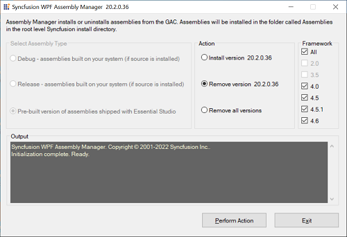

# Patches

Syncfusion provides patch setup for major version or service pack version, either to add new features or to fix issues. You have to install the patches in the order you have received.

## Installing a Patch Setup

The following procedure illustrates how to install a patch.

I> Before installing the patch, ensure that corresponding Essential Studio version or platforms setup has been installed in your machine.

1. Double-click the Syncfusion Essential Studio patch setup file. The Syncfusion Essential Studio Service Pack opens.
   
   

2. Click Next. The Assembly Manager screen opens.
   
   

3. Select the Run Assembly Manager check box to install the assemblies in GAC.

4. Click Next. The Ready To Install screen opens.
   
   

5. Click Install to continue installing.
   
   

   N> The patch is installed on your computer, and a dialog box appears when the installation is complete.

    

6. Click Finish. 

   The new assemblies are placed in the Pre-Compiled Assemblies folder. These new assemblies can be referenced in your project.
   
   
## Patch Assembly Version Format
   
In the patch assembly, the **File Version** and **Product Version** will be different. Product Version will be the release version and File Version will be the increment of the release version's **revision** number. For each patch, the File Version will be a different one. You can differentiate between the build and patch assemblies by File Version. 
   
**File Version of the assembly shipped in build:**
   

   
**File Version of the assembly shipped in patch:**
   

   
## Command Line Installation

The patch can also be installed through Command Line. Follow the given steps to run the Patch Installer via Command Line. 

1. Open Command Prompt with administrative privileges, that is, in the Admin mode.
2. Navigate to the patch file’s location and pass the following argument:
   
   **Argument:** {patchsetup.exe} [/silent or /verysilent]

   **Example:**
   SyncfusionPatch_12.4.0.24_234640_5192015083205629_139538.exe /verysilent  
   SyncfusionPatch_12.4.0.24_234640_5192015083205629_139538.exe /silent         
   
   
   
  
    N> /silent – Displays the progress dialog alone during the patch setup installation.
	/verysilent – It will be installed in background.

## Reverting a Patch

The Patch installation takes a backup of the Release Assemblies and stores them in the Backup Assemblies folder. The patch assemblies are also stored in the Patch folder. You can revert back when needed. 

**Reverting back to Release Assemblies:** 

The following steps help you revert to the Release Assemblies. 

1. Copy the Release Assemblies from the Backup Assemblies folder.
2. Paste them in the precompiledassemblies folder.
3. Open Syncfusion Control Panel > Utilities > Assembly Manager.

   

4. Select the Remove allversions radio button.
5. Click Perform Action. All versions are removed.
6. Select Install version x.x.x.x.

   N> x.x.x.x has to be replaced with the corresponding Essential Studio Version.

7. Click Perform Action. The assemblies for that specific version are configured in your machine.

   N> You can also revert to specific patch assemblies by copying the patch assemblies from the Patch folder and adding them in the precompiledassemblies folder.

