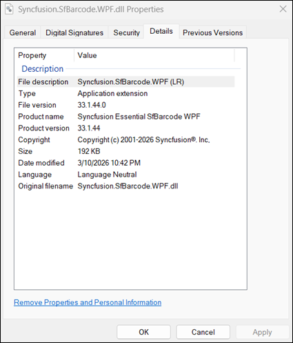
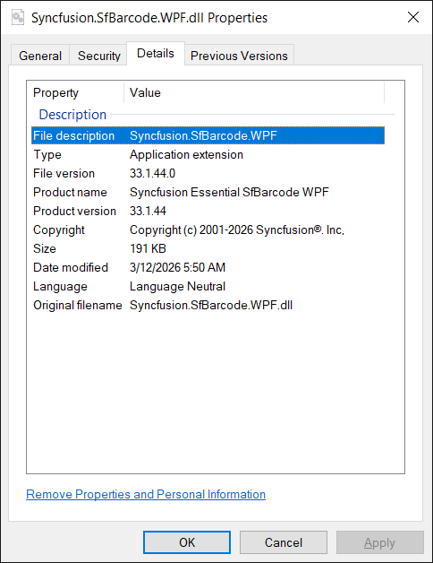

# Assembly Information

## Assembly Description

We have two types of assembly descriptions to distinguish between trial and licensed assemblies.

### Trial Installer

In the trial installer, License Enforced Syncfusion&reg; assemblies will be shipped and this information will be present in the File Description as **License Required (LR).**

**Example:** Syncfusion.SfBarcode.WPF (LR)

### Licensed Installer

In the License installer, licensed Syncfusion&reg; assemblies will be shipped and **LR** information will not be shown in the File description.

**Example:** Syncfusion.SfBarcode.WPF

## Assembly Version Format

The assembly version format differs for each of the Essential Studio&reg; platform. Refer the following table for the assembly version’s format for ASP.NET MVC (Essential&reg; JS 2), WPF, Windows Forms, UWP, WinUI, .NET MAUI and Xamarin platforms.

<table>
<tr>
<td>
<b>Platforms/Frameworks</b></td><td>
<b>4.6.2</b></td><td>
<b>net 8.0</b></td><td>
<b>net 9.0</b></td><td>
<b>net 10.0</b></td><td>
<b>uap10.0</b></td></tr>
<tr>
<td>
<b>.NET MAUI</b></td><td>
NA</td><td>
NA</td><td>
31.1.x</td><td>
31.1.x</td><td>
NA</td></tr>
<tr>
<td>
<b>WinUI</b></td><td>
NA</td><td>
23.1.x</td><td>
31.1.x</td><td>
31.1.x</td><td>
21.1.x</td></tr>
<tr>
<td>
<b>Windows Forms</b></td><td>
21.1462.x</td><td>
23.1.x</td><td>
31.1.x</td><td>
31.1.x</td><td>
NA</td></tr>
<tr>
<td>
<b>WPF</b></td><td>
21.1462.x</td><td>
23.1.x</td><td>
31.1.x</td><td>
31.1.x</td><td>
NA</td></tr>
<tr>
<td>
<b>UWP</b></td><td>
21.1.x</td><td>
NA</td><td>
NA</td><td>
NA</td><td>
NA</td></tr>
<tr>
<td>
<b>ASP.NET MVC (Essential&reg; JS 2)</b></td><td>
NA</td><td>
23.1.x</td><td>
31.1.x</td><td>
31.1.x</td><td>
NA</td></tr>
</table>

**For .NET Standard Frameworks:**

<table>
<tr>
<td>
<b>netstandard 1.2</b></td><td>
<b>netstandard 1.4</b></td><td>
<b>netstandard 2.0</b></td></tr>
<tr>
<td>
21.1.x</td><td>
21.1.x</td><td>
21.1.x</td></tr>
</table>

The following Essential Studio&reg; platforms do not have assembly support.

* JavaScript (Essential&reg; JS 2)

## Supported Framework version for Essential Studio&reg; Assemblies

Following are the supported Framework versions of the Essential Studio&reg; assemblies

<table>
<tr>
<th>Essential Studio&reg; platform</th>
<th>Supported Framework version</th>
</tr>
<tr>
<td>.NET MAUI</td>
<td>.NET 9.0 and .NET 10.0</td>
</tr>
<tr>
<td>UWP</td>
<td>Target Platform version UAP 10.0.16299 and above</td>
</tr>
<tr>
<td>WinUI</td>
<td>Target Platform version UAP 10.0.17134 and above</td>
</tr>
<tr>
<td>WPF</td>
<td>.NET Framework 4.6.2, .NET 8.0, .NET 9.0 and .NET 10.0</td>
</tr>
<tr>
<td>Windows Forms</td>
<td>.NET Framework 4.6.2, .NET 8.0, .NET 9.0 and .NET 10.0</td>
</tr>
<tr>
<td>ASP.NET MVC (Essential&reg; JS 2)</td>
<td>MVC 4 and MVC 5</td>
</tr>
</table>