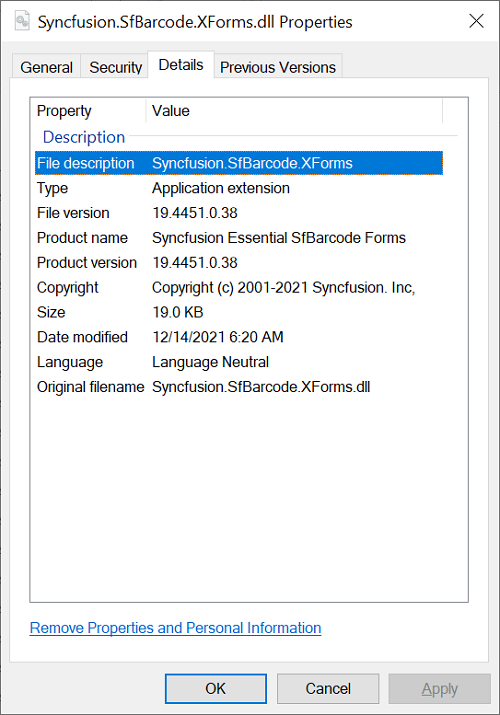

# Assembly Information

## Assembly Description

Starting with version 16.2.0.41 (2018 Vol 2), Syncfusion provides separate setup for License and Trial. In the trial setup, License Enforced Syncfusion assemblies will be shipped and this information will be present in the File Description as **License Required(LR)**.

**Example:** Syncfusion.SfBarcode.XForms(LR)

In the License setup, licensed Syncfusion assemblies will be shipped and **LR** information will not be shown in the File description.

**Example:** Syncfusion.SfBarcode.XForms

## Assembly Version Format

The assembly version format differs for each platform. Refer the following table for the assembly version’s format for ASP.NET, ASP.NET MVC (Essential JS 1), ASP.NET MVC (Essential JS 2), JavaScript (Essential JS 1), WPF, Windows Forms, UWP and Xamarin platforms.

<table>
<tr>
<td>
<b>Platforms/Frameworks</b></td><td>
<b>2.0</b></td><td>
<b>3.5</b></td><td>
<b>4.0</b></td><td>
<b>4.5</b></td><td>
<b>4.5.1</b></td><td>
<b>4.6</b></td></tr>
<tr>
<td>
<b>Windows Forms</b></td><td>
16.2200.0.x</td><td>
16.2350.0.x</td><td>
16.2400.0.x</td><td>
16.2450.0.x</td><td>
16.2451.0.x</td><td>
16.2460.0.x</td></tr>
<tr>
<td>
<b>WPF</b></td><td>
NA</td><td>
16.2350.0.x</td><td>
16.2400.0.X</td><td>
16.2450.0.X</td><td>
16.2451.0.X</td><td>
16.2460.0.x</td></tr>
<tr>
<td>
<b>UWP</b></td><td>
NA</td><td>
NA</td><td>
NA</td><td>
NA</td><td>
NA</td><td>
16.2460.0.x</td></tr>
<tr>
<td>
<b>Xamarin</b></td><td>
NA</td><td>
NA</td><td>
NA</td><td>
NA</td><td>
16.2451.0.x</td><td>
NA</td></tr>
<tr>
<td>
<b>ASP.NET MVC (Essential JS 2)</b></td><td>
NA</td><td>
NA</td><td>
MVC 4 - 16.2400.0.x</td><td>
MVC 5 - 16.2500.0.x</td><td>
NA</td><td>
NA</td></tr>
<tr>
<td>
<b>ASP.NET (Essential JS 1)</b></td><td>
NA</td><td>
16.2350.0.x</td><td>
16.2400.0.x</td><td>
16.2450.0.x</td><td>
16.2451.0.x</td><td>
16.2460.0.x</td></tr>
<tr>
<td>
<b>ASP.NET MVC (Essential JS 1)</b></td><td>
NA</td><td>
NA</td><td>
<li>MVC 3 - 16.2300.0.x</li><li>MVC 4 - 16.2400.0.x</li></td><td>
MVC 5 - 16.2500.0.x</td><td>
NA</td><td>
MVC 6 - 16.2600.0.x</td></tr>
<tr>
<td>
<b>JavaScript (Essential JS 1)</b></td><td>
NA</td><td>
16.2350.0.x</td><td>
16.2400.0.X</td><td>
16.2450.0.X</td><td>
16.2451.0.X</td><td>
16.2460.0.x</td></tr>
</table>

**For ASP.NET Core (Essential JS 1 and Essential JS 2):**

<table>
<tr>
<td>
<b>Platforms</b></td><td>
<b>netstandard 1.2</b></td><td>
<b>netstandard 1.4</b></td><td>
<b>netstandard 2.0</b></td></tr>
<tr>
<td>
<b>ASP.NET Core</b></td><td>
16.2120.0.x</td><td>
16.2140.0.x</td><td>
16.2200.0.x</td></tr>
</table>

The following Essential Studio platforms do not have assembly support.

* JavaScript (Essential JS 2)
* PHP (Essential JS 1)
* JSP (Essential JS 1)