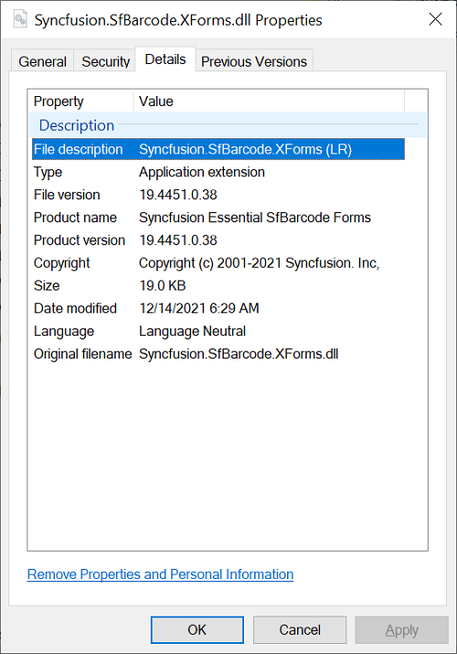

# Assembly Information

## Assembly Description

Starting with version 16.2.0.41 (2018 Vol 2), Syncfusion provides separate installer for Paying (Licensed installer) and Evaluation (Trial installer) customers. In the trial installer, License Enforced Syncfusion assemblies will be shipped and this information will be present in the File Description as **License Required (LR)**.

**Example:** Syncfusion.SfBarcode.XForms (LR)

In the License installer, licensed Syncfusion assemblies will be shipped and **LR** information will not be shown in the File description.

**Example:** Syncfusion.SfBarcode.XForms

## Assembly Version Format

The assembly version format differs for each platform. Refer the following table for the assembly version’s format for ASP.NET Web Forms, ASP.NET MVC (Essential JS 1), ASP.NET MVC (Essential JS 2), JavaScript (Essential JS 1), WPF, Windows Forms, UWP, WinUI and Xamarin platforms.

<table>
<tr>
<td>
<b>Platforms/Frameworks</b></td><td>
<b>2.0</b></td><td>
<b>3.5</b></td><td>
<b>4.0</b></td><td>
<b>4.5</b></td><td>
<b>4.5.1</b></td><td>
<b>4.6</b></td><td>
<b>netcoreapp3.1</b></td><td>
<b>net 5.0</b></td><td>
<b>uap10.0</b></td></tr>
<tr>
<td>
<b>WinUI</b></td><td>
NA</td><td>
NA</td><td>
NA</td><td>
NA</td><td>
NA</td><td>
NA</td><td>
NA</td><td>
NA</td><td>
18.3300.0.x</td></tr>
<tr>
<td>
<b>Windows Forms</b></td><td>
18.3200.0.x</td><td>
18.3350.0.x</td><td>
18.3400.0.x</td><td>
18.3450.0.x</td><td>
18.3451.0.x</td><td>
18.3460.0.x</td><td>
18.3310.0.x</td><td>
18.3500.0.x</td><td>
NA</td></tr>
<tr>
<td>
<b>WPF</b></td><td>
NA</td><td>
18.3350.0.x</td><td>
18.3400.0.X</td><td>
18.3450.0.X</td><td>
18.3451.0.X</td><td>
18.3460.0.x</td><td>
18.3310.0.x</td><td>
18.3500.0.x</td><td>
NA</td></tr>
<tr>
<td>
<b>UWP</b></td><td>
NA</td><td>
NA</td><td>
NA</td><td>
NA</td><td>
NA</td><td>
18.3460.0.x</td><td>
NA</td><td>
NA</td><td>
NA</td></tr>
<tr>
<td>
<b>Xamarin</b></td><td>
NA</td><td>
NA</td><td>
NA</td><td>
NA</td><td>
18.3451.0.x</td><td>
NA</td><td>
NA</td><td>
NA</td><td>
NA</td></tr>
<tr>
<td>
<b>ASP.NET MVC (Essential JS 2)</b></td><td>
NA</td><td>
NA</td><td>
MVC 4 - 18.3400.0.x</td><td>
MVC 5 - 18.3500.0.x</td><td>
NA</td><td>
NA</td><td>
NA</td><td>
NA</td><td>
NA</td></tr>
<tr>
<td>
<b>ASP.NET Web Forms (Essential JS 1)</b></td><td>
NA</td><td>
18.3350.0.x</td><td>
18.3400.0.x</td><td>
18.3450.0.x</td><td>
18.3451.0.x</td><td>
18.3460.0.x</td><td>
NA</td><td>
NA</td><td>
NA</td></tr>
<tr>
<td>
<b>ASP.NET MVC (Essential JS 1)</b></td><td>
NA</td><td>
NA</td><td>
<li>MVC 3 - 18.3300.0.x</li><li>MVC 4 - 18.3400.0.x</li></td><td>
MVC 5 - 18.3500.0.x</td><td>
NA</td><td>
NA</td><td>
NA</td><td>
NA</td><td>
NA</td></tr>
<tr>
<td>
<b>JavaScript (Essential JS 1)</b></td><td>
NA</td><td>
18.3350.0.x</td><td>
18.3400.0.X</td><td>
18.3450.0.X</td><td>
18.3451.0.X</td><td>
18.3460.0.X</td><td>
NA</td><td>
NA</td><td>
NA</td></tr>
</table>

**For .NET Standard Frameworks:**

<table>
<tr>
<td>
<b>netstandard 1.2</b></td><td>
<b>netstandard 1.4</b></td><td>
<b>netstandard 2.0</b></td></tr>
<tr>
<td>
18.3120.0.x</td><td>
18.3140.0.x</td><td>
18.3200.0.x</td></tr>
</table>

The following Essential Studio platforms do not have assembly support.

* JavaScript (Essential JS 2)
* PHP (Essential JS 1)
* JSP (Essential JS 1)

## Supported Framework version for Essential Studio Assemblies

Following are the supported Framework versions of the Essential Studio assemblies

<table>
<tr>
<th>Essential Studio platform</th>
<th>Supported Framework version</th>
</tr>
<tr>
<td>Xamarin</td>
<td>netstandard 2.0. Find the platform specific version {{'[here](https://help.syncfusion.com/xamarin/installation-and-upgrade/system-requirements#supported-platforms)'| markdownify }}</td>
</tr>
<tr>
<td>UWP</td>
<td>Target Platform version UAP 10.0.16299 and above</td>
</tr>
<tr>
<td>WinUI</td>
<td>Target Platform version UAP 10.0.16299 and above</td>
</tr>
<tr>
<td>WPF</td>
<td>.NET Framework 3.5 to 4.6, .NET Core 3.1 and .NET 5.0</td>
</tr>
<tr>
<td>Windows Forms</td>
<td>.NET Framework 2.0 to 4.6, .NET Core 3.1 and .NET 5.0</td>
</tr>
<tr>
<td>ASP.NET MVC (Essential JS 2)</td>
<td>MVC 4 and MVC 5</td>
</tr>
<tr>
<td>ASP.NET Web Forms</td>
<td>.NET Framework 3.5 to 4.6</td>
</tr>
<tr>
<td>ASP.NET MVC (Essential JS 1)</td>
<td>MVC 3, MVC 4 and MVC 5</td>
</tr>
<tr>
<td>ASP.NET Core (Essential JS 1)</td>
<td>netstandard 1.2 to 2.0 and netcoreapp 2.1 to 3.1</td>
</tr>
<tr>
<td>JavaScript (Essential JS 1)</td>
<td>.NET Framework 3.5 to 4.6</td>
</tr>
</table>