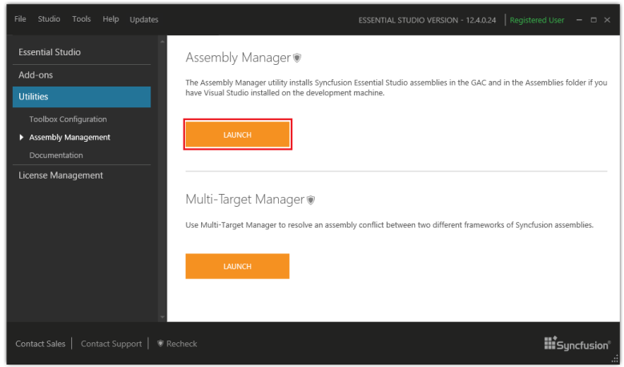
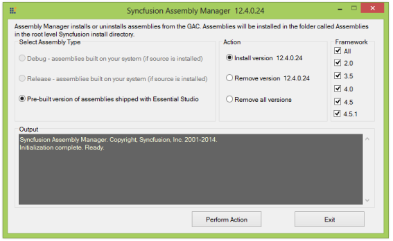
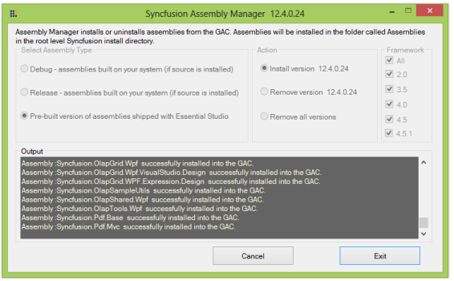
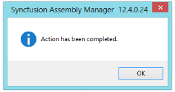
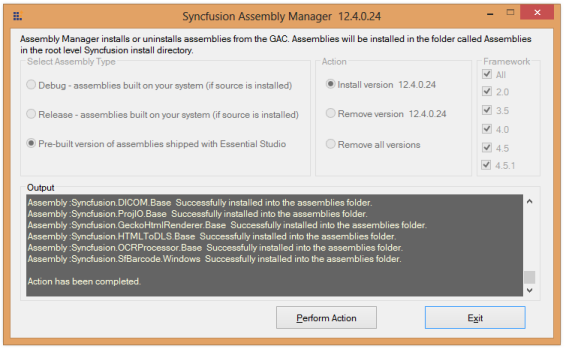

### Assembly Manager

The Assembly Manager is used to install and uninstall the assemblies, to and from the GAC and Public Assemblies folder under the installed location. It is used to install and uninstall the assemblies into the GAC.

Launching the Assembly Manager 

Use the following steps to run the Assembly Manager.

1. Open Syncfusion Dashboard.
1. Click Utilities > Assembly Management.
2. Click Launch button for Assembly Manager.

{:.image }

3. The Syncfusion Assembly Manager x.x.x.x window opens.

> 
{:.image }
 _Note: You can also open the Assembly Manager from the following location:_ 

> _(Installed location)\Syncfusion\Essential Studio\x.x.x.x\Utilities\Assembly Manager\AssemblyManagerWindows.exe_ 

{:.image }

4. Select the required option from Select Assembly Type.
* Pre-built Assemblies - These are the assemblies shipped with Essential Studio. Selecting this mode triggers the AssemblyManager to install the pre-built assemblies. 
* Debug and Release Assemblies - This mode triggers the AssemblyManager to install custom versions, built from the source code, using Build Manager. These assemblies can be used only when the source code for at least one of the Essential Studio products, has been installed. This triggers the AssemblyManager to install custom versions built from source code, installed on your machine. Applies only to versions of the product that come with the source code.
> 

{:.image }
_Note: The Build Manager application must be run to build, debug or release versions of the assemblies before the Assembly Manager can install the custom built assemblies._

> 

5. Select the required option for the Action sections.

Action

The AssemblyManager can install or uninstall assemblies. To perform this action, select the Install version x.x.x.x or Remove version x.x.x.x radio button. To remove all, select the Remove All Versions radio button.

> 
{:.image }
_Note: Remove All Versions must be used with caution in scenarios when one has applications depending on certain versions of the Syncfusion assemblies installed in the GAC. They may cease to function._

> 

6. Select the required option for Framework sections. 

Framework

The Framework group box comprises of checkboxes for the .NET framework versions based on the Visual Studio SDK installed in the machine. The following checkboxes are available:

* 4.5.1 - Selecting 4.5.1 ensures installation of 4.5.1 assemblies into the GAC and assemblies folder. In cases where only Visual Studio 2013 SDK is installed, the 4.5.1 assemblies have to be deployed.
* 4.5 - Selecting 4.5 ensures installation of 4.5 assemblies into the GAC and assemblies folder. In cases where only Visual Studio 2012 SDK is installed, the 4.5 assemblies have to be deployed.
* 4.0 - Selecting 4.0 ensures installation of 4.0 assemblies into the GAC and assemblies folder. In cases where only Visual Studio 2010 SDK is installed, the 4.0 assemblies have to be deployed.
* 3.5 - Selecting 3.5 ensures installation of 3.5 assemblies into the GAC and assemblies folder. In cases where only Visual Studio 2008 SDK is installed, the 3.5, 2.0 assemblies can be deployed.
* 2.0 - Selecting 2.0 ensures installation of 2.0 assemblies into the GAC and assemblies folder. In cases where only Visual Studio 2005 SDK is installed, the 2.0 assemblies have to be deployed.
* All – Selecting All ensures installation of all frameworks, or the frameworks installed in the machine, and assemblies into the GAC and assemblies folder.

> 
{:.image }
_Note: By default 2.0 is enabled in a system where Visual Studio 2008 SDK is installed._

7. Click Perform Action. It starts processing.

{:.image }

8. Once the action is completed, a confirmation message is displayed.

{:.image }

9. Click OK.

{:.image }

{:.image }
Important Note: In earlier versions, the Assembly Manager also served as Build Manager to build custom versions of the Syncfusion assemblies. Now, this function has been moved to a separate BuildManager utility. Installation of assemblies to the Visual Studio.NET toolbox is now handled by a separate utility called the ToolboxInstaller. The new Assembly Manager just handles installation of assemblies to the GAC and the assemblies’ folder; the Assemblies folder is applicable only when Visual Studio.NET is installed.

In previous versions, the Assembly Manager allowed switching to any version of the Syncfusion assemblies, installed on the system. This causes compatibility issues and also restricts the overall structure of the utility. To switch to another version from the current version, you must run the Assembly Manager of the respective version.It is preferable to have the Assembly Manager do a Remove All operation before it installs the latest assemblies. 

The console version of the Assembly Manager runs at the end of the installation process, to add the default, pre-built version of the Syncfusion assemblies to the Global Assembly Cache (GAC) and the Visual Studio .NET Public Assemblies folders. The need to run the Assembly Manager arises, only when changes have been made to the GAC, or when custom versions have been built for controls for debugging purposes.

> 
{:.image }
_Note: The version number in the tags have to be changed to the version you are linking it to._

Syncfusion Assemblies

The Syncfusion assemblies are installed in the following two locations: 

* Assemblies folder
* Global Assembly Cache (GAC)

The Assemblies folder

In the Assemblies folder, the assemblies are available in the following installation path:

 [System Drive]:\Program Files\Syncfusion\Essential Studio\x.x.x.x\Assemblies

> __
{:.image }
_Note:_

> _•The sub-folder 3.5 is used with .NET 3.5 and the sub-folder 2.0 is used with .NET 2.0. In most cases, [System Drive]:\ is C:\._

> _•In 2.0 and 3.5 GAC, the assemblies are available in the installation path [System Drive]:\WINDOWS\assembly._

> _•In 4.0, 4.5, and 4.5.1 GAC, the assemblies are available in the installation path [System Drive]:\WINDOWS\ Microsoft.NET\assembly\GAC_MSIL._

> 

Essential Studio ships the pre-built 2.0, 3.5, 4.0, 4.5, and 4.5.1 .NET Framework versions of the Syncfusion assemblies. These assemblies are located in the PreCompiledAssemblies folder.        

[System Drive]:\Program Files\Syncfusion\Essential Studio\x.x.x.x\PreCompiledAssemblies\x.x.x.x\2.0 

When you work with multiple target environments, you can see that each appropriate version is installed in the GAC, for true side-by-side use.

Working with Syncfusion assemblies that have been built and tested with specific .NET Framework versions, greatly increases the overall reliability. It also allows Syncfusion controls to take advantage of features that may be available in specific environments. For instance .NET 2.0 variants of the control offer features specific to the .NET 2.0 environment.

