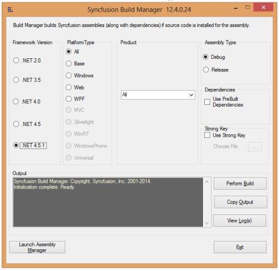

### Build Manager

Build Manager allows you to build or debug the assemblies using Syncfusion source code. 

Launching Build Manager 

The following steps help you launch the Build Manager. 

1. Open the Syncfusion Dashboard.
1. Click Utilities > Build Management.
2. Click the Launch button for Build Manager.
3. The Syncfusion Build Manager x.x.x.x window opens.

> 
{:.image }
_Note: Build Manager is available in the Dashboard only when Source code is installed. You can also launch the Build Manager from the following location: C:\Program Files\Syncfusion\Essential Studio\x.x.x.x\Utilities\Build Manager\buildmanagerwindows.exe_

{:.image }

4. Select the required setting in the Syncfusion Build Manager x.x.x.x window.

Build Manager Settings

This window contains seven sections. 

1. Framework Version 

The Framework Version group box has five options: .NET 2.0, .NET 3.5, .NET 4.0, .NET 4.5 and .NET 4.5.1. When Visual Studio 2013 is not installed in your system, the .NET 4.5 option is selected by default. When Visual Studio 2012 is not installed in your system, the .NET 4.0 option is selected by default. When Visual Studio 2010 is not installed in your system, .NET 3.5 option is selected by default. When Visual Studio 2008 is not installed in your system, .NET 2.0 option is selected by default. You can change the default option by clicking the Other button. The version of the .NET framework that the assemblies should be built with is specified here and is used automatically to rebuild the assemblies. 

2. Product

The Product group box has a drop-down list box. By default, All is selected. You can change the default option by selecting one of the products from the drop-down list box. 

3. Platform Type

Syncfusion products typically have a common base library that forms the basis for the Windows and Web variants. The library category to be built is specified using the Product Type. This frame has eight options. All is selected by default. You can click the required product's button to perform the build operation.

> 
{:.image }
_Note: For assemblies that are not built and pre-compiled, assemblies that ship with the product is automatically used._

4. Assembly Type

This frame has two options: Debug and Release. Debug is selected by default. To choose the Release mode for assembly, select Release.

You can switch between the Debug and Release mode of product configurations. Building the Debug version of the assemblies allows you to step into the Syncfusion assemblies when debugging applications. 

5. Dependencies

This enables you to specify whether the dependent assemblies of the product need to be used or not. When the Use Pre-Built Dependencies check box is selected, the dependent assemblies of the product under the selected product frame are taken from the Pre-Compiled Assemblies folder that exists under the installed location. Rebuilding assemblies can be restricted to specific assemblies, by enabling the pre-built dependencies. In that case, the other assemblies would be just precompiled variants, installed with the product. 

6. Strong Key

This enables you to install the compiled assemblies in GAC. Select the Use Strong Key check box and choose a .snk file to achieve this. 

7. Output

This frame shows the output, that is, the status of the build operation, in a text area. 

After selecting the required options in the above-mentioned frames, click Perform Build inside the output frame.

> 
{:.image }
_Note: The Build operation is performed and the status is updated in the text area, inside the output frame. On completion of the Build operation, an information message is displayed stating that the Build operation has been completed. It also asks you to review the Build output and log files for additional information._

> 

