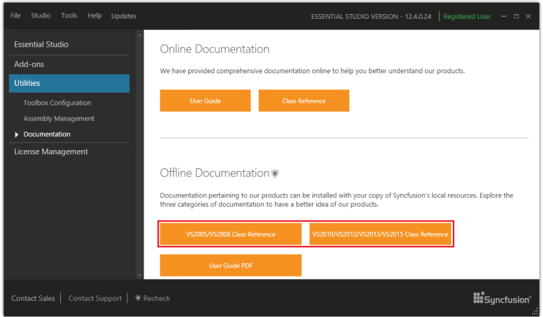

### Class Reference

Local documentation - A complete set of documentation for Class Reference is provided under the following headers. 

Installed Documentation - Documentation pertaining to Essential Studio can be installed with your copy of Syncfusion local resources. Explore the following three categories of documentation to have a better idea of Essential Studio products.

* Visual Studio 2005/Visual Studio 2008 Class Reference
* Visual Studio 2010/Visual Studio 2012/Visual Studio 2013 Class Reference

This local documentation can be accessed from the Dashboard > Utilities > Documentation > Local Documentation.

{:.image }

Online Documentation: Syncfusion provides comprehensive documentation online, to help you understand Essential Studio products better. This can be accessed from the Utilities > Documentation > Online Documentation.

{:.image }

