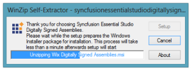
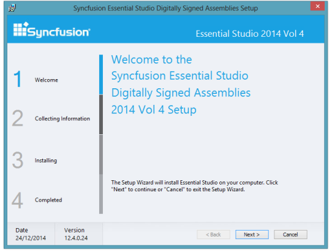
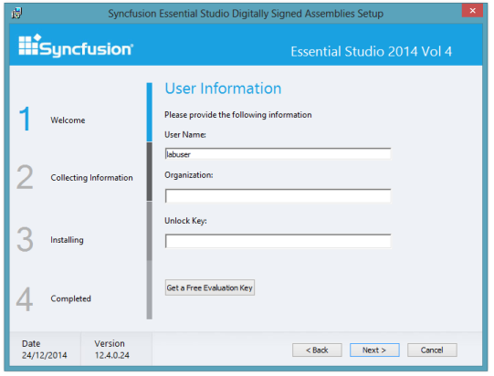
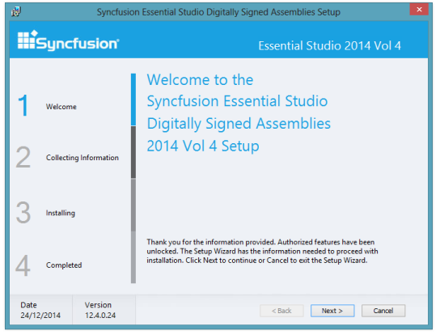
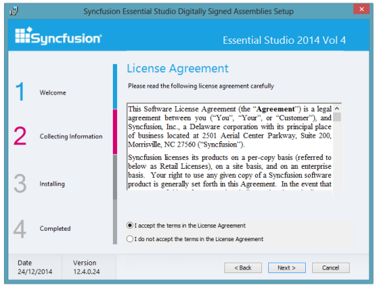
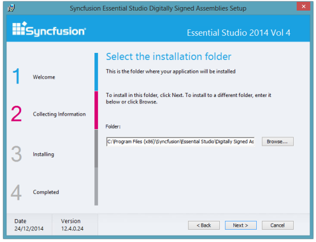
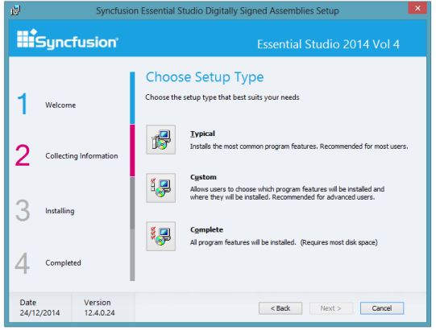
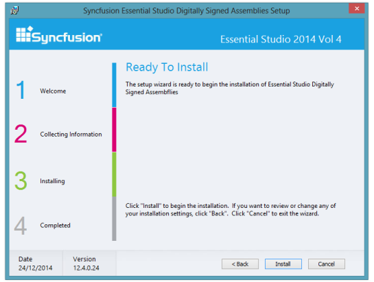
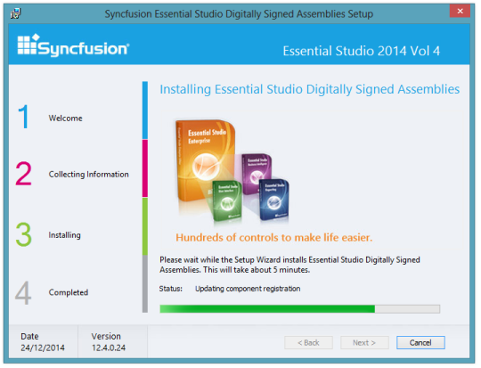
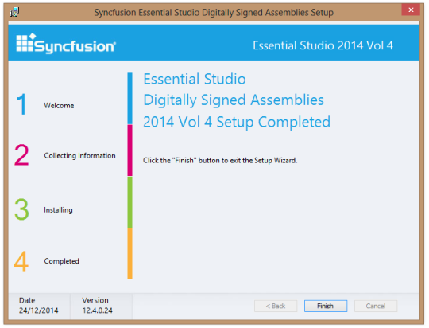

### Digitally Signed Assemblies Setup

Syncfusion provides Digitally Signed Assemblies Setup. It signs the Syncfusion assemblies with a .pfx file. 

The following steps illustrate how to install Digitally Signed Assemblies Setup.

1. Double-click the Syncfusion Digitally Signed Setup file. The Self-ExtractorWizard opens and extracts the package automatically. 

{:.image }

2. Once the unzip operation is complete, Syncfusion Essential Studio Digitally Signed Assemblies Setup screen opens.

{:.image }

3. Click Next. The User Information screen opens.

{:.image }

4. Enter your User Name, Organization and Unlock Key in the corresponding text boxes provided.
5. Click Next.
> 

{:.image }
_Note: The Unlock Key is validated and the Welcome screen opens._

{:.image }

6. Click Next to continue with installation. The License Agreement screen opens.

{:.image }

7. On accepting the terms, click the I accept the terms in the License Agreement option.
8. Click Next. The Select the Installation Folder screen opens.

{:.image }

> 
{:.image }
_Note: You can also browse to choose a location by clicking Browse._

9. Click Next. The Setup Type screen opens.

{:.image }

10. Select the preferred setup type. To install the complete setup, click Complete.

{:.image }

11. Click Install to continue with the installation.

{:.image }

> 
{:.image }
_Note: The Completed screen is displayed once the selected package is installed._

{:.image }

12. Click Finish to exit the Setup Wizard. Assemblies will be installed.

