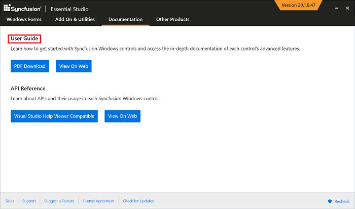
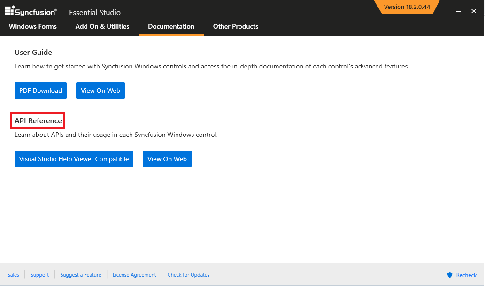

# Documentation Installer  

Documentation is provided for both User Guide and Class Reference.

## User Guide

* User Guide PDF

Syncfusion User Guide has step-by-step procedure so that users can clearly understand the usage of the Syncfusion controls from it. 

 User Guide can be accessed from the Syncfusion Control Panel > Documentation.

You can access the User Guide documentation in any of the below two ways.

* **PDF Download**  - You can download the User Guide as a PDF and access it in offline
* **View On Web** - You can view the User Guide for the corresponding platform online.

## API Reference

Syncfusion API reference provides a clear understanding to the users for accessing the classes, methods, properties etc... from the Syncfusion assemblies

API Reference can be accessed from the Syncfusion Control Panel > Documentation >

You can access the API reference documentation in any of the below two ways.

* **Visual Studio Help Viewer Compatible** - You can download the API reference installer and install it in Offline.

Visual Studio Help Viewer Compatible is available for the following platforms
	  <li><b>ASP.NET Web Forms</b> </li>
	  <li><b>ASP.NET MVC</b> </li>
	  <li><b>Windows Forms</b> </li>
	  <li><b>WPF</b> </li>
	  <li><b>ASP.NET Core</b> </li>
	  <li><b>UWP</b> </li>
	  <li><b>WinUI</b> </li>
	  <li><b>Xamarin</b> </li>	  

* **View On Web**  - You can view the API reference for the corresponding platform online.

I> For accessing the API Reference offline, you need to install the **Help Viewer** for the corresponding version Visual Studio.