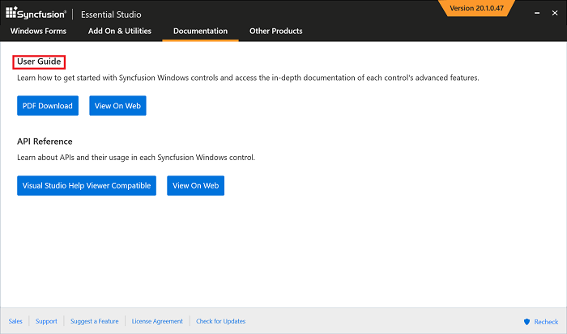
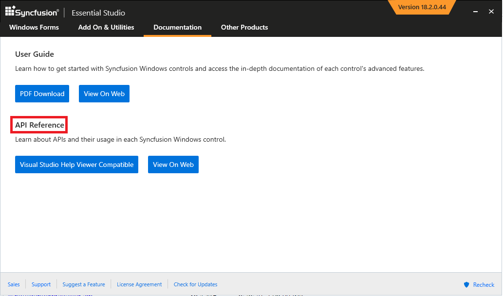

# Documentation Installer  

Documentation is provided for both User Guide and API Reference.

## User Guide

The Syncfusion&reg; User Guide provides step-by-step procedures so that users can clearly understand the usage of the Syncfusion&reg; controls.

You can access the User Guide from the **Syncfusion&reg; Control Panel** under **Documentation**.

You can access the User Guide documentation in any of the following two ways:

* **PDF Download** - You can download the User Guide as a PDF and access it offline.
* **View On Web** - You can view the User Guide for the corresponding platform online.

## API Reference

The Syncfusion&reg; API Reference provides a clear understanding for accessing the classes, methods, properties, and other members from the Syncfusion&reg; assemblies.

You can access the API Reference from the **Syncfusion&reg; Control Panel** under **Documentation > API Reference**.

You can access the API Reference documentation in any of the following two ways:

* **Visual Studio Help Viewer Compatible** - You can download the API Reference installer and install it for offline use.

> Visual Studio Help Viewer Compatible is available for the following platforms:
> * Blazor
> * ASP.NET MVC EJ2
> * Windows Forms
> * WPF
> * ASP.NET Core EJ2
> * UWP
> * WinUI
> * Xamarin
> * .NET MAUI

* **View On Web** - You can view the API Reference for the corresponding platform online.

    N> For accessing the API Reference offline, you need to install the **Help Viewer** for the corresponding version of Visual Studio.