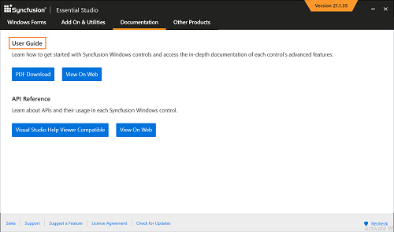
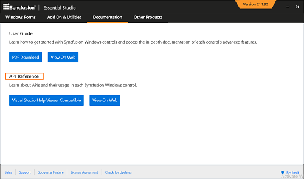

# Documentation Setup  

Documentation is provided for both User Guide and Class Reference.

## User Guide

**Local documentation** - A complete set of documentation for the User Guide is provided under the following headers. 

**Installed Documentation** – Offline User Guide setup files have been removed for Essential Studio 11.4.0.26 and later; instead, the User Guides are provided in PDF file format. Documentation pertaining to Essential Studio can be installed with your copy of Syncfusion local resources. Explore the following to have a better idea of Essential Studio products.

* User Guide PDF

This local documentation can be accessed from the Syncfusion Control Panel > Utilities > Documentation > User Guide PDF.

**Online Documentation:** Syncfusion provides comprehensive documentation online, to help you understand Essential Studio products, better. This can be accessed from the Utilities > Documentation > Online User Guide.

## Class Reference

**Local documentation** - A complete set of documentation for Class Reference is provided under the following headers. 

Installed Documentation - Documentation pertaining to Essential Studio can be installed with your copy of Syncfusion local resources. Explore the following three categories of documentation to have a better idea of Essential Studio products.

* Visual Studio 2005/Visual Studio 2008 Class Reference
* Visual Studio 2010/Visual Studio 2012/Visual Studio 2013/Visual Studio 2015/Visual Studio 2017 Class Reference

This local documentation can be accessed from the Syncfusion Control Panel > Utilities > Documentation > Class Reference.

N> When you have not installed local documentation, then a prompt opens to download the setup.

**Online Documentation:** Syncfusion provides comprehensive documentation online, to help you understand Essential Studio products better. This can be accessed from the Utilities > Documentation > Online Class Reference.

