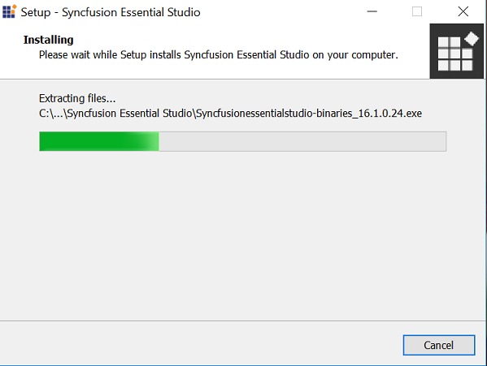
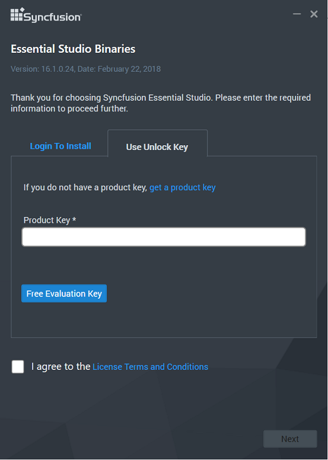
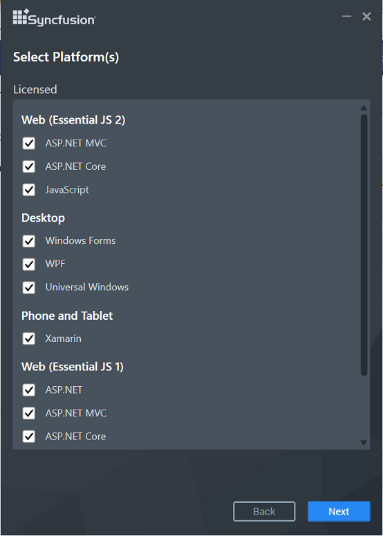
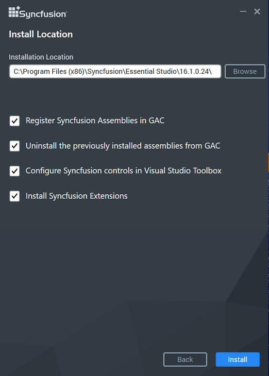
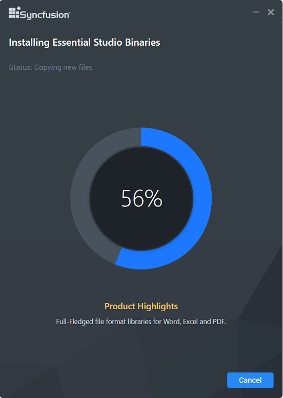
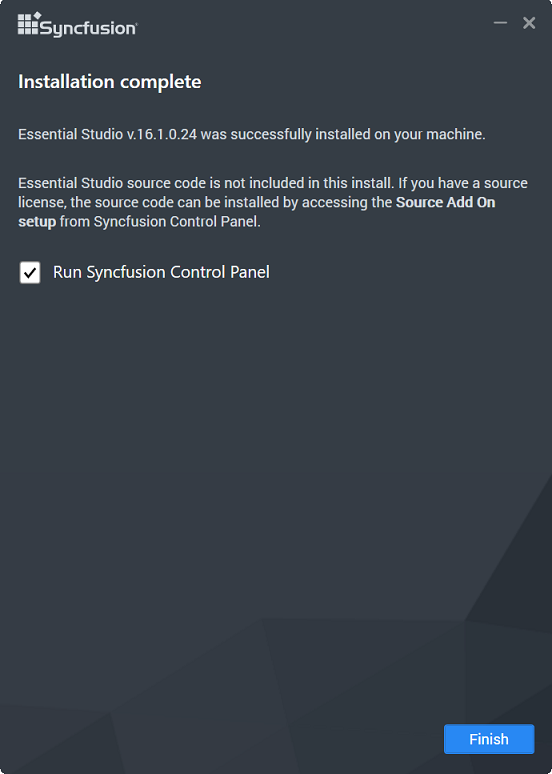

# Essential Studio Enterprise - Binaries

## Essential Studio - Binaries

Syncfusion provides the Essential Studio - Binaries Setup to configure the Syncfusion controls in a build machine, in which Syncfusion Essential Studio is not installed. This installs Essential Studio assemblies into the target folder. For information, see [Essential Studio - Binaries](http://www.syncfusion.com/support/kb/7653). 

The following procedure illustrates how to install Essential Studio - Binaries setup.

1.  Double-click the Syncfusion Essential Studio - Binaries Setup file. The Setup Wizard opens and extracts the package automatically.

    

2.  Once the unzip operation is complete, the License registration screen opens.

    

3.  Enter the Unlock Key in the corresponding text box provided and select the I accept the terms and conditions check box after reading the License Agreement.

4.  Click Next. The Select Platform screen opens. Select the required platforms to install the assemblies and click Next.

    

5.  The Installation Location screen opens.
   
    N> Click Browse to choose a location for installing the Essential Studio assemblies.

6.  To install in the displayed default location, click Next.

    
   
7.  Essential Studio - Binaries installation will be started.

    

    N> The Completed screen is displayed once the selected package is installed.
    
    

8. Click Finish to exit the Setup Wizard. Essential Studio - Binaries setup will be installed.

## Essential Studio - Digitally Signed Binaries

Syncfusion provides Digitally Signed Binaries Setup. It signs the Syncfusion assemblies with a .pfx file. For information, see [Digitally Signed Binaries ](http://www.syncfusion.com/support/kb/7671). 

The following steps illustrate how to install Digitally Signed Binaries Setup.

1.  Double-click the Syncfusion Digitally Signed Binaries Setup file. The Setup Wizard opens and extracts the package automatically. 
   
    

2.  Once the unzip operation is complete, the License registration screen opens.

    

3.  Enter the Unlock Key in the corresponding text box provided and select the I accept the terms and conditions check box after reading the License Agreement.

4.  Click Next. The Select Platform screen opens. Select the required platforms to install the assemblies and click Next.

    

5.  The Installation Location screen opens.
   
    N> Click Browse to choose a location for installing the Essential Studio Binaries.

6.  To install in the displayed default location, click Next.

    
   
7.  Digitally Signed Binaries installation will be started.

    

    N> The Completed screen is displayed once the selected package is installed.
    
    

8. Click Finish to exit the Setup Wizard. Digitally Signed Binaries will be installed.