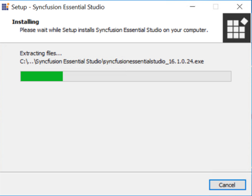
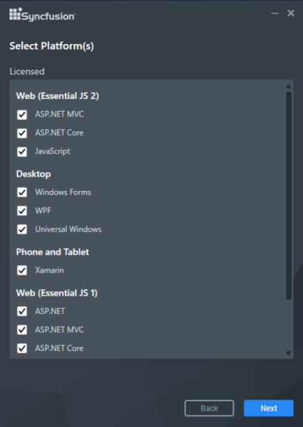
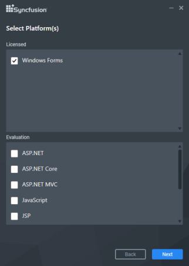
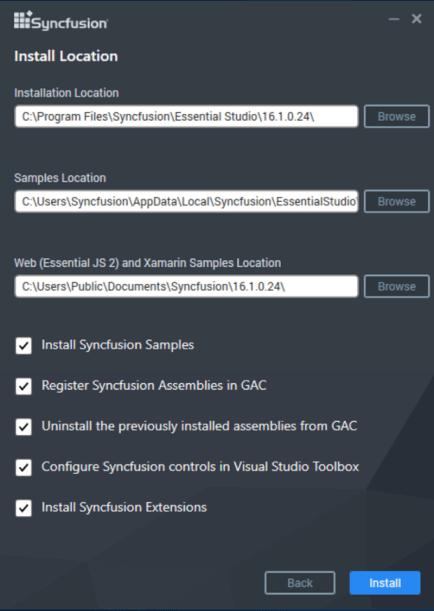
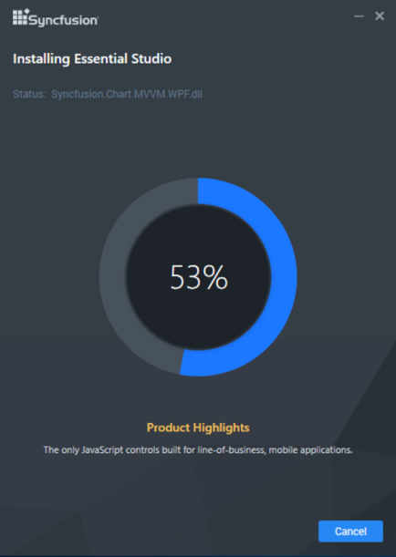
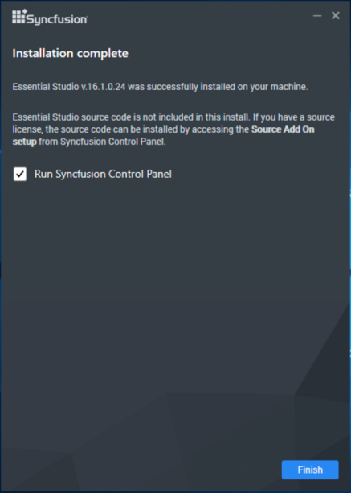

# Essential Studio Enterprise Installer

## Overview

The Essential Studio Enterprise Installer includes all of the following platforms. There is also a separate installer for individual platforms. For more information refer to the [Platform installer](http://help.syncfusion.com/common/essential-studio/essential-studio-installer-for-individual-platform ) section.

* ASP.NET
* ASP.NET Core
* ASP.NET MVC
* JavaScript
* LightSwitch HTML
* PHP
* Universal Windows Platform
* Windows Forms
* WinRT
* WPF 
* Xamarin

 N> WinRT can only be installed from Windows 8 and later. Universal Windows Platform will be installed only in Windows 10. Syncfusion has removed Classic products(ASP.NET and ASP.NET MVC), Silverlight, and LightSwitch Silverlight platforms from the Syncfusion Enterprise edition setup and providing them as individual platform setup alone from the 2015 Vol 4 release(v13.4.0.53). Also we have removed Android, Windows Phone and Universal 8.1 from Syncfusion Enterprise edition setup and providing individual platform setup from the 2016 Vol 3 release(v14.3.0.49).

You are provided with the separate installer for FileFormat. 

Also, you are provided iOS packages as zip file. It contains Framework library of the controls and samples. 

 N> Syncfusion has removed Classic products(ASP.NET and ASP.NET MVC), Silverlight, and LightSwitch Silverlight platforms from the Syncfusion Enterprise edition setup and providing them as individual platform setup alone from the 2015 Vol 4 release(v13.4.0.53). Also we have removed Android, Windows Phone and Universal 8.1 from Syncfusion Enterprise edition setup and providing individual platform setup from the 2016 Vol 3 release(v14.3.0.49).
 
 
## Step-by-Step Installation

The following procedure illustrates how to install Essential Studio setup. 

1.  Double-click the Syncfusion Essential Studio Setup file. The Setup Wizard opens and extracts the package automatically.

    
    
    
     N> The Setup wizard extracts the syncfusionessentialstudio(version).exe dialog, displaying the unzip operation of the package.
    
2. From the 2016 Vol 3 release(v14.3.0.49), you are provided with two options to unlock the Syncfusion setup.
    
    **A) Install with login ID**

   

    N>  You should enter your Syncfusion Direct-Trac login credentials. If you don't have Syncfusion Direct-Trac login credentials, then you can click on Sign Up to a create new account. Else if you forgot your password, click on Reset Password to create new password. Here Email address and Password is validated and the Platform Selection window opens.

**B) Install with product key**

    N> The Unlock key is validated and the Platform Selection window opens.

3.  After reading the terms by clicking the **License Terms and Conditions** link, check the I accept the terms and conditions check box.

4.  Click Next. Platform selection window opens. This window displays the platforms based on the license type(Licensed or Evaluation).

    

   
     N> If you have complete license, then all the platforms will be displayed under Licensed category. 
     

     
     N> If you have entered evaluation account, then platforms will be displayed under Evaluation category. 

 
     N>If you have license only for some of the products, then both licensed and evaluation platforms will be displayed under the repective category. 

    

    N> WinRT platform will be installed only from Windows 8 and later. Universal Windows Platform will be installed only in Windows 10.

5.  Select the Installation, Samples Folder and Advanced Options screen opens. To install in the displayed default location, click Next.

    
	
       N> You can also browse and choose a location by clicking Browse. When you have already installed any other same version‘s setup, you cannot change the install path.

    * Select the Install Syncfusion samples check box to install Syncfusion samples, or leave the check box clear, when you do not want to install Syncfusion samples.
    * Select the Register Syncfusion assemblies in GAC check box to install the latest Syncfusion assemblies in GAC, or clear this check box when you do not want to install the latest assemblies in GAC.
    * Select the Uninstall previously installed Syncfusion assemblies from GAC check box to uninstall the previously installed Syncfusion assemblies from GAC, or clear this check box to maintain the previously installed assemblies.
    * Select the Configure Syncfusion controls in Visual Studio Toolbox (if assemblies installed) check box to configure the Syncfusion controls in the Visual Studio toolbox, or clear this check box when you do not want to configure the Syncfusion controls in the Visual Studio toolbox during setup installation. Note that you must also select the Register Syncfusion assemblies in GAC check box when you select this check box.

7.  Click Install.

    

    N> The Completed screen is displayed once the selected platform is installed.

    

8. Select the Run Syncfusion Control Panel check box to launch the Syncfusion Control Panel after installing.

9. Click Finish. Essential Studio is installed in your system and Syncfusion Control Panel is launched automatically. For more information, refer to [Brief Tour of Syncfusion Control Panel](http://help.syncfusion.com/common/essential-studio/utilities#dashboard ).

## MSI Installer

Syncfusion has started providing MSI setup for Essential Studio Enterprise Installer from the version 13.4. Please refer the steps provided in [MSI Installation](http://www.syncfusion.com/kb/6041) for installing the MSI Installer.  	

## Command Line 

Syncfusion Essential Studio supports installing the setup through Command Line Install and Uninstall. The following sections illustrate these options. 

### Command Line Installation

Follow the given steps to install through Command Line in Silent mode.

1. Double-click the Syncfusion Essential Studio Setup file. The Setup Wizard opens and extracts the package automatically.
2. The SyncfusionEssentialStudio_(version).exe file is extracted into the Temp folder. 
3. Run %temp%. The Temp folder opens. The SyncfusionEssentialStudio_(version).exe file is available in one of the folders.
4. Copy the SyncfusionEssentialStudio_(version).exe file in local drive. Example: D:\temp
5. Cancel the wizard.
6. Open Command Prompt in administrator mode and pass the following arguments for corresponding version:
   
   Essential Studio version from 11.1 to 13.1:

   “Setup file path\SyncfusionEssentialStudio_(version).exe” Install /PIDKEY:“(product unlock key)” [/log “{Log file path}”] [/InstallPath:{Location to install}] 

    N> [..] – Arguments inside the square brackets are optional.
 
    Example: “D:\Temp\SyncfusionEssentialStudio_12.1.0.43.exe” Install /PIDKEY:“product unlock key” /log “C:\Temp\EssentialStudio.log” /InstallPath:C:\Syncfusion\x.x.x.x

    Essential Studio version 13.2 and later:

    “Setup file path\SyncfusionEssentialStudio_(version).exe” /Install silent /PIDKEY:“(product unlock key)” [/log “{Log file path}”] [/InstallPath:{Location to install}] [/InstallSamples:{true/false}] [/InstallAssemblies:{true/false}] [/UninstallExistAssemblies:{true/false}] [/InstallToolbox:{true/false}]

    N> [..] – Arguments inside the square brackets are optional.

    Example: “D:\Temp\SyncfusionEssentialStudio_13.2.0.30.exe” /Install silent /PIDKEY:“product unlock key” /log “C:\Temp\EssentialStudio.log” /InstallPath:C:\Syncfusion\x.x.x.x /InstallSamples:true /InstallAssemblies:true /UninstallExistAssemblies:true /InstallToolbox:true

    N> We have provided Advanced Options in silent installation from Syncfusion Version 13.2.0.x.

7. Setup is installed.

   N> x.x.x.x needs to be replaced with the Essential Studio version installed on your machine, and product unlock key needs to be replaced with the Unlock Key for that version.

   
### Command Line Uninstallation

Syncfusion Essential Studio supports uninstalling the setup through Command Line in Silent mode. The following steps help you uninstall the setup. 

1. When you do not have the extracted setup (SyncfusionEssentialStudio_(version).exe) then follow the steps from 2 to 7.
2. Double-click the Syncfusion Essential Studio Setup file. The Setup Wizard opens and extracts the package automatically.
3. The SyncfusionEssentialStudio_(version).exe file gets extracted into the Temp folder.
4. Run %temp%. The Temp folder opens. The SyncfusionEssentialStudio_(version).exe file is available in one of the folders.
5. Copy the SyncfusionEssentialStudio_(version).exe file in local drive. Example: D:\temp
6. Cancel the wizard.
7. Open the Command Prompt in administrator mode and pass the following arguments for corresponding version: 

   Essential Studio version from 11.1 to 13.1:

   “Setup file path\SyncfusionEssentialStudio_(version).exe” /uninstall true 

   Example: “D:\Temp\SyncfusionEssentialStudio_12.1.0.43.exe" /uninstall true

   Essential Studio version 13.2 and later:

   “Setup file path\SyncfusionEssentialStudio_(version).exe” /uninstall silent 

   Example: “D:\Temp\SyncfusionEssentialStudio_13.2.0.30.exe" /uninstall silent

8. Setup is uninstalled.

   N> x.x.x.x need to be replaced with the Essential Studio version installed in your machine and the product unlock key needs to be replaced with the unlock key for that version.