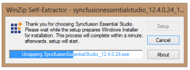
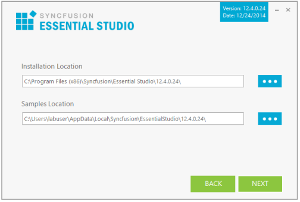

# Essential Studio Enterprise Installer

## Overview

The Essential Studio Enterprise Installer includes all of the following platforms. There is also a separate installer for individual platforms. For more information refer to the [Platform installer](http://docs.syncfusion.com/common/essential-studio/essential-studio-installer-for-individual-platform ) section.

* ASP.NET 
* ASP.NET (Classic)
* ASP.NET MVC 
* ASP.NET MVC (Classic)
* JavaScript
* LightSwitch HTML
* LightSwitch Silverlight 
* Silverlight
* Universal
* Windows Forms
* Windows Phone
* WinRT
* WPF

 N> WinRT can only be installed from Windows 8.

You are provided with the separate installers for FileFormat, Android and Xamarin platforms. 

Also, you are provided iOS packages as zip file. It contains framework library of the controls and samples. 

## Step-by-Step Installation

The following procedure illustrates how to install Essential Studio setup. 

1.  Double-click the Syncfusion Essential Studio Setup file. The Self-ExtractorWizard opens and extracts the package automatically.
   
    

    N> The WinZip Self-Extractor extracts the syncfusionessentialstudio(version).exe dialog, displaying the unzip operation of the package.

    

2.  Enter your User Name, Organization, and Unlock Key in the corresponding text boxes provided.

3.  Click Next.

    N> The Unlock Key is validated and the License Agreement Screen opens.

    

4.  After reading the terms, click the I accept the terms and conditions check box.

5.  Click Next. Select the Installation and Samples Folder screen opens.

    

    N> You can also browse and choose a location by clicking Browse. When you have already installed any other version‘s setup, you cannot change the install path.

6.  To install in the displayed default location, click Next.

7.  Select the platforms to be installed.

    

    N> WinRT platforms will install only from Windows 8.

8.  Click Next. The Select Advanced Options screen opens.

    

    * Select the Install Syncfusion samples check box to install Syncfusion samples, or leave the check box clear, when you do not want to install Syncfusion samples.
    * Select the Register Syncfusion assemblies in GAC check box to install the latest Syncfusion assemblies in GAC, or clear this check box when you do not want to install the latest assemblies in GAC.
    * Select the Uninstall previously installed Syncfusion assemblies from GAC check box to uninstall the previously installed Syncfusion assemblies from GAC, or clear this check box to maintain the previously installed assemblies.
    * Select the Configure Syncfusion controls in Visual Studio Toolbox (if assemblies installed) check box to configure the Syncfusion controls in the Visual Studio toolbox, or clear this check box when you do not want to configure the Syncfusion controls in the Visual Studio toolbox during setup installation. Note that you must also select the Register Syncfusion assemblies in GAC check box when you select this check box.

9.  Click Install.

    

    N> The Completed screen is displayed once the selected platform is installed.

    

10. Select the Run Dashboard check box to launch the Dashboard after installing.

11. Click Finish. Essential Studio is installed in your system and Syncfusion Essential Studio Dashboard is launched automatically. For more information, refer to [Brief Tour of Dashboard](http://docs.syncfusion.com/common/essential-studio/utilities#dashboard ).

    N> The Completed screen is displayed once the selected platform is installed.

	
## Command Line 

Syncfusion Essential Studio supports installing the setup through Command Line Install and Uninstall. The following sections illustrate these options. 

### Command Line Installation

Follow the given steps to install through Command Line in Silent mode.

1. Double-click the Syncfusion Essential Studio Setup file. The Self-ExtractorWizard opens and extracts the package automatically.
2. The SyncfusionEssentialStudio_(version).exe file is extracted into the Temp folder. 
3. Run %temp%. The Temp folder opens. The SyncfusionEssentialStudio_(version).exe file is available in one of the folders.
4. Copy the SyncfusionEssentialStudio_(version).exe file in local drive. Example: D:\temp
5. Cancel the wizard.
6. Open Command Prompt in administrator mode and pass the following arguments for corresponding version:
   
   Essential Studio version 13.1 and earlier:

   “Setup file path\SyncfusionEssentialStudio_(version).exe” Install /PIDKEY:“(product unlock key)” [/log “{Log file path}”] [/InstallPath:{Location to install}] 

    N> [..] – Arguments inside the square brackets are optional.
 
    Example: “D:\Temp\SyncfusionEssentialStudio_12.1.0.43.exe” Install /PIDKEY:“product unlock key” /log “C:\Temp\EssentialStudio.log” /InstallPath:C:\Syncfusion\x.x.x.x

    Essential Studio version 13.2 and later:

    “Setup file path\SyncfusionEssentialStudio_(version).exe” /Install silent /PIDKEY:“(product unlock key)” [/log “{Log file path}”] [/InstallPath:{Location to install}] [/InstallSamples:{true/false}] [/InstallAssemblies:{true/false}] [/UninstallExistAssemblies:{true/false}] [/InstallToolbox:{true/false}]

    N> [..] – Arguments inside the square brackets are optional.

    Example: “D:\Temp\SyncfusionEssentialStudio_13.2.0.30.exe” /Install silent /PIDKEY:“product unlock key” /log “C:\Temp\EssentialStudio.log” /InstallPath:C:\Syncfusion\x.x.x.x /InstallSamples:true /InstallAssemblies:true /UninstallExistAssemblies:true /InstallToolbox:true

    N> We have provided Advanced Options in silent installation from Syncfusion Version 13.2.0.x.

7. Setup is installed.

   N> x.x.x.x needs to be replaced with the Essential Studio version installed on your machine, and product unlock key needs to be replaced with the Unlock Key for that version.

   
### Command Line Uninstallation

Syncfusion Essential Studio supports uninstalling the setup through Command Line in Silent mode. The following steps help you uninstall the setup. 

1. When you do not have the extracted setup (SyncfusionEssentialStudio_(version).exe) then follow the steps from 2 to 7.
2. Double-click the Syncfusion Essential Studio Setup file. The Self-ExtractorWizard opens and extracts the package automatically.
3. The SyncfusionEssentialStudio_(version).exe file gets extracted into the Temp folder.
4. Run %temp%. The Temp folder opens. The SyncfusionEssentialStudio_(version).exe file is available in one of the folders.
5. Copy the SyncfusionEssentialStudio_(version).exe file in local drive. Example: D:\temp
6. Cancel the wizard.
7. Open the Command Prompt in administrator mode and pass the following arguments for corresponding version: 

   Essential Studio version 13.1 and earlier:

   “Setup file path\SyncfusionEssentialStudio_(version).exe” /uninstall true 

   Example: “D:\Temp\SyncfusionEssentialStudio_12.1.0.43.exe" /uninstall true

   Essential Studio version 13.2 and later:

   “Setup file path\SyncfusionEssentialStudio_(version).exe” /uninstall silent 

   Example: “D:\Temp\SyncfusionEssentialStudio_13.2.0.30.exe" /uninstall silent

8. Setup is uninstalled.
   N> x.x.x.x need to be replaced with the Essential studio version installed in your machine and the product unlock key needs to be replaced with the unlock key for that version.