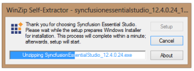
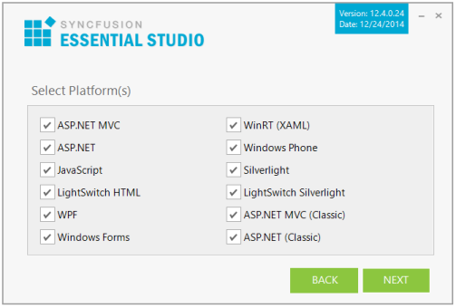
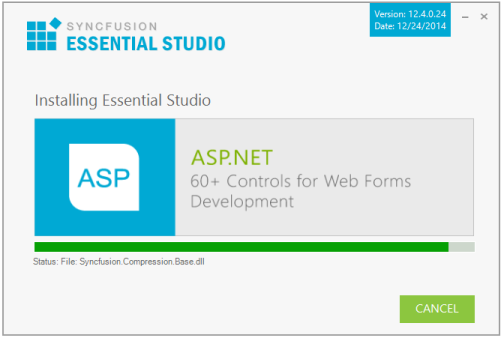

### Step-by-Step Installation

The following procedure illustrates how to install Essential Studio setup. 

1. Double-click the Syncfusion Essential Studio Setup file. The Self-ExtractorWizard opens and extracts the package automatically.

{:.image }

> __
{:.image }
_Note: The WinZip Self-Extractor extracts the syncfusionessentialstudio_(version).exe dialog, displaying the unzip operation of the package._

{:.image }

2. Enter your User Name, Organization, and Unlock Key in the corresponding text boxes provided.
3. Click Next.
> 

{:.image }
_Note: The Unlock Key is validated and the License Agreement Screen opens._

{:.image }

4. After reading the terms, click the I accept the terms and conditions check box.
5. Click Next. Select the Installation and Samples Folder screen opens.

{:.image }

> 
{:.image }
_Note: You can also browse and choose a location by clicking Browse. When you have already installed any other version‘s setup, you cannot change the install path._

6. To install in the displayed default location, click Next.
7. Select the platforms to be installed.

{:.image }

> 
{:.image }
_Note: WinRT platforms will install only from Windows 8._

8. Click Next. The Select Advanced Options screen opens.

{:.image }

* Select the Install Syncfusion samples check box to install Syncfusion samples, or leave the check box clear, when you do not want to install Syncfusion samples.
* Select the Register Syncfusion assemblies in GAC check box to install the latest Syncfusion assemblies in GAC, or clear this check box when you do not want to install the latest assemblies in GAC.
* Select the Uninstall previously installed Syncfusion assemblies from GAC check box to uninstall the previously installed Syncfusion assemblies from GAC, or clear this check box to maintain the previously installed assemblies.
* Select the Configure Syncfusion controls in Visual Studio Toolbox (if assemblies installed) check box to configure the Syncfusion controls in the Visual Studio toolbox, or clear this check box when you do not want to configure the Syncfusion controls in the Visual Studio toolbox during setup installation. Note that you must also select the Register Syncfusion assemblies in GAC check box when you select this check box.

9. Click Install.

{:.image }

> 
{:.image }
_Note: The Completed screen is displayed once the selected platform is installed._

{:.image }

10. Select the Run Dashboard check box to launch the Dashboard after installing.
11. Click Finish. Essential Studio is installed in your system and Syncfusion Essential Studio Dashboard is launched automatically. For more information, refer to Brief Tour of Dashboard.
> 

{:.image }
_Note: The Completed screen is displayed once the selected platform is installed._

