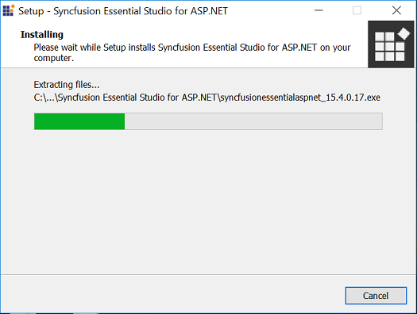
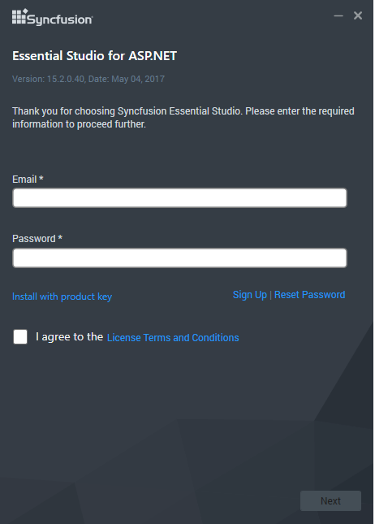
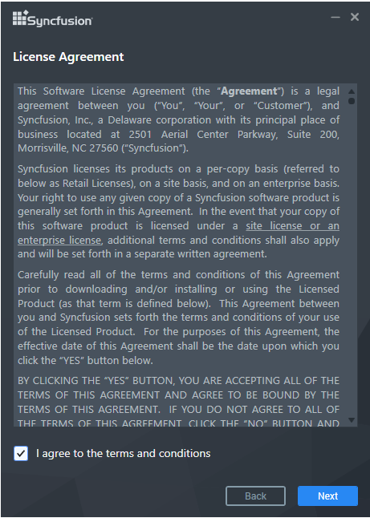
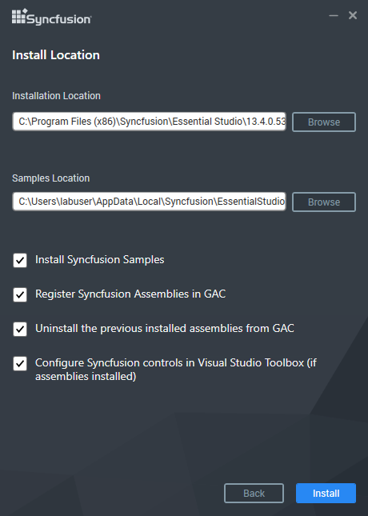
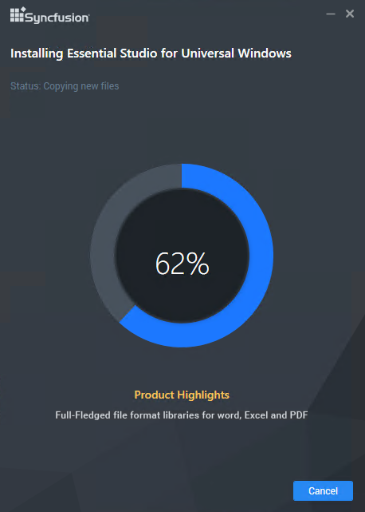
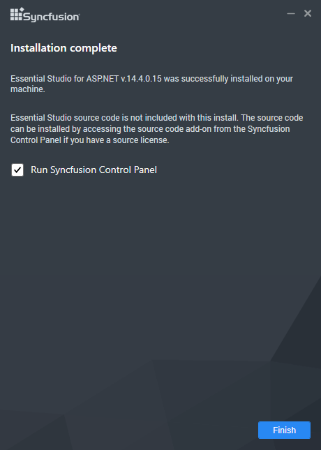

# Essential Studio Installer for Individual Platforms

## Overview

Separate platform setups are provided from version 11.1.0.21. There are 18 platforms.

* ASP.NET (from 12.2.0.36 and later)
* ASP.NET (Classic)
* ASP.NET MVC (from 12.1.0.43 and later)
* ASP.NET MVC (Classic) 
* Silverlight
* Windows Forms
* Windows Phone (only for Windows Phone SDK 8 and later )
* WinRT (only for Microsoft Windows 8 and later)
* WPF
* JavaScript (from 11.2.0.63 and later)
* LightSwitch HTML (from 12.4.0.24 and later)
* LightSwitch Silverlight (from 11.3.0.30 and later)
* FileFormats
* Android
* iOS
* Xamarin
* MVC Extension (from 12.1.0.43 and later)
* Universal Windows (from 13.2.0.34 and later)

Essential Studio MVC Extension is provided from version 12.1.0.43. For more information refer to [MVC Extension](http://www.syncfusion.com/kb/2350).

The LightSwitch platform has been marked as LightSwitch Silverlight from version 12.3.0.26 and later.

WinRT and Windows Phone platform setup can be installed in Windows version 8 and later. Universal Windows platform setup can be installed in Windows 10.

You are provided with iOS packages as a .zip file. It is developed in MAC OS. It contains framework library of the controls and samples.

Essential Studio for ASP.NET MVC has been marked as "Classic" from version 12.1.0.43.

Essential Studio for ASP.NET has been marked as "Classic" from version 12.2.0.36.

## Step-by-Step Installation

The following procedure illustrates how to install Essential Studio. 

1. Double-click the Syncfusion Essential Studio Platform Setup file. The Self-Extractor Wizard opens and extracts the package automatically.

   

    N> The WinZip Self-Extractor extracts the syncfusionessentialstudio_(version).exe dialog, displaying the unzip operation of the package.

   

2. Enter User Name, Organization and Unlock Key in the corresponding text boxes provided.

3. Click Next.

    N> The Unlock Key is validated and the License Agreement dialog opens.

   

4. After reading the terms, click the I accept the terms and conditions check box.

5. Click Next. Select the Installation, Samples Folder and Advanced Options screen opens. 

   
   
    N> To install in the displayed default location, click Install. You can also browse and choose a location by clicking Browse. When you have already installed any other same version‘s setup, you cannot change the install and samples path.
		
    * Select the Install Syncfusion samples check box to install Syncfusion samples, or leave the check box clear, when you do not want to install Syncfusion samples.
    * Select the Register Syncfusion assemblies in GAC check box to install the latest Syncfusion assemblies in GAC, or clear this check box when you do not want to install the latest assemblies in GAC.
    * Select the Uninstall previously installed Syncfusion assemblies from GAC check box to uninstall the previously installed Syncfusion assemblies from GAC, or clear this check box to maintain the previously installed assemblies.
    * Select the Configure Syncfusion controls in Visual Studio Toolbox (if assemblies installed) check box to configure the Syncfusion controls in the Visual Studio toolbox, or clear this check box when you do not want to configure the Syncfusion controls in the Visual Studio toolbox during setup installation. Note that you must also select the Register Syncfusion assemblies in GAC check box when you select this check box.

6.  Click Install.

   

    N> The Completed screen is displayed once the package is installed.

   

7. Select the Run Dashboard check box to launch the Dashboard after installing.

8. Click Finish. Essential Studio is installed in your system and the Syncfusion Essential Studio [Dashboard](http://help.syncfusion.com/common/essential-studio/utilities#dashboard ) is launched automatically.

## Command Line 

The Syncfusion Essential Studio Platform Installer supports installing the setup through Command Line Install and Uninstall. The following sections illustrate this ability. 

### Command Line Installation

Follow the steps below to install through Command Line in Silent mode.

1. Double-click the Syncfusion Essential Studio platform Setup file. The Self-Extractor Wizard opens and extracts the package automatically.
2. The SyncfusionEssentialStudio(platform)_(version).exe file is extracted into the Temp folder.
3. Run %temp%. The Temp folder will open. The SyncfusionEssentialStudio(platform)_(version).exe file is available in one of the folders.
4. Copy the SyncfusionEssentialStudio_(version).exe file in local drive. Example: D:\temp
5. Cancel the Wizard.
6. Open the Command Prompt in administrator mode and pass the following arguments for corresponding version:

   Essential Studio version from 11.1 to 13.1:

   “Setup file path\SyncfusionEssentialStudio(platform)_(version).exe” Install /PIDKEY:“(product unlock key)” [/log “{Log file path}”] [/InstallPath: {Location to install}] 

   N> [..] – Arguments inside the square brackets are optional.

   Example: “D:\Temp\SyncfusionEssentialStudio(platform)_12.1.0.43.exe” Install /PIDKEY:“product unlock key” /log “C:\Temp\EssentialStudio_Platform.log” /InstallPath:C:\Syncfusion\x.x.x.x 

   Essential Studio version 13.2 and later:

   “Setup file path\SyncfusionEssentialStudio(platform)_(version).exe” /Install silent /PIDKEY:“(product unlock key)” [/log “{Log file path}”] [/InstallPath:{Location to install}] [/InstallSamples:{true/false}] [/InstallAssemblies:{true/false}] [/UninstallExistAssemblies:{true/false}] [/InstallToolbox:{true/false}]

    N> [..] – Arguments inside the square brackets are optional.

   Example: “D:\Temp\SyncfusionEssentialStudio(platform)_13.2.0.30.exe” /Install silent /PIDKEY:“product unlock key” /log “C:\Temp\EssentialStudio_Platform.log” /InstallPath:C:\Syncfusion\x.x.x.x /InstallSamples:true /InstallAssemblies:true /UninstallExistAssemblies:true /InstallToolbox:true

   N> We have provided Advanced Options in silent installation from 13.2.0.x.

7. Setup is installed.

   N> x.x.x.x needs to be replaced with the Essential Studio version installed in your machine and the Product Unlock Key needs to be replaced with the Unlock Key for that version. The platform should be replaced with asp.net, asp.netmvc, asp.netmvc-classic, silverlight, windowsforms, windowsphone, winrt, wpf, javascript, or lightswitch.
   

### Command Line Uninstallation

Syncfusion Essential Studio supports uninstalling the setup through Command Line in Silent mode. The following steps illustrate this. 

1. When you do not have the extracted setup (SyncfusionEssentialStudio(platform)_(version).exe) then follow the steps from 2 to 7.
2. Double-click the Syncfusion Essential Studio platform Setup file. The Self-Extractor Wizard opens and extracts the package automatically.
3. The SyncfusionEssentialStudio(platform)_(version).exe file is extracted into the Temp folder.
4. Run %temp%. The Temp folder will open. The SyncfusionEssentialStudio(platform)_(version).exe file is available in one of the folders.
5. Copy the SyncfusionEssentialStudio(platform)_(version).exe file in local drive. Example: D:\temp
6. Cancel the Wizard.
7. Open the Command Prompt in administrator mode and pass the following arguments for corresponding version: 

   Essential Studio version from 11.1 to 13.1:

   “Setup file path\SyncfusionEssentialStudio(platform)_(version).exe” /uninstall true 

   Example: “D:\Temp\SyncfusionEssentialStudio(platform)_12.1.0.43.exe" /uninstall true
    
   Essential Studio version 13.2 and later:

   “Setup file path\SyncfusionEssentialStudio(platform)_(version).exe” /uninstall silent 

   Example: “D:\Temp\SyncfusionEssentialStudio(platform)_13.2.0.30.exe" /uninstall silent

8. Setup is uninstalled.

    N> x.x.x.x needs to be replaced with the Essential Studio version installed in your machine and the Product Unlock Key needs to be replaced with the unlock key for that version. Platform should be replaced with asp.net, asp.netmvc, asp.netmvc-classic, silverlight, windowsforms, windowsphone, winrt, wpf, javascript, or lightswitch.
