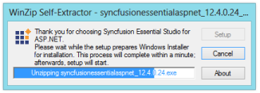
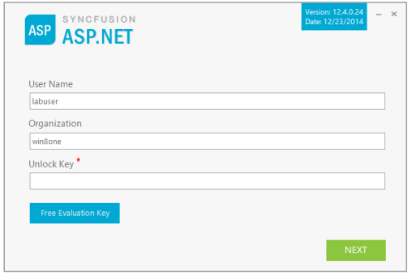
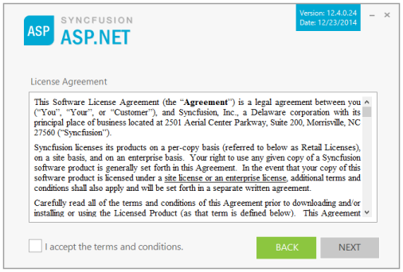
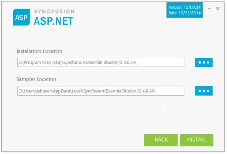
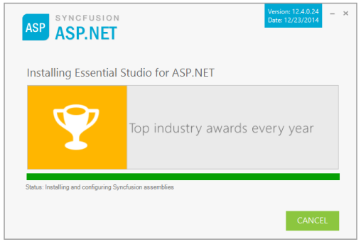
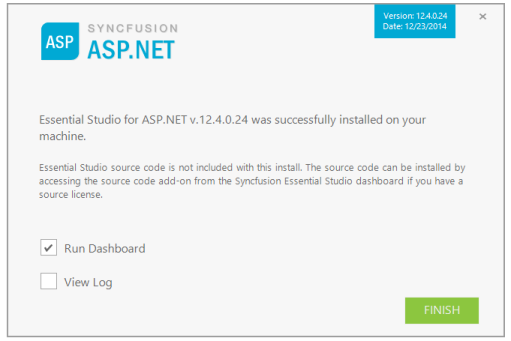

### Step-by-Step Installation

The following procedure illustrates how to install Essential Studio. 

1. Double-click the Syncfusion Essential Studio Platform Setup file. The Self-ExtractorWizard opens and extracts the package automatically.

{:.image }

> 
{:.image }
_Note: The WinZip Self-Extractor extracts the syncfusionessentialstudio_(version).exe dialog, displaying the unzip operation of the package._

{:.image }

2. Enter User Name, Organization and Unlock Key in the corresponding text boxes provided.
3. Click Next.
> 

{:.image }
_Note: The Unlock Key is validated and the License Agreement dialog opens._

{:.image }

4. After reading the terms, click the I accept the terms and conditions check box.
5. Click Next. The Select the Installation and Samples Folder window opens.

{:.image }

> 
{:.image }
_Note: You can also browse and choose a location by clicking Browse. When you have already installed any other platform setup, it does not allow you to change the install path again._

6. To install it in the displayed default location, click Install.

{:.image }

> 
{:.image }
_Note: The Completed screen is displayed once the selected package is installed._

{:.image }

7. Select the Run Dashboard check box to launch the Dashboard after installing.
8. Click Finish. Essential Studio is installed in your system and the Syncfusion Essential Studio Dashboard is launched automatically.
