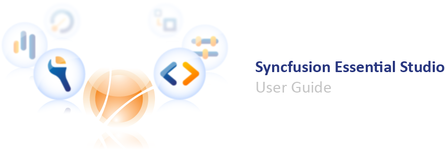

## Essential Studio

Welcome to the Syncfusion Essential Studio product documentation. The following content is to help you get started with Essential Studio.

{:.image }

Essential Studio consists of several .NET libraries that provide support for building modern Windows Forms, Windows Phones, WPF, Silverlight, LightSwitch, ASP.NET, ASP.NET(Classic), ASP.NET MVC, ASP.NET MVC (Classic), JavaScript, FileFormats, Universal and WinRT applications. The packages can the Release-xml configuration for SfDataGrid be used in any .NET environment, including C#, VB.NET, and managed C++.It also consists of iOS and Android that have the Xcode Framework library and Jars respectively.

> 
{:.image }
_Note: The Express Editions of Visual Studio.NET do not have support for toolbox._ 

