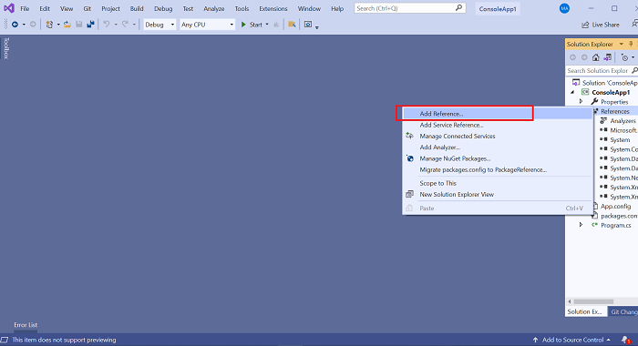
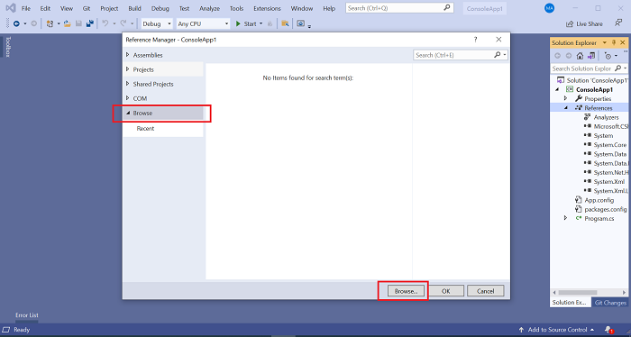
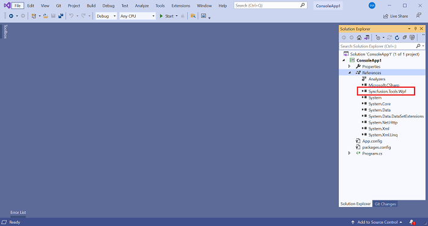

---
layout: post
title: Refer local assemblies in VS instead of private NuGet server | Syncfusion
description: Learn here about the Refer local assemblies in VS instead of private NuGet server.
platform: common
documentation: ug
--- 

# How to refer the local assemblies in the Visual Studio project instead of private NuGet server

Refer the following steps to add the assemblies to project reference from the local location instead of configuring the private NuGet server and feed.

1.	Create a folder like **Dependent Assemblies** in the application root folder and place the required assemblies. Also move/commit the assemblies if you are compiling/running outside of the machine like CI/CD.

2.	Open the application and select **Add References** by right-clicking References.

	 

3.	Select **Browse** button from the **Browse tab**.

	 

4.	Browser assemblies in the Dependent Assemblies folder and add into the project. 

5.	The selected assemblies will be added to the project reference.

	 
	 

6.	The assemblies refer from the Dependent Assemblies folder. You could replace the assemblies if the assemblies modified. 
