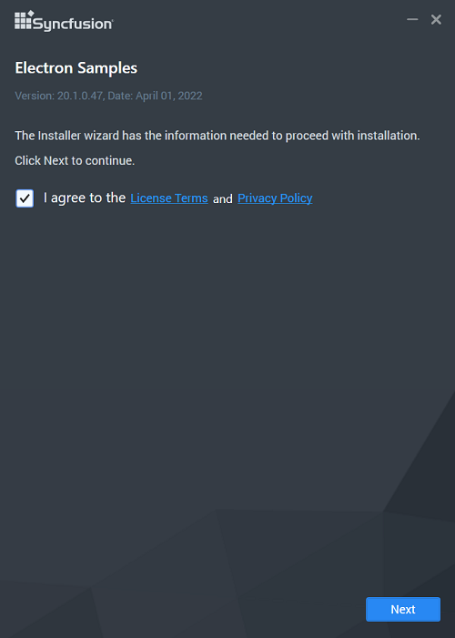

# Electron Add-on installer

Electron (formerly Atom Shell) is used to create a cross-platform desktop application for different operating systems such as Linux, Windows, and OS X by using JavaScript and being able to access platform specific native APIs.

## Step-by-Step Installation

The steps below show how to install the Electron installer.

1. Double-click the Syncfusion Electron installer to launch it. The installer Wizard automatically opens and extracts the package.

   
   

   N> Syncfusion Electron does not require a key..

2. The License Agreement screen appears, when the unzip operation is finished.

   

3. After reading the License Agreement, check the **I agree to the License Terms and Conditions** check box.

4. Click the Next button. The installation location screen will appear.

   

   N> By clicking **Browse**, you can also browse and select a location.

5. Click Install, To install in the displayed default location.

   
   
   N> The Completed screen will be displayed once the Electron is installed.
   
   

6. Click Finish. Electron is installed in your machine.
