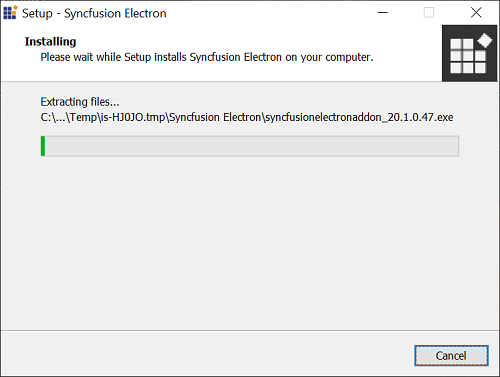
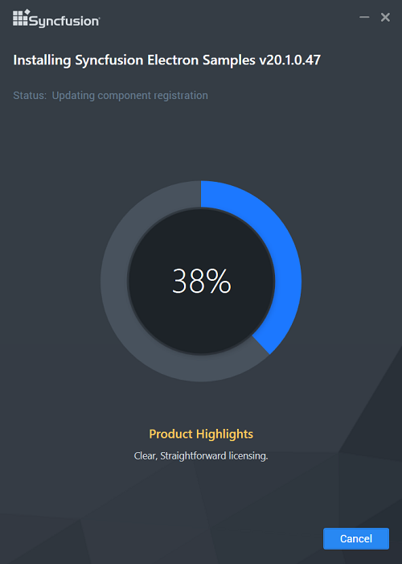

# Electron Add-on installer

Electron (Previously known as Atom Shell) is used create a cross platform desktop application for different OS like Linux, Windows and OS X by using JavaScript and able to access platform specific native API’s.

## Step-by-Step Installation

The following are the steps to install the Electron installer.

1. Double-click the Syncfusion Electron installer. The installer Wizard opens and extracts the package automatically. 

   
   

   N> No key is required for Syncfusion Electron.

2. Once the unzip operation is complete, License Agreement screen opens.

   

3. After reading the License Agreement, check the **I agree to the License Terms and Conditions** check box.

4. Click Next. Installation location will be displayed.

   

   N> You can also browse and choose a location by clicking Browse.

5. To install in the displayed default location, click Install.

   
   
   N> The Completed screen will be displayed once the Electron is installed.
   
   

6. Click Finish. Electron is installed in your system.
