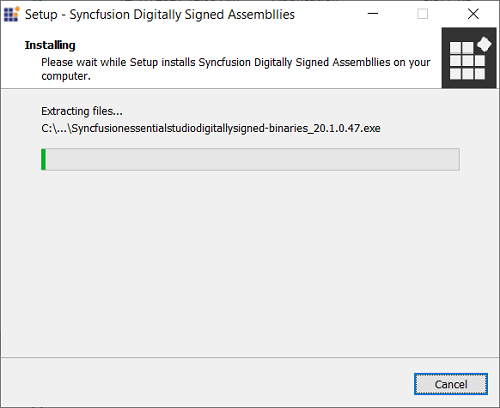

# Essential Studio - Digitally Signed Binaries

Syncfusion provides Digitally Signed Binaries installer. It signs the Syncfusion assemblies with a .pfx file. For information, see [Digitally Signed Binaries ](http://www.syncfusion.com/support/kb/7671). 

I> Essential Studio Digitally Signed Binaries can be installed only by the customers who holds the valid license

The following steps illustrate how to install Digitally Signed Binaries installer.

1.  Double-click the Syncfusion Digitally Signed Binaries installer file. The installer Wizard opens and extracts the package automatically. 
   
    

2.  Once the unzip operation is complete, the License registration screen opens.

    

3.  Enter the Unlock Key in the corresponding text box provided and select the **I agree to the License Terms and Conditions** check box after reading the License Agreement.

4.  Click Next. The Select Platform screen opens. Select the required platforms to install the assemblies and click Next.

    

5.  The Installation Location screen opens.
   
    N> Click Browse to choose a location for installing the Essential Studio Binaries.

6.  To install in the displayed default location, click Next.

    
   
7.  Digitally Signed Binaries installation will be started.

    

    N> The Completed screen is displayed once the selected package is installed.
    
    

8. Select the **Run Syncfusion Control Panel** check box to launch the Syncfusion Control Panel after installing. Click Finish to exit the installer Wizard. Digitally Signed Binaries will be installed.