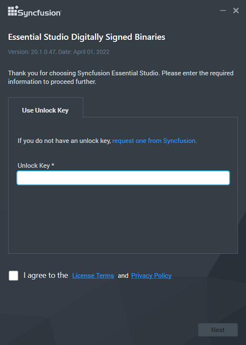
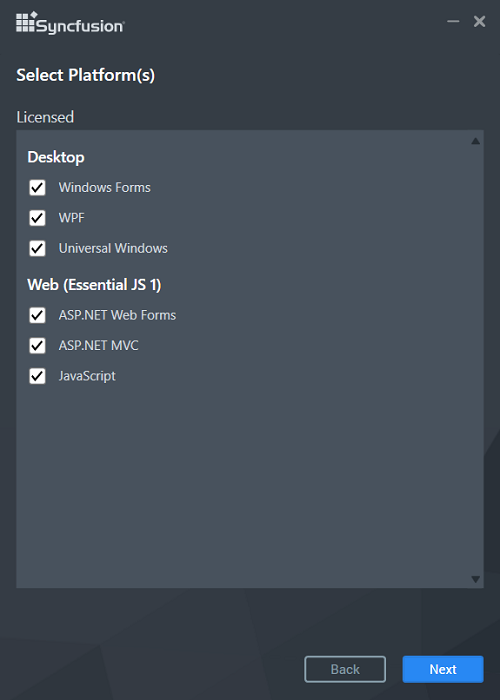
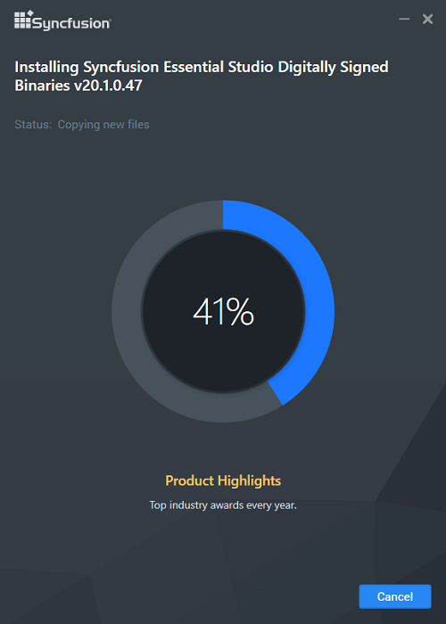
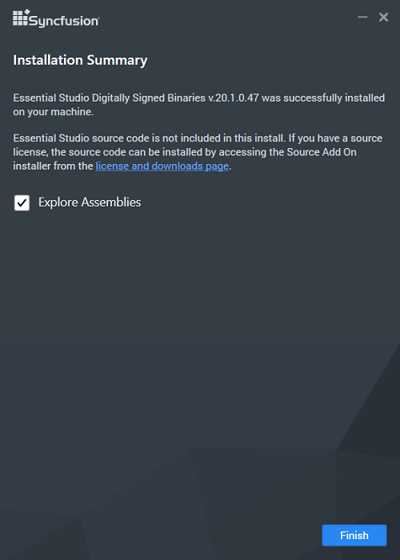

# Essential Studio - Digitally Signed Binaries

Syncfusion's installer includes Digitally Signed Binaries. It uses a.pfx file to sign the Syncfusion assemblies. See [Digitally Signed Binaries](http://www.syncfusion.com/support/kb/7671) for more information. 

I>* Only customers with a valid licence can install Essential Studio Digitally Signed Binaries
* Trial users will not be able to access this.

The steps below show how to install Digitally Signed Binaries installer.

1.  Open the Syncfusion Digitally Signed Binaries installer file by double-clicking it. The installer Wizard automatically opens and extracts the package
   
    

2.  The Unlock key registration screen appears, when the unzip operation is finished, .

    

3.  After reading the License Agreement, enter the Unlock Key in the corresponding text box and check the **I agree to the License Terms and Conditions** box.

4.  Next, Click the Next button. The platform selection screen appears. Select the platforms on which you want to install the assemblies and then click Next.

    

5.  The Installation Location wizard appears.
   
    N> Select a location for installing the Essential Studio Binaries by clicking **Browse**.

6.  Click Next to install in the default location.

    
   
7.  Digitally Signed Binaries installation will begins.

    

    N> The Completed screen will be displayed once the selected package is installed.
    
    

8.  After installation, check the **Run Syncfusion Control Panel** box to launch the Syncfusion Control Panel. To exit the installer Wizard, click Finish. Digitally Signed Binaries is installed in your machine.