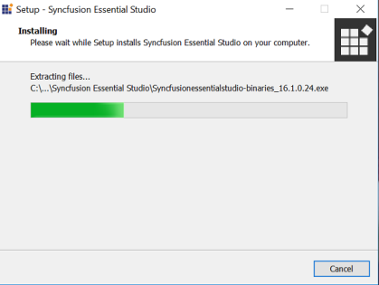
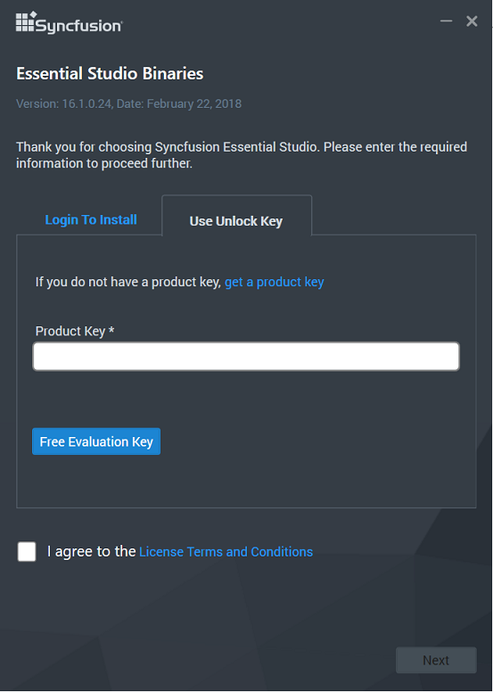
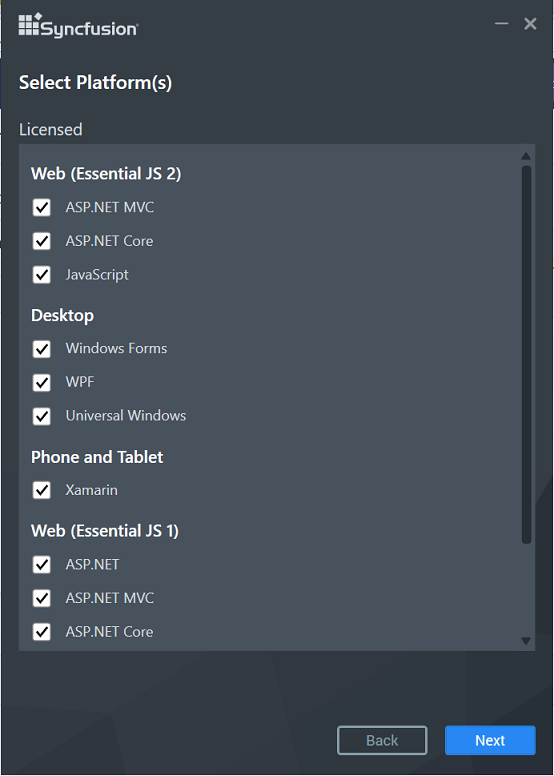
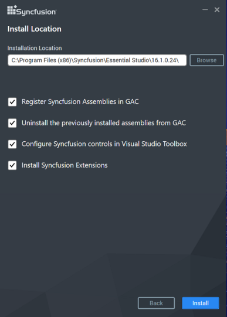
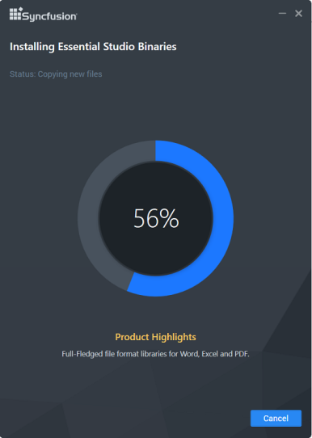
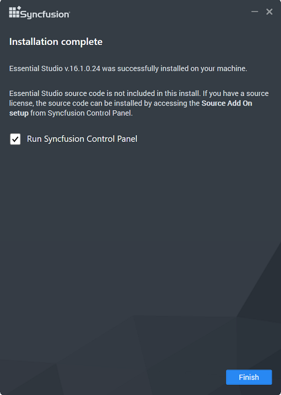

# Essential Studio Enterprise - Binaries

Syncfusion provides the Essential Studio - Binaries installer to configure the Syncfusion controls in a build machine, in which Syncfusion Essential Studio is not installed. This installs Essential Studio assemblies into the target folder. For information, see [Essential Studio - Binaries](http://www.syncfusion.com/support/kb/7653). 

I> Syncfusion has stopped providing the Essential Studio - Binaries installer from 2018 Volume 2 release. However, you can download and install the previous versions.

The following procedure illustrates how to install Essential Studio - Binaries installer.

1.  Double-click the Syncfusion Essential Studio - Binaries installer file. The installer Wizard opens and extracts the package automatically.

    

2.  Once the unzip operation is complete, the License registration screen opens.

    

3.  Enter the Unlock Key in the corresponding text box provided and select the **I agree to the License Terms and Conditions** check box after reading the License Agreement.

4.  Click Next. The Select Platform screen opens. Select the required platforms to install the assemblies and click Next.

    

5.  The Installation Location screen opens.
   
    N> Click Browse to choose a location for installing the Essential Studio assemblies.

6.  To install in the displayed default location, click Next.

    
   
7.  Essential Studio - Binaries installation will be started.

    

    N> The Completed screen is displayed once the selected package is installed.
    
    

8. Select the **Run Syncfusion Control Panel** check box to launch the Syncfusion Control Panel after installing. Click Finish to exit the installer Wizard. Essential Studio - Binaries installer is installed in your machine.

