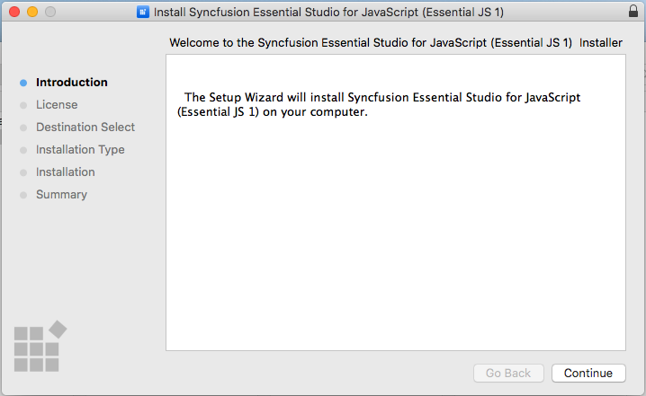
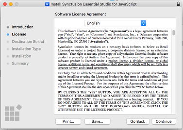
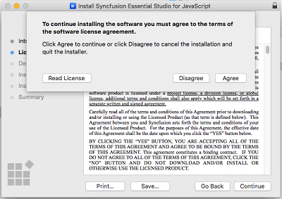
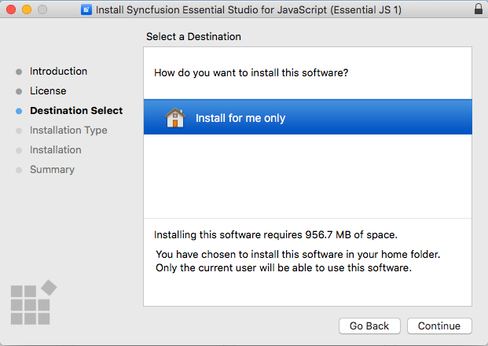
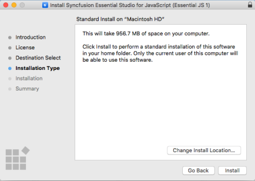
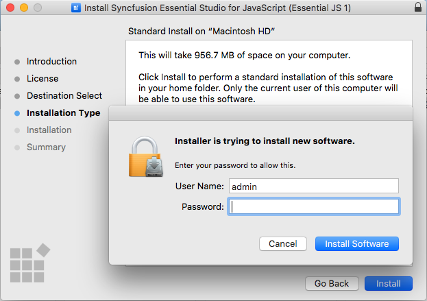
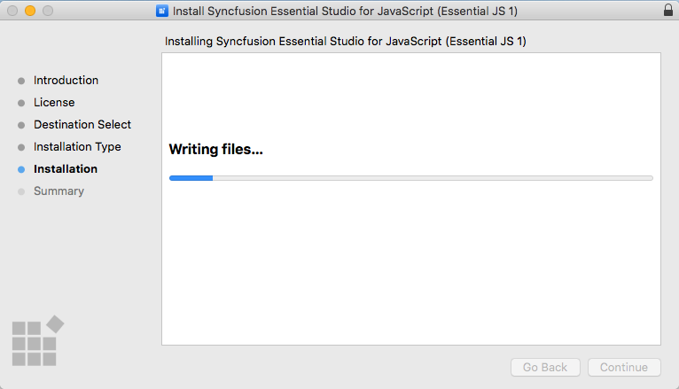
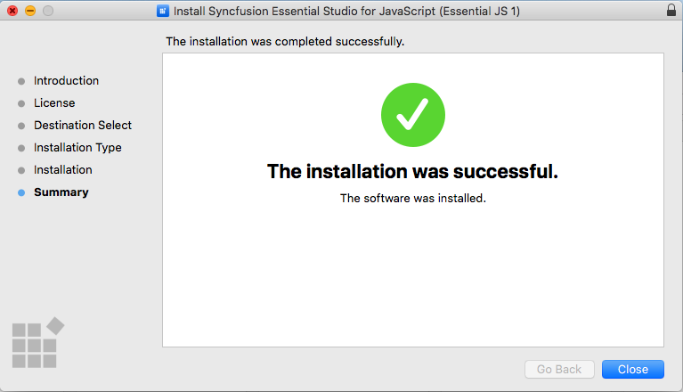
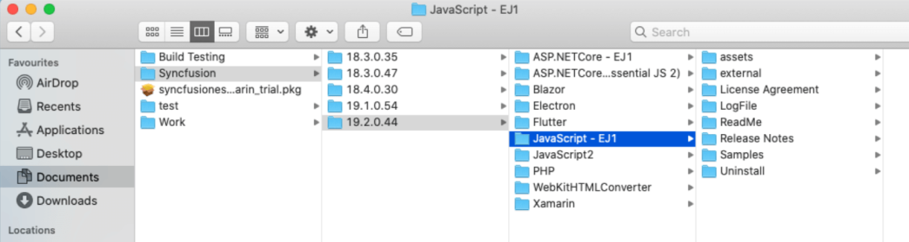

# Essential Studio Mac Installer

## Overview

Syncfusion provides the Mac installer for the following Essential Studio platforms.

* ASP.NET Core (Essential JS 2)
* JavaScript (Essential JS 2)
* Xamarin
* ASP.NET Core (Essential JS 1)
* JavaScript (Essential JS 1)
* PHP
* Electron
* WebKit HTML Converter

## Step-by-Step Installation

The following procedure illustrates how to install Essential Studio Mac installer. 

1. Double-click the Syncfusion Essential Studio Mac Setup(.pkg) file. The Setup Wizard opens. Click Continue.

   
   

2. Software License Agreement window opens. Click Continue.

      
   

3. Confirmation window will be displayed for the License Agreement. Click **Agree**.

   
   
   N> Unlock key is not required for installing the Mac installer. Syncfusion Mac installer can be used for developing purposes without registering the Unlock key.

4. Destination Select windows opens. Click Continue.

   

5. Installation Type window opens. Click Install.

   

6. Authentication window opens. Provide your system's user name, password and click **Install Software**

   

7. Installation will be started in your machine. 
   
   
   
8. Completed screen will be displayed once the installation is finished. Click Close to exit the installation wizard. 

   
   
By default, Mac installer will install the files in following location.

   **Location:** {Documents}\Syncfusion\ {version}\ {platform}
   
   

