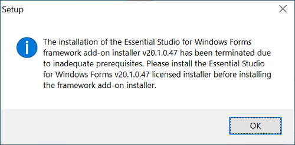
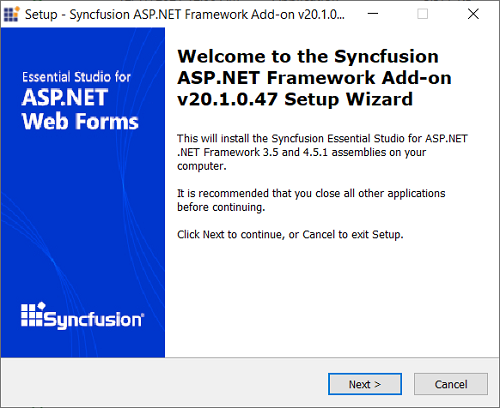
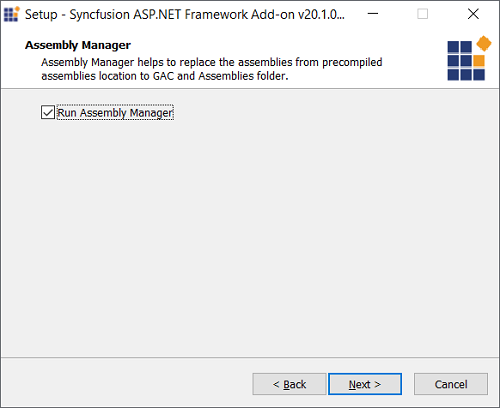
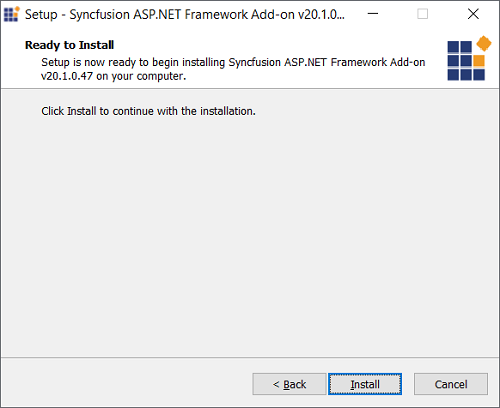
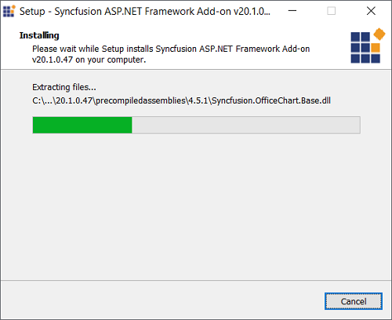
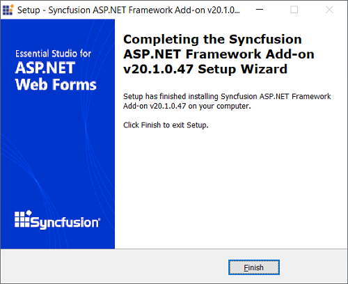

# Essential Studio Platform Framework Add-Ons

## Overview

Starting with version 16.4.0.* (2018 Volume 4), Syncfusion has removed the .NET Framework 2.0, 3.5 and 4.5.1 assemblies and provide the separate Add-On setup for the following platforms. . 

N> Only customers with valid license can download and install the Framework Add-Ons

* Windows Forms
* WPF
* ASP.NET
* ASP.NET MVC
* JavaScript

## Prerequisites

To install the above platform add-ons, corresponding Essential Studio platform setup should be installed in the same version. If not, prerequisite alert will be displayed.

## Step-by-Step Installation

The following procedure illustrates how to install Syncfusion Platform Framework Add-On setup.

1.  Double-click the Syncfusion Platform Framework Add-On setup file. Welcome wizard will be displayed. Click Next.

    

2.  Confirmation to run the Assembly Manager will be displayed. Click Next. 

    N> If you do not need the asssemblies to be installed in GAC, uncheck the **Run Assembly Manager** checkbox and click Next.

    

3.  **Ready To Install** wizard will be displayed. Click **Install** to proceed installation of Syncfusion Platform Framework Add-On setup.

    

4.  Syncfusion Platform Framework Add-On installation will be started.

    

5.  Completed screen will be displayed once the installation is completed. Click Finish to exit the setup.
  
    
	
Now, you can find the Framework 2.0, 3.5 and 4.5.1 assemblies from the Syncfusion Essential Studio Platform installed location.

**Location:** {ProgramFilesFolder}\Syncfusion\Essential Studio\{Platform}\{version}\precompiledassemblies

**Example:** C:\Program Files (x86)\Syncfusion\Essential Studio\Windows\16.4.0.40\precompiledassemblies
