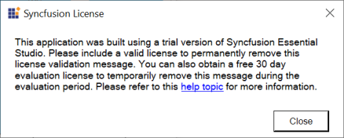

# How to install the Trial and Licensed setup side by side safely?

You can install both Licensed and Trial setup side by side for different Essential Studio platforms. The following alert message will be shown if you install the combination of License and Trial platform setup. However, you can continue the installation. The alert message will be shown for the following platforms.

* ASP.NET Web Forms
* ASP.NET MVC
* JavaScript
* Windows Forms
* WPF
* File Formats  

**Online Installer**

**Offline Installer**

### Problem

If you install Licensed and Trial setup in the same machine, licensing issues will occur while development and the following licensing alert will be shown.

### Reason

Assemblies will conflict as both Licensed and Trial assemblies will be present in GAC.

### Suggested solution

Run the [Assembly Manager](https://help.syncfusion.com/common/essential-studio/utilities#assembly-manager) for the licensed platform setup you are using for development to avoid licensing issues while running samples and using Syncfusion controls.

