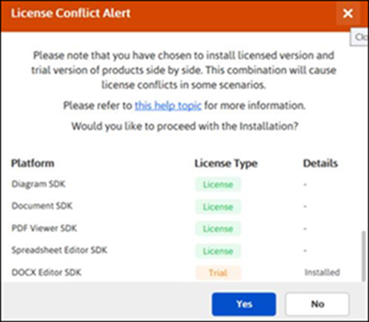
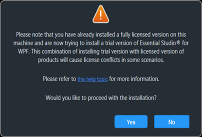
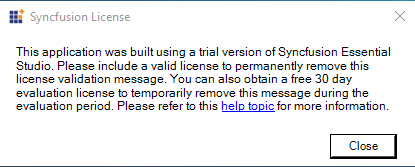

# How to install the Trial and Licensed Installer side by side safely?

You can install both Licensed and Trial installer side by side for different Essential Studio&reg; products. The following alert message will be shown if you install the combination of License and Trial platform installer. However, you can continue the installation. The alert message will be shown for the following products.

* Windows Forms
* WPF
* File Formats

<em>**Online Installer**</em>

<strong>Alert displayed when running the online installer in side-by-side mode.</strong>

<em>**Offline Installer**</em>

<strong>Alert displayed when running the offline installer in side-by-side mode.</strong>

> **Note:** Administrator (elevated) privileges are required to install assemblies in the GAC and to run the installers in side-by-side mode.

### Problem

If you install both Licensed and Trial installers on the same machine, licensing issues will occur during development and the following licensing alert is shown.

### Reason

Assemblies will conflict because both Licensed and Trial assemblies are present in the GAC, and the runtime cannot determine which license to apply.

### Suggested solution

To avoid licensing issues while running demos or using Syncfusion&reg; controls, use the [Assembly Manager](https://help.syncfusion.com/common/essential-studio/utilities#assembly-manager) to install the licensed assemblies in the GAC for the product you are developing with.

#### Prerequisites

* Ensure you have administrator (elevated) privileges on the machine.
* Use the Assembly Manager version that matches the version of the licensed product you are developing with.
* Remove the conflicting Trial assemblies from the GAC before installing the licensed assemblies.

#### Steps

1. Launch the **Assembly Manager** from the Syncfusion folder in the installed product's Utilities directory.
2. Select the licensed product version that matches the one used for development.
3. Choose **Perform Action** for the licensed assemblies.
4. Confirm the action and wait for the installation to complete.
5. Restart any open Visual Studio instances so that the updated assemblies are picked up.

### Troubleshooting

* If the licensing alert still appears after running the Assembly Manager, verify that the licensed assemblies are present in the GAC by opening `C:\Windows\Microsoft.NET\assembly\GAC_MSIL` and confirming the licensed version.
* Ensure that no Trial assemblies of the same product version are referenced by your project. Clear the `Bin` and `Obj` folders and rebuild the solution.

