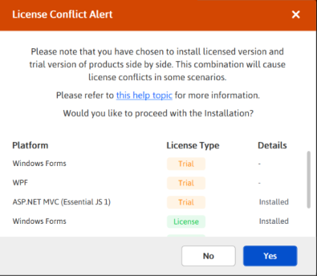

# How to install the Trial and Licensed installer side by side safely?

You can install both Licensed and Trial installer side by side for different Essential Studio&reg;  products. The following alert message will be shown if you install the combination of License and Trial platform installer. However, you can continue the installation. The alert message will be shown for the following products.

* Windows Forms
* WPF
* File Formats  

<em>**Online Installer**</em>

<em>**Offline Installer**</em>

### Problem

If you install Licensed and Trial installer in the same machine, licensing issues will occur while development and the following licensing alert will be shown.

### Reason

Assemblies will conflict as both Licensed and Trial assemblies will be present in GAC.

### Suggested solution

To avoid licensing issues while running demos or using Syncfusion&reg;  controls, launch the [Assembly Manager](https://help.syncfusion.com/common/essential-studio/utilities#assembly-manager) for the licensed product you're using for development and install the licensed assemblies in GAC.

