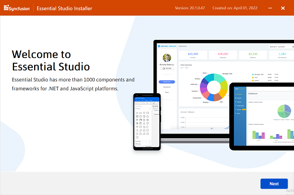
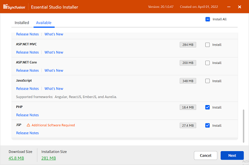
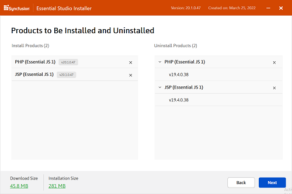
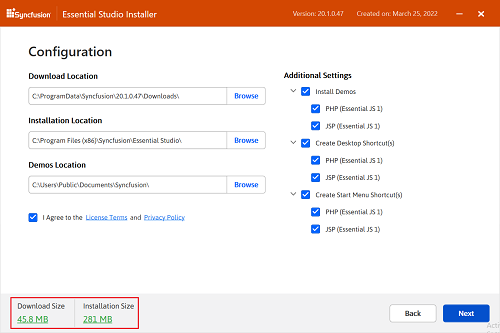
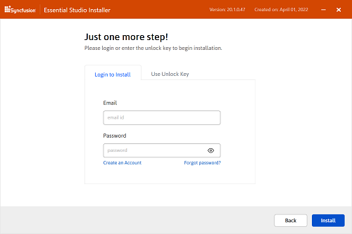
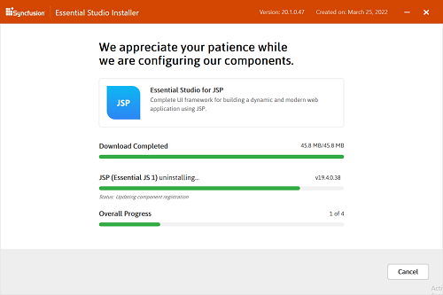
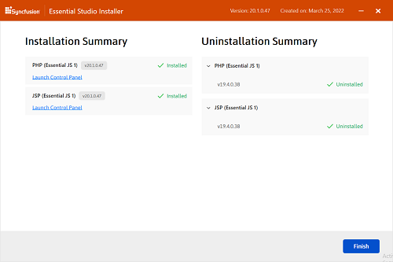

# Essential Studio Offline Installer

## Overview

Syncfusion started providing the Offline Essential Studio setup only for Licensed customers from 2018 Volume 2 release. The Essential Studio Enterprise Edition Installer includes the following platforms. You can download the latest version Essential Studio Installer [here](https://www.syncfusion.com/downloads/latest-version) . 

Starting with the version 17.3 (2019 Vol 3), Syncfusion provides updated version of Offline Installer which allows both installation and uninstallation the platforms for that specific version.

I> You can install the Essential Studio Offline Installer using Login and Unlock key.

**Web (Essential JS 2)**

* ASP.NET MVC
* ASP.NET Core
* JavaScript

**Mobile**

* Xamarin
* Flutter

**Desktop**

* Windows Forms
* WPF
* Universal Windows Platform

**Web (Essential JS 1)**

* ASP.NET Web Forms
* ASP.NET MVC
* ASP.NET Core
* JavaScript
* PHP
* JSP
 
 
The following procedure illustrates how to install Essential Studio Offline Installer setup. 

1.Double-click the Syncfusion Essential Studio Offline Installer setup file. The Setup Wizard opens and extracts the package automatically.

    
N> The Setup wizard extracts the syncfusionessentialstudiosetup_{version}.exe dialog, displaying the unzip operation of the package.
    
2.Welcome wizard of the Syncfusion Offline Installer will be displayed. Click Next.

  
3.Platform Selection wizard will be displayed. Here you can select the required platforms to be installed/uninstalled. Select the platforms to be installed from the **Available** tab and platforms to be uninstalled from the **Installed** tab. Click Next.

**Available**
	

	
**Installed**
	

	
I> If the required software of the selected platform was not already installed, **Additional Software Required** alert will be displayed.
	

	
4. Confirmation wizard will be displayed. Here you can view and modify the list of platforms that will be installed/uninstalled.

	
N> You can check the Estimated size of the Download and Installation by clicking the **Download Size and Installation Size** link.
	

	

5.  Configuration wizard will be displayed. Here you can change the Download, Install and samples location. Also, you can change the Additional settings by platform basis. To install using the default configuration, click Next.

	
I> From version 17.3 (2019 Vol 3), Syncfusion provides option to provide custom download location.
	
   
    N> From the 2018 Volume 2 release, Syncfusion has changed the install and samples location 
	   **Default Install location:** {ProgramFilesFolder}\Syncfusion\{Platform}\{version}
	   **Default Samples location:** C:\Users\Public\Documents\Syncfusion\{platform}\{version}
	   However, you can change the locations by clicking browse button.

	
	
* Select the **Install Demos** check box to install Syncfusion samples, or leave the check box clear, when you do not want to install Syncfusion samples.
* Select the **Register Syncfusion Assemblies in GAC** check box to install the latest Syncfusion assemblies in GAC, or clear this check box when you do not want to install the latest assemblies in GAC.
* Select the **Configure Syncfusion controls in Visual Studio** check box to configure the Syncfusion controls in the Visual Studio toolbox, or clear this check box when you do not want to configure the Syncfusion controls in the Visual Studio toolbox during setup installation. Note that you must also select the Register Syncfusion assemblies in GAC check box when you select this check box.
* Select the **Configure Syncfusion Extensions in Visual Studio** checkbox to configure the Syncfusion Extensions in Visual Studio or clear this check box when you do not want to configure the Syncfusion Extensions in Visual Studio.
* Select the **Create Desktop Shortcut** checkbox to create the desktop shortcut for Syncfusion Control Panel.

6.After reading the License Terms and Conditions, check the **I agree to the License Terms and Privacy Policy** check box. Click Next.

7.Login wizard will be displayed. You are provided with two options to unlock the Syncfusion setup.

   
   * Login To Install
   
   * Use Unlock Key

**Login To Install** 

 You should enter your Syncfusion Direct-Trac login credentials. If you don't have Syncfusion Direct-Trac login credentials, then you can click on **Create an Account**. Else if you forgot your password, click on **Forgot Password** to create new password. Click Install.

**Use Unlock Key**
   
You should use the Syncfusion License key. Licensed customer can generate key from [here](https://www.syncfusion.com/kb/2326/how-to-generate-syncfusion-setup-unlock-key-from-the-syncfusion-support-account).

8.Download, Installation and Uninstallation progress will be displayed.

9.Once the Installation/Uninstallation is complete, **Summary** wizard will be displayed. Here you can check the list of platforms which are installed/uninstalled successfully and failed. Click Finish to exit the Summary wizard. 

	
* Click **Launch Control Panel** to open the Syncfusion Control Panel.

