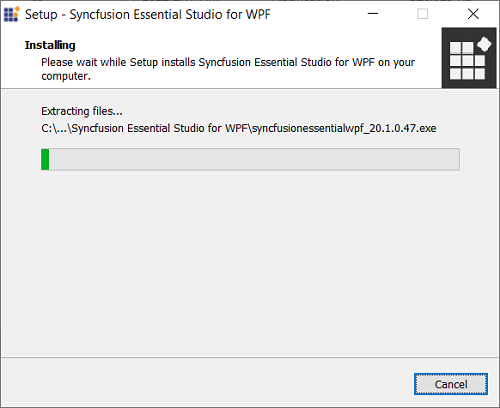
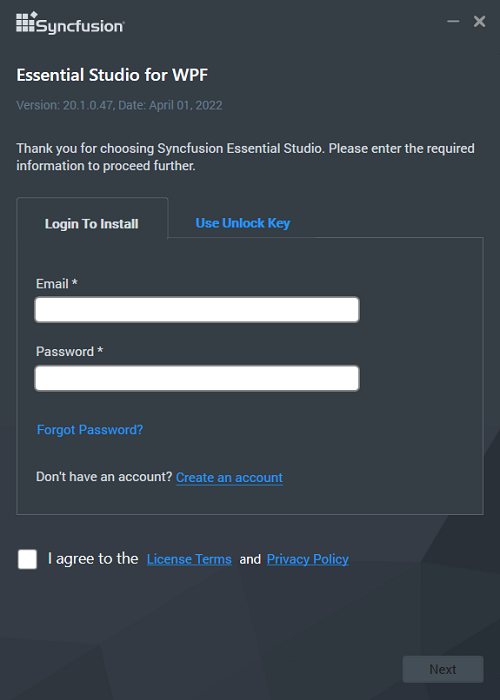
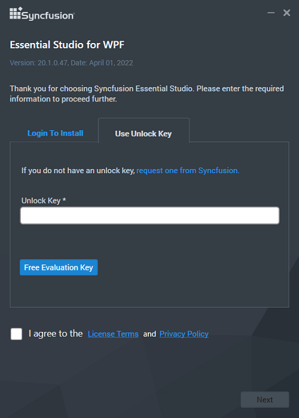
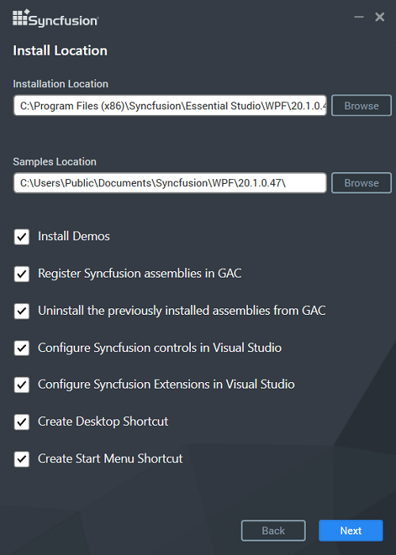
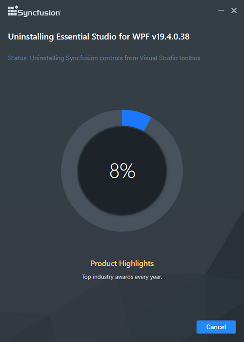

# Essential Studio Installer for Individual Platforms

## Overview

Syncfusion provides separate platform setups for all the Essential Studio platforms. You can download the latest version platforms Installer [here](https://www.syncfusion.com/downloads/latest-version) .

* ASP.NET MVC (Essential JS 2)
* ASP.NET Core (Essential JS 2)
* JavaScript (Essential JS 2)
* Xamarin
* Windows Forms 
* WPF
* Universal Windows Platform
* FileFormats
* ASP.NET Web Forms
* ASP.NET MVC (Essential JS 1)
* ASP.NET Core (Essential JS 1)
* JavaScript (Essential JS 1)
* JSP
* PHP

N> From the 2018 Volume 2 release, Syncfusion provides the support for uninstalling the particular platform alone. 

   N> Universal Windows Platform setup can be installed in Windows 8.1 and later.

## Step-by-Step Installation

The following procedure illustrates how to install Essential Studio. 

1. Double-click the Syncfusion Essential Studio Platform Setup file. The Setup Wizard opens and extracts the package automatically.

   

   N> The Setup wizard extracts the syncfusionessentialstudio_(version).exe dialog, displaying the unzip operation of the package.

2. You are provided with two options to unlock the Syncfusion setup.

   
   * **Login To Install**   
   
   * **Use Unlock Key**
   
   N> While installing the Syncfusion setup, by default **Login To Install** screen will be displayed. You can provide the email ID and password registered with Syncfusion for unlocking the Essential Studio setup and your license will be configured. For unlocking the setup with License Key, you can select the **Use Unlock Key** option in the Installer and you will be prompt to enter the license key.
   
   
   **Login To Install**
   
   You should enter your Syncfusion Direct-Trac login credentials. If you don't have Syncfusion Direct-Trac login credentials, then you can click on Sign Up to a create new account. Else if you forgot your password, click on Reset Password to create new password. Here Email address and Password is validated and the Platform Selection window opens.

      

   **Use Unlock Key**
   
   You should use the Syncfusion License/Trial key. Trial key is valid for 30 days and the installer won't accept the expired trial key. Licensed customer can generate key from [here](https://www.syncfusion.com/kb/2326/how-to-generate-syncfusion-setup-unlock-key-from-the-syncfusion-support-account).

   
   

3. After reading the License Terms and Conditions, check the **I agree to the License Terms and Conditions** check box.

4. Click Next. Select the Installation, Samples Folder and Advanced Options screen opens. To install in the displayed default location, click Install

    

	
    N> From the 2018 Volume 2 release, Syncfusion has changed the install and samples location 
	   **Default Install location:** {ProgramFilesFolder}\Syncfusion\{Platform}\{version}
	   **Default Samples location:** C:\Users\Public\Documents\Syncfusion\{platform}\{version}
	   However, you can change the locations by clicking browse button.

   

    * Select the **Install Syncfusion Samples** check box to install Syncfusion samples, or leave the check box clear, when you do not want to install Syncfusion samples.
    * Select the **Register Syncfusion Assemblies in GAC** check box to install the latest Syncfusion assemblies in GAC, or clear this check box when you do not want to install the latest assemblies in GAC.
    * Select the **Uninstall the previously installed Syncfusion assemblies from GAC** check box to uninstall the previously installed Syncfusion assemblies from GAC, or clear this check box to maintain the previously installed assemblies.
    * Select the **Configure Syncfusion controls in Visual Studio Toolbox** check box to configure the Syncfusion controls in the Visual Studio toolbox, or clear this check box when you do not want to configure the Syncfusion controls in the Visual Studio toolbox during setup installation. Note that you must also select the Register Syncfusion assemblies in GAC check box when you select this check box.
    * Select the **Install Syncfusion Extensions** checkbox to configure the Syncfusion Extensions in Visual Studio or clear this check box when you do not want to configure the Syncfusion Extensions in Visual Studio.

5.  Click Install.

    

     N> The Completed screen is displayed once the package is installed.

    

6. Select the **Run Syncfusion Control Panel** check box to launch the Syncfusion Control Panel after installing.

7. Click Finish. Essential Studio is installed in your system and the Syncfusion Essential Studio [Syncfusion Control Panel](http://help.syncfusion.com/common/essential-studio/utilities#dashboard ) is launched automatically.

## Command Line 

The Syncfusion Essential Studio Platform Installer supports installing/uninstalling the setup through Command Line. The following sections illustrate this ability. 

### Command Line Installation

Follow the steps below to install through Command Line in Silent mode.

1. Double-click the Syncfusion Essential Studio platform Setup file. The Setup Wizard opens and extracts the package automatically.
2. The SyncfusionEssentialStudio(platform)_(version).exe file is extracted into the Temp folder.
3. Run %temp%. The Temp folder will open. The SyncfusionEssentialStudio(platform)_(version).exe file is available in one of the folders.
4. Copy the SyncfusionEssentialStudio_(version).exe file in local drive. Example: D:\temp
5. Cancel the Wizard.
6. Open the Command Prompt in administrator mode and pass the following arguments for corresponding version:

   **Essential Studio version 17.1 and later**

   **Arguments:** “Setup file path\SyncfusionEssentialStudio(platform)_(version).exe” /Install silent /UNLOCKKEY:“(product unlock key)” [/log “{Log file path}”] [/InstallPath:{Location to install}] [/InstallSamples:{true/false}] [/InstallAssemblies:{true/false}] [/UninstallExistAssemblies:{true/false}] [/InstallToolbox:{true/false}] [/InstallVsix:{true/false}] [/CreateShortcut:{true/false}]
   
   
   N> [..] – Arguments inside the square brackets are optional.

   **Example:** “D:\Temp\SyncfusionEssentialStudio(platform)_13.2.0.30.exe” /Install silent /UNLOCKKEY:“product unlock key” /log “C:\Temp\EssentialStudio_Platform.log” /InstallPath:C:\Syncfusion\x.x.x.x /InstallSamples:true /InstallAssemblies:true /UninstallExistAssemblies:true /InstallToolbox:true /InstallVsix:true /CreateShortcut:true
   
   **Refer the below table for older versions**
   
<table>
<tr>
<td>
<b>Syncfusion Essential Studio Versions</b></td><td>
<b>Arguments</b></td><td>
<b>Example</b></td></tr>
<tr>
<td>
<b>16.2 to 16.4</b></td><td>
“Setup file path\SyncfusionEssentialStudio(platform)_(version).exe” /Install silent /UNLOCKKEY:“(product unlock key)” [/log “{Log file path}”] [/InstallPath:{Location to install}] [/InstallSamples:{true/false}] [/InstallAssemblies:{true/false}] [/UninstallExistAssemblies:{true/false}] [/InstallToolbox:{true/false}] [/InstallVsix:{true/false}]</td><td>
“D:\Temp\SyncfusionEssentialStudio(platform)_13.2.0.30.exe” /Install silent /UNLOCKKEY:“product unlock key” /log “C:\Temp\EssentialStudio_Platform.log” /InstallPath:C:\Syncfusion\x.x.x.x /InstallSamples:true /InstallAssemblies:true /UninstallExistAssemblies:true /InstallToolbox:true /InstallVsix:true</td>
</tr>
<tr>
<td>
<b>13.2 to 16.1</b></td><td>
“Setup file path\SyncfusionEssentialStudio(platform)_(version).exe” /Install silent /PIDKEY:“(product unlock key)” [/log “{Log file path}”] [/InstallPath:{Location to install}] [/InstallSamples:{true/false}] [/InstallAssemblies:{true/false}] [/UninstallExistAssemblies:{true/false}] [/InstallToolbox:{true/false}]</td><td>
“D:\Temp\SyncfusionEssentialStudio(platform)_13.2.0.30.exe” /Install silent /PIDKEY:“product unlock key” /log “C:\Temp\EssentialStudio_Platform.log” /InstallPath:C:\Syncfusion\x.x.x.x /InstallSamples:true /InstallAssemblies:true /UninstallExistAssemblies:true /InstallToolbox:true</td>
</tr>
<tr>
<td>
<b>11.1 to 13.1</b></td><td>
“Setup file path\SyncfusionEssentialStudio(platform)_(version).exe” Install /PIDKEY:“(product unlock key)” [/log “{Log file path}”] [/InstallPath: {Location to install}]</td><td>
“D:\Temp\SyncfusionEssentialStudio(platform)_12.1.0.43.exe” Install /PIDKEY:“product unlock key” /log “C:\Temp\EssentialStudio_Platform.log” /InstallPath:C:\Syncfusion\x.x.x.x</td>
</tr>
</table>
   

   N> We have provided Advanced Options in silent installation from 13.2.0.x.

	
7. Setup is installed.

   N> x.x.x.x needs to be replaced with the Essential Studio version installed in your machine and the Product Unlock Key needs to be replaced with the Unlock Key for that version. The platform should be replaced with ASP.NET Web Forms, ASP.NET MVC, Windows Forms, WPF, JavaScript, Xamarin, PHP, JSP or UWP.
   

### Command Line Uninstallation

Syncfusion Essential Studio supports uninstalling the setup through Command Line in Silent mode. The following steps illustrate this. 

1. When you do not have the extracted setup (SyncfusionEssentialStudio(platform)_(version).exe) then follow the steps from 2 to 7.
2. Double-click the Syncfusion Essential Studio platform Setup file. The Setup Wizard opens and extracts the package automatically.
3. The SyncfusionEssentialStudio(platform)_(version).exe file is extracted into the Temp folder.
4. Run %temp%. The Temp folder will open. The SyncfusionEssentialStudio(platform)_(version).exe file is available in one of the folders.
5. Copy the SyncfusionEssentialStudio(platform)_(version).exe file in local drive. Example: D:\temp
6. Cancel the Wizard.
7. Open the Command Prompt in administrator mode and pass the following arguments for corresponding version: 

   **Essential Studio version 13.2 and later**

   **Arguments:** “Setup file path\SyncfusionEssentialStudio(platform)_(version).exe” /uninstall silent 

   **Example:** “D:\Temp\SyncfusionEssentialStudio(platform)_13.2.0.30.exe" /uninstall silent
   
   **Essential Studio version from 11.1 to 13.1**

   **Arguments:** “Setup file path\SyncfusionEssentialStudio(platform)_(version).exe” /uninstall true 

   **Example:** “D:\Temp\SyncfusionEssentialStudio(platform)_12.1.0.43.exe" /uninstall true
    
   
8. Setup is uninstalled.

   N> x.x.x.x needs to be replaced with the Essential Studio version installed in your machine and the Product Unlock Key needs to be replaced with the unlock key for that version. Platform should be replaced with ASP.NET Web Forms, ASP.NET MVC, Windows Forms, WPF, JavaScript, Xamarin, PHP, JSP or UWP.

