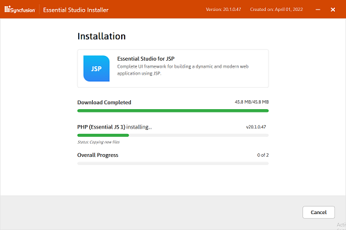
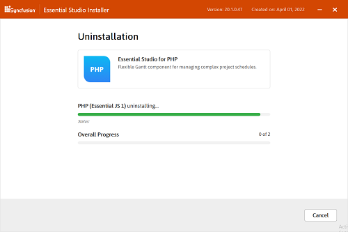
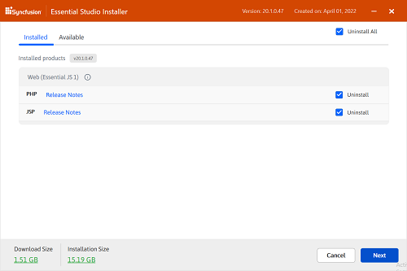
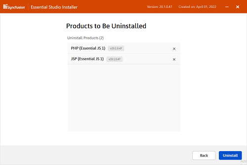

# Essential Studio Web Installer

## Overview

Syncfusion started providing the Online Installer for Essential Studio from 2018 Volume 2 release. This installer reduces the burden of downloading the setup of larger size. You can just download and launch the online installer which will be of smaller size and it will downloads and installs all the Essential Studio packages for the platforms you have selected. The Essential Studio Web Installer includes all of the following platforms. You can download the latest version Essential Studio Web Installer [here](https://www.syncfusion.com/downloads/latest-version) . 

**Web (Essential JS 2)**

* ASP.NET MVC
* ASP.NET Core
* JavaScript

**Desktop**

* Windows Forms
* WPF
* Universal Windows Platform

**Mobile**

* Xamarin

**FileFormats**

**Web (Essential JS 1)**

* ASP.NET
* ASP.NET MVC
* ASP.NET Core
* JavaScript
* PHP
* JSP

   N> Universal Windows Platform will be installed in Windows 8.1 and later.   
 
 
## Step-by-Step Installation

The following procedure illustrates how to install Essential Studio Online Installer setup. 

1.  Double-click the Syncfusion Essential Studio Online Installer setup file. The Setup Wizard opens and extracts the package automatically.

    

    
    N> The Setup wizard extracts the syncfusion{platform}webinstaller_{version}.exe dialog, displaying the unzip operation of the package.
    
2. Welcome wizard of the Syncfusion Online Installer will be displayed. Click Proceed.

   

  
3.  Platform Selection wizard will be displayed. Here you can select the required platforms to be installed. Click Next.

    
	
	I> If the required software of the selected platform was not already installed, **Additional Software Required** alert will be displayed.
	
	
	
	N> You can check the Estimated size of the Download and Installation by clicking the **Download Size and Installation Size** link.
	
	

4.  Configuration wizard will be displayed. Here you can change the Install and samples location. Also, you can change the Additional settings for the individual platform. To install using the default configuration, click Next.

    
	
    I> From the 2018 Volume 2 release, Syncfusion has changed the install and samples location. The default install location will be **{ProgramFilesFolder}\Syncfusion\{Platform}\{version}**. The default samples location will be the **Public Documents** folder. However, you can change the locations by clicking browse button.
	
	

    * Select the **Install Demos** check box to install Syncfusion samples, or leave the check box clear, when you do not want to install Syncfusion samples.
    * Select the **Register Syncfusion Assemblies in GAC** check box to install the latest Syncfusion assemblies in GAC, or clear this check box when you do not want to install the latest assemblies in GAC.
    * Select the **Configure Syncfusion controls in Visual Studio** check box to configure the Syncfusion controls in the Visual Studio toolbox, or clear this check box when you do not want to configure the Syncfusion controls in the Visual Studio toolbox during setup installation. Note that you must also select the Register Syncfusion assemblies in GAC check box when you select this check box.
	* Select the **Configure Syncfusion controls in Visual Studio** checkbox to configure the Syncfusion Extensions in Visual Studio or clear this check box when you do not want to configure the Syncfusion Extensions in Visual Studio.

5.  After reading the License Terms and Conditions, check the **I agree to the License Terms and Privacy Policy** check box. Click Next.

6. Login wizard will be displayed. You should enter your Syncfusion Direct-Trac login credentials. If you don't have Syncfusion Direct-Trac login credentials, then you can click on **Create an Account**. Else if you forgot your password, click on **Forgot Password** to create new password. Click Install.

    

7. Download and Installation progress will be displayed.

    

8. Once the Installation is complete, **Installation Summary** wizard will be displayed. Here you can check the list of platforms which are installed successfully and failed. Click on the **Getting Started** link to goto the UG documentation of the corresponding platform and **Launch Control Panel** to open the Syncfusion Control Panel. Click Finish to exit the Installation Summary wizard. 

    

