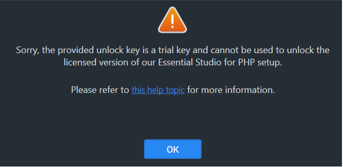
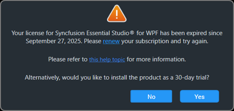
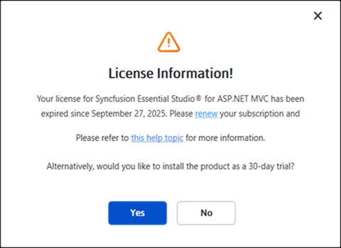
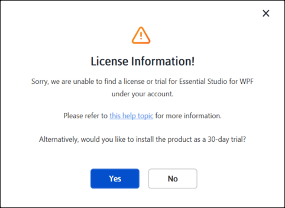
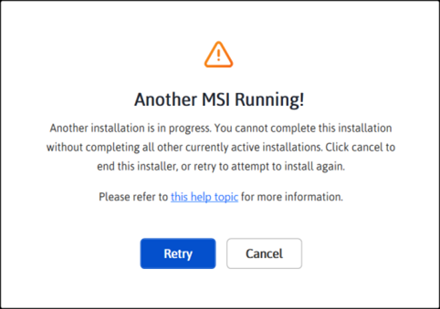
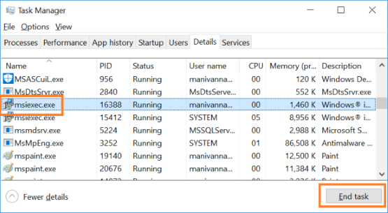
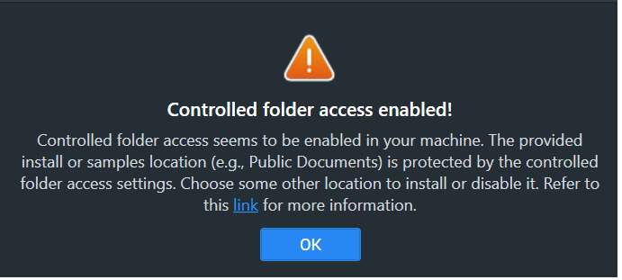
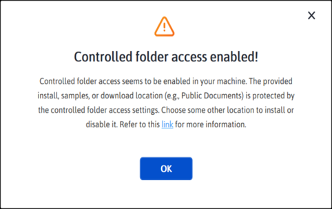

# Essential Studio Installation Errors

This article describes the most common installation errors, as well as the causes and solutions to those errors.

* [Unlocking the license installer using the trial key](https://help.syncfusion.com/common/essential-studio/installation/installation-errors#unlocking-the-license-installer-using-the-trial-key)
* [License has expired](https://help.syncfusion.com/common/essential-studio/installation/installation-errors#license-has-expired)
* [Unable to find a valid license or trial](https://help.syncfusion.com/common/essential-studio/installation/installation-errors#unable-to-find-a-valid-license-or-trial)
* [Unable to install because of another installation](https://help.syncfusion.com/common/essential-studio/installation/installation-errors#unable-to-install-because-of-another-installation)
* [Unable to install due to controlled folder access](https://help.syncfusion.com/common/essential-studio/installation/installation-errors#unable-to-install-due-to-controlled-folder-access)

## Unlocking the license installer using the trial key

### Problem

**Error Message:** Sorry, the provided unlock key is a trial unlock key and cannot be used to unlock the licensed version of our Essential Studio<sup style="font-size:70%">&reg;</sup> for {Platform} installer



### Reason

You are attempting to use a Trial unlock key to unlock the licensed installer.

### Suggested solution

Only a licensed unlock key can unlock a licensed installer. So, to unlock the Licensed installer, use the Licensed unlock key. To generate the licensed unlock key, refer to [Generate a licensed unlock key](https://www.syncfusion.com/kb/2326).


## License has expired

### Problem

**Error Message:** Your license for Syncfusion<sup style="font-size:70%">&reg;</sup> Essential Studio<sup style="font-size:70%">&reg;</sup> for {Platform} has been expired since {Date}. Please renew your subscription and try again

**Offline Installer**



**Online Installer**



### Reason

This error message will appear if your license has expired.

### Suggested solution

You can choose from the options listed below. 

1. You can renew your subscription [here](https://www.syncfusion.com/account/my-renewals). 
2. You can get a new license [here](https://www.syncfusion.com/sales/products). 
3. You can reach out to our sales team by emailing <sales@syncfusion.com>. 
4. You can also extend the 30-day trial period after your trial license has expired.


## Unable to find a valid license or trial

### Problem

**Error Message:** Sorry, we are unable to find a valid license or trial for Essential Studio<sup>&reg;</sup> for {Platform} under your account.

<em>**Offline installer**</em>


<em>**Online installer**</em>



### Reason

The following are possible causes of this error:

* When your trial period expired
* When you don't have a license or an active trial
* You are not the license holder of your license 
* Your account administrator has not yet assigned you a license.

### Suggested solution

You can choose from the options listed below. 

1. You can get a new license [here](https://www.syncfusion.com/sales/products). 
2. Contact your account administrator. 
3. Send an email to  <clientrelations@syncfusion.com> to request a license. 
4. You can reach out to our sales team by emailing  <sales@syncfusion.com>.


## Unable to install because of another installation

### Problem

**Error Message:** Another installation is in progress. You cannot complete this installation without completing all other currently active installations. Click cancel to end this installer, or retry to attempt to install again.



### Reason

You are trying to install when another installation is already running in your machine.

### Suggested solution

The **recommended solution** is to wait until the other installation is complete and then continue installing Syncfusion Essential Studio Products. If the installation is stuck or taking unusually long, use the steps below to end the msiexec.exe process.

Open and kill the msiexec process in the task manager and then continue to install Syncfusion<sup style="font-size:70%">&reg;</sup>. If the problem is still present, restart the computer and try Syncfusion<sup style="font-size:70%">&reg;</sup> installer.

1. Open the Windows Task Manager.

2. Browse the Details tab.

3. Select the msiexec.exe and click **End task**.



Alternatively, run the following command from an elevated Command Prompt or PowerShell window:

```batch
taskkill /F /IM msiexec.exe
```

## Unable to install due to controlled folder access

### Problem

#### Offline:

**Error Message:** Controlled folder access seems to be enabled in your machine. The provided install or samples location (e.g., Public Documents) is protected by the controlled folder access settings.



#### Online:

**Error Message:** Controlled folder access seems to be enabled in your machine. The provided install, samples, or download location (e.g., Public Documents) is protected by the controlled folder access settings.



### Reason

You have enabled controlled folder access settings on your computer.

### Suggested solution

**Suggestion 1:** (Install to a different directory - **Recommended**)

&nbsp;&nbsp;&nbsp;&nbsp;If you do not want to disable controlled folder access, install the demos in a different directory during setup.

**Suggestion 2:** (Disable controlled folder access)

1.	Our demos are installed in the Public Documents folder by default. 
2.	You have controlled folder access enabled on your machine, so the demos cannot be installed in the Documents folder. If you need to install the demos in the Documents folder, follow the steps in this [link](https://support.microsoft.com/en-us/windows/allow-an-app-to-access-controlled-folders-b5b6627a-b008-2ca2-7931-7e51e912b034) and disable the controlled folder access.
3.	You can re-enable this option after the setup has completed.


