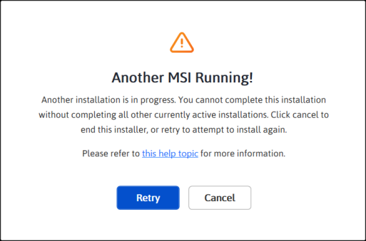

# Installation Errors

This article lists the common Installation errors, reasons and solution for those errors.

* [Could not unlock the Licensed setup with Trial key?](https://help.syncfusion.com/common/essential-studio/installation/installation-errors#could-not-unlock-the-licensed-setup-with-trial-key)
* [Licensed Expired! What to do?](https://help.syncfusion.com/common/essential-studio/installation/installation-errors#licensed-expired-what-to-do)
* [Not a Valid license holder?](https://help.syncfusion.com/common/essential-studio/installation/installation-errors#not-a-valid-license-holder)
* [Unable to find a license or trial?](https://help.syncfusion.com/common/essential-studio/installation/installation-errors#unable-to-find-a-license-or-trial)
* [Could not install the setup due to another installation?](https://help.syncfusion.com/common/essential-studio/installation/installation-errors#could-not-install-the-setup-due-to-another-installation)
* [Could not install the setup due to controlled folder access?](http://172.16.0.76/common/essential-studio/installation/installation-errors#could-not-install-the-setup-due-to-controlled-folder-access)

### Could not unlock the Licensed setup with Trial key?

#### Problem

**Error Message:** Sorry, the provided unlock key is a trial key and cannot be used to unlock the licensed version of our Essential Studio for {platform} setup

#### Reason

If you unlocked the Licensed setup with Trial key, this error message will be shown.

#### Suggested solution

Licensed setup can be unlocked only by License key. So, use the License key to unlock the Licensed setup. Refer [this](http://syncfusion.com/kb/2326) topic to generate the license key.

### Licensed Expired! What to do?

#### Problem

**Error Message:** Your license for Syncfusion Essential Studio for {platform} has been expired since {date}. Please renew your subscription and try again

**Online Installer**

#### Reason

This error message will be shown when your license has been expired.

#### Suggested solution.

Renew the subscription [here](https://www.syncfusion.com/sales/products) or contact our sales team at <salessupport@syncfusion.com>. Also, you can continue the 30 days trial after your license has been expired.

### Not a Valid license holder?

#### Problem

**Error Message:** Sorry, we are unable to find a valid license for Essential Studio for {platform} under your account.

#### Reason

The possible reasons for this error are:

* When your trial expired
* When you don't have License or trial

#### Suggested solution.

Renew the subscription [here](https://www.syncfusion.com/sales/products) or contact our sales team at <salessupport@syncfusion.com>.

### Unable to find a license or trial?

#### Problem

**Error Message:** Sorry, we are unable to find a license or trial for Essential Studio for {platform} under your account.

#### Reason

This is due to one of the following reasons:

* You are not the license holder of your license. 
* Your account administrator has not assigned a license to your account yet. Please contact your account administrator to have a license assigned to you or contact us via email at <clientrelations@syncfusion.com>.

#### Suggested solution.

Please check your subscription [here](https://www.syncfusion.com/sales/products) or contact our sales team at <salessupport@syncfusion.com>. Also, you can continue the 30 days trial.

### Could not install the setup due to another installation?

#### Problem

**Error Message:** Another installation is in progress. You cannot complete this installation without completing all other currently active installations. Click cancel to end this setup, or retry to attempt to install again.

#### Reason

This error message will be shown when another installation is already running in your machine. 

#### Suggested solution.

Open the Task Manager and kill the msiexec process and then continue the Syncfusion installation. If still the problem persists, restart the machine and try installing Syncfusion setup.

1. Open the Windows Task Manager.

2. Navigate to the Details tab.

3. Select the msiexec.exe and click **End task**.

### Could not install the setup due to controlled folder access?

#### Problem

##### Offline:

**Error Message:** Controlled folder access seems to be enabled in your machine. The provided install or samples location (e.g., Public Documents) is protected by the controlled folder access settings.

##### Online:

**Error Message:** Controlled folder access seems to be enabled in your machine. The provided install, samples, or download location (e.g., Public Documents) is protected by the controlled folder access settings.

#### Reason

This alert will be shown when Controlled folder access settings has been enabled in your machine. 

#### Suggested solution.

Choose some other location to install the setup or disable the controlled folder access in your machine and then try installing the setup.

