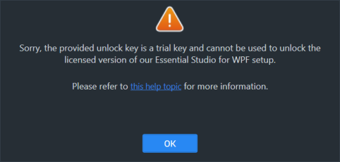

# Installation Errors

This article lists the common Installation errors, reasons and solution for those errors.

* [Couldn't unlock Licensed setup with Trial key?](http://172.16.0.76/common/essential-studio/installation/installation-errors#couldn't-unlock-licensed-setup-with-trial-key)
* [Licensed Expired! What to do?](http://172.16.0.76/common/essential-studio/installation/installation-errors#licensed-expired-what-to-do)
* [Not a Valid license holder?](http://172.16.0.76/common/essential-studio/installation/installation-errors#not-a-valid-license-holder)

### Couldn't unlock Licensed setup with Trial key?

#### Problem

**Error Message:** Sorry, the provided unlock key is a trial key and cannot be used to unlock the licensed version of our Essential Studio for {platform} setup

#### Reason

If you unlocked the Licensed setup with Trial key, this error message will be shown.

#### Suggested solution

Licensed setup can be unlocked only by License key. So, use the License key to unlock the Licensed setup. Refer [this](http://syncfusion.com/kb/2326) topic to generate the license key.

### Licensed Expired! What to do?

#### Problem

**Error Message:** Your license for Syncfusion Essential Studio for {platform} has been expired since {date}. Please renew your subscription and try again

**Online Installer**

#### Reason

This error message will be shown when your license has been expired.

#### Suggested solution.

Renew the subscription [here](https://www.syncfusion.com/sales/products) or contact our sales team at <salessupport@syncfusion.com>. Also, you can continue the 30 days trial after your license has been expired.

### Not a Valid license holder?

#### Problem

**Error Message:** Sorry, we were unable to find a valid license for Essential Studio for {platform} under your account.

#### Reason

The possible reasons for this error are:

* **When your trial expired**
* **When you don't have License or trial**

#### Suggested solution.

Renew the subscription [here](https://www.syncfusion.com/sales/products) or contact our sales team at <salessupport@syncfusion.com>.

