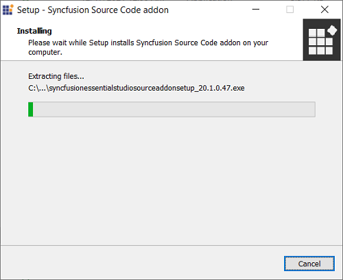
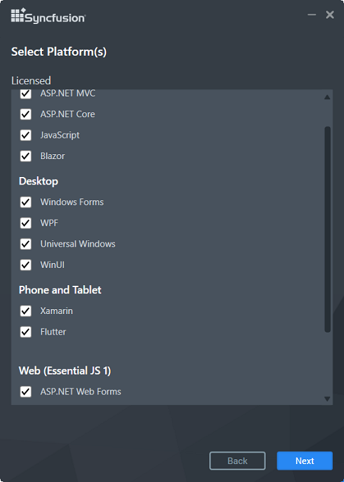
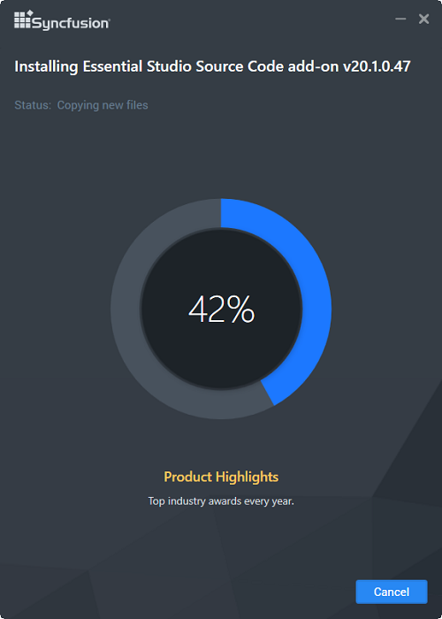
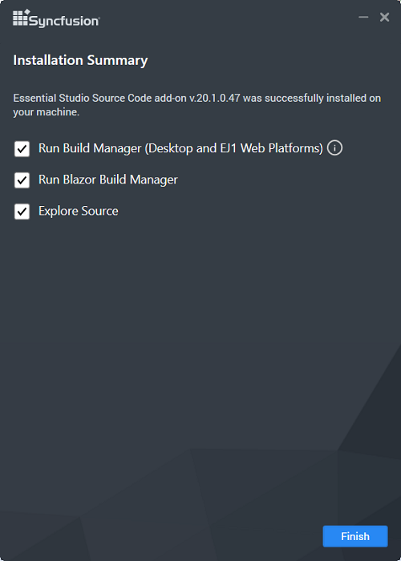

# Source Code Add-on installer

## Overview

Syncfusion provides a Source Code Add On installer that allows you to modify the Syncfusion source code and use customized assemblies. This installer contains all of the Essential Studio sources, and you can easily build the customized source. The Source License is required in order to download and install the Source Code Add-on installer.

## Supported Platforms

Syncfusion provides sources for the following platforms in the source add-on setup.

**Web**

* ASP.NET MVC
* ASP.NET Core
* JavaScript
* Blazor

**Mobile**

* Xamarin
* Flutter

**Desktop**

* Windows Forms
* WPF
* Universal Windows Platform

**Web (Essential JS 1)**

* ASP.NET Web Forms
* ASP.NET MVC
* ASP.NET Core
* JavaScript
* PHP

## Step-by-Step Installation

The steps below show how you can install the Essential Studio Source Code Add-on installer.

1. 	Run the Syncfusion Essential Studio Source code add-on installer from downloaded location by double-clicking it. The installer Wizard automatically opens and extracts the package.
   
    

    N> The installer extracts the syncfusionessentialsourcecodeaddon(version).exe dialogue, which displays the package's unzip operation.
	
   

2.  After reading the License terms and Privacy Policy, enter the Source Unlock Key in the corresponding text box and check the **I agree to the License Terms and Privacy Policy** check box.
   
    
   

3.  Click the Next button. The Platform selection wizard will appear. Choose the platforms that will be installed.

    
   

4.  Click the Next button. The installation location of the Source Code Add On will be displayed.

    

5.  Click the Install button. The Installation process begins. 

    

    N> The Completed screen will be displayed once the selected platform is installed.
	

6.  Select the **Run Build Manager** check box to launch the Build Manager once installation completed. Select **Explore Source** check box to get into the source location.

7.  Click the Finish button. Essential Studio Source Code Add On is installed in your machine.

    
  
   
## Build Manager

Build Manager enables you to build and debug assemblies written in Syncfusion source code. The Build Manager can be launched from the following location.

**Location:**{ProgramFilesFolder}\Syncfusion\Essential Studio\Source Code Add On\{version}\Utilities\Build Manager\Buildmanagerwindows.exe

   
   

The output assemblies of the Build Manager will be placed in the below location.

**Output Location:** {ProgramFilesFolder}\Syncfusion\Essential Studio\Source Code Add On\{version}\UserAssemblies\{version}\{framework}\{Debug\Release}

The required setting can be selected in the Syncfusion Build Manager x.x.x.x window.

### Build Manager Settings

This window contains several sections. 

**1. Framework Version **

   The Framework Version group box has six options: .NET 2.0, .NET 3.5, .NET 4.0, .NET 4.5, .NET 4.5.1, .NET 4.6, .NET CORE 3.1 and NET 5.0. 
   
   * When .NET 5.0 is installed in your system, the NET 5.0 option is selected by default.
   
   * When .NET CORE 3.1 is installed in your system, the .NET CORE 3.1 option is selected by default.
   
   * When Visual Studio 2017 is not installed in your system, the .NET 4.6 option is selected by default. 
   
   * When Visual Studio 2015 is not installed in your system, the .NET 4.5.1 option is selected by default. 
   
   * When Visual Studio 2013 is not installed in your system, the .NET 4.5 option is selected by default. 
   
   * When Visual Studio 2012 is not installed in your system, the .NET 4.0 option is selected by default. 
   
   * When Visual Studio 2010 is not installed in your system, .NET 3.5 option is selected by default. 
   
   * When Visual Studio 2008 is not installed in your system, .NET 2.0 option is selected by default. 
   
   You can change the default option by clicking the other button. The version of the .NET Framework that the assemblies should be built with is specified here and is used automatically to rebuild the assemblies. 

**2. Product**

   The Product group box has a drop-down list box. By default, All is selected. You can change the default option by selecting one of the products from the drop-down list box. 

**3. Platform Type** 

   Syncfusion products typically share a base library that serves as the foundation for both the Windows and Web variants. The Platform Type specifies the library category to be built. This frame comes with eight different options. By default, everything is selected. To perform the build operation, click the button for the required product.

   N> For assemblies that are not built and pre-compiled, assemblies that shipped with the product is automatically used.

**4. Assembly Type**

   This frame has two options: Debug and Release. Debug is selected by default. To choose the Release mode for assembly, select Release.

   You can switch between the Debug and Release mode of product configurations. Building the Debug version of the assemblies allows you to step into the Syncfusion assemblies when debugging applications. 

**5. Strong Key**

   This enables you to install the compiled assemblies in GAC. Select the **Use Strong Key** check box and choose a .snk file to achieve this. You can debug the assembly only when it is complied with the Strong Key. 

**6. Output**

   This frame shows the output, that is, the status of the build operation, in a text area. 

   After selecting the required options in the above-mentioned frames, click Perform Build inside the output frame.

N> The Build operation is performed and the status is updated in the text area, inside the output frame. On completion of the Build operation, an information message is displayed stating that the Build operation has been completed. It also asks you to review the Build output and log files for additional information.

## Assembly Manager

   Assembly Manager, which is included in the Source Code Add On, is used to **InstallRemove** the **DebugRelease** assemblies from the GAC and has its own set of features. The Assembly Manager can be launched from the Source Code Add On installation location listed below.
   
   **Location:**{ProgramFilesFolder}\Syncfusion\Essential Studio\Source Code Add On\{version}\Utilities\Assembly Manager\AssemblyManagerWindows.exe 
   

   * Pre-built Assemblies - These are the assemblies that come standard with Essential Studio. You can only remove pre-built assemblies from the Assembly Manager that comes with the Source Code Add-on.

   * Debug and Release Assemblies - This mode instructs the Assembly Manager to install custom assemblies created from source code using Build Manager. The Debug\Release option will be enabled during compilation based on the **Assembly Type** selected in Build Manager.
   
   

   Refer to [this](https://help.syncfusion.com/common/essential-studio/utilities#assembly-manager) link for more information on Assembly Manager's functionalities.
   
   
 

