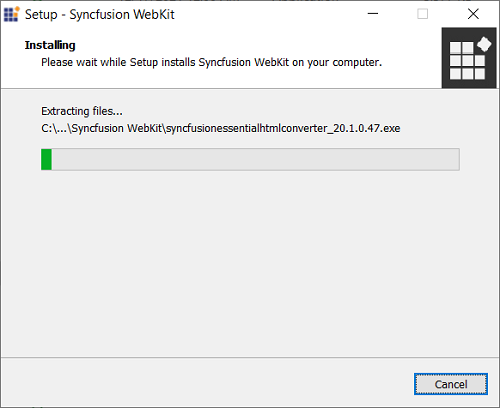
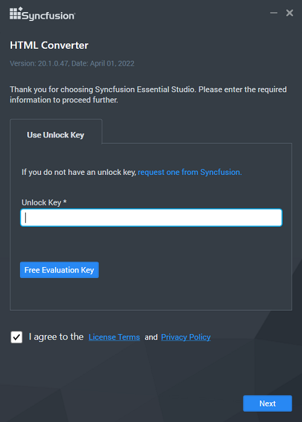
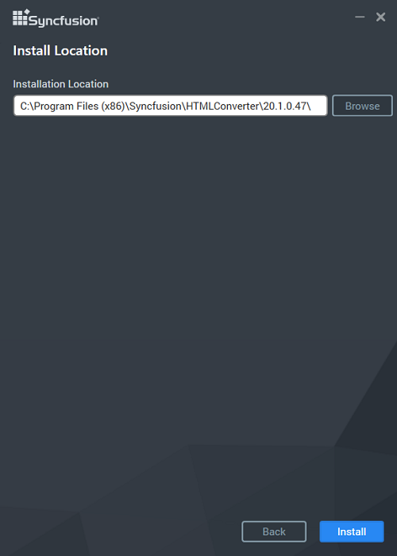

# WebKit HTML converter

Syncfusion introduces the HTML converter in Essential Studio 13.1.0.21, which supports HTML to PDF conversion by using the advanced Qt WebKit rendering engine. This converter can easily be integrated into any.NET application such as Windows Forms, WPF, ASP.NET, ASP.NET MVC, and ASP.NET Core to convert URLs, HTML strings, SVG, and MHTML to PDF, as well as HTML to MHTML, HTML to SVG, and HTML to image.

## Step-by-Step Installation

The steps for installing the HTML Converter installer are as follows.

1. Run the Syncfusion HTML Converter Installer by double-clicking it. The installer Wizard automatically opens and extracts the package.

   

   

   N> Syncfusion HTML Converter does not require a key.

2. The License Agreement screen appears, when the unzip operation is finished.

   

3. After reading the License Agreement, check the **I agree to the License Terms and Conditions** check box.

4. Click the Next button. The installation location screen will appear.

   

   N> By clicking **Browse**, you can also browse and select a location.

5. Click Install, To install in the displayed default location, .

   
   
   N> The Completed screen will be displayed once the  HTML converter is installed.
   
   

6. Click Finish.  HTML converter is installed in your machine.

## Command Line 

Command Line Install and Uninstall are supported by the Syncfusion  HTML converter Installer. The following section demonstrate this ability.

#### Command Line Installation

Follow the given steps to install through Command Line in Silent mode.

1. Double-click the Syncfusion  HTML converter Installer to launch it. The Self-Extractor Wizard automatically opens and extracts the package.
2. The syncfusionessentialhtmlconverter_(version).exe file is extracted into the Temp folder. 
3. Run %temp%. The Temp folder opens. The syncfusionessentialhtmlconverter_(version).exe file is available in one of the folders.
4. Copy the syncfusionessentialhtmlconverter_(version).exe file in local drive. Example: D:\temp
5. Cancel the wizard.
6. Open Command Prompt in administrator mode and pass the following arguments:

   **Arguments:** “Installer file path\syncfusionessentialhtmlconverter_(version).exe” /Install silent [/log “{Log file path}”] [/InstallPath:{Location to install}]

   N> [..] – Arguments inside the square brackets are optional.

   **Example:** “D:\Temp\syncfusionessentialhtmlconverter13.2.0.30.exe” /Install silent /log “C:\Temp\EssentialWebkit.log” /InstallPath:C:\Syncfusion\x.x.x.x 

7.  HTML converter is installed.
    
	N> * x.x.x.x needs to be replaced with the HTML Converter version installed on your machine.* Above steps applicable from the version 13.2.0.x.
   
### Command Line Uninstallation

Uninstalling Syncfusion  HTML converter Installer via Command Line in Silent mode is possible. The steps below will assist you in uninstalling the  HTML converter.

1. When you do not have the extracted installer (syncfusionessentialhtmlconverter_(version).exe) then follow the steps from 2 to 7.
2. Double-click the Syncfusion Essential Studio installer. The Self-ExtractorWizard opens and extracts the package automatically.
3. The syncfusionessentialhtmlconverter_(version).exe file gets extracted into the Temp folder.
4. Run %temp%. The Temp folder opens. The syncfusionessentialhtmlconverter_(version).exe file is available in one of the folders.
5. Copy the syncfusionessentialhtmlconverter_(version).exe file in local drive. Example: D:\temp
6. Cancel the wizard.
7. Open the Command Prompt in administrator mode and pass the following arguments: 

   **Arguments:** “Installer file path\ syncfusionessentialhtmlconverter_(version).exe” /uninstall silent 

    **Example:** “D:\Temp\ syncfusionessentialhtmlconverter_13.2.0.30.exe" /uninstall silent

8.  HTML Converter is uninstalled.
    
	N> * x.x.x.x need to be replaced with the HTML Converter version installed in your machine.* Above steps applicable from the version 13.2.0.x.		